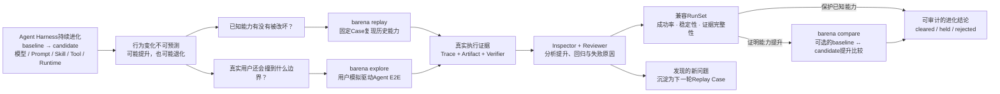
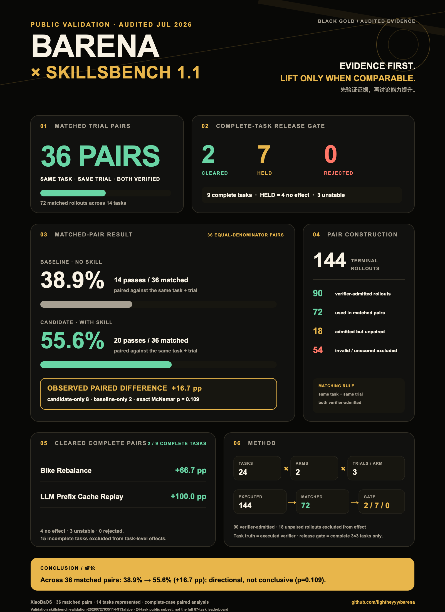

# Barena

### 面向 Agent Harness 演进的端到端评测与发布门禁

> **Prove every Agent change works reliably before you ship it.**

当模型、Prompt、Role、Skill、Tool、Memory 或 Runtime 发生变化时，Barena 用真实 Agent E2E 任务做隔离执行，保留 Trace、Artifact 与 Verifier 证据。回归型变更用固定 Case 证明已知能力没有被破坏；优化型变更再比较 baseline / candidate，最终形成可审计的 `cleared / held / rejected` 发布结论。

> Barena 是评测控制面。XiaobaOS、OpenClaw、Hermes 或其他 CLI Agent 都只是被测目标。Barena **不会调用 XiaobaOS 内置 Arena 来替自己完成评测**。

## 为什么需要 Barena

Agent Harness 的改动不是普通函数改动。单元测试可以验证某个工具函数，却很难回答：

- 新 Skill 在真实 Agent 中是否真的提升任务成功率？
- Prompt、模型或工具改动有没有破坏历史能力？
- 多次运行是否稳定，还是偶然成功？
- Agent 声称“完成”时，目标 Artifact 是否真的存在且正确？
- 这次发布结论能否回到原始 Case、Trace、Workspace 和 Verifier 证据？

Barena 把这些问题收敛为一条发布评测链路：



当前版本已经落地两条执行路径：固定 Case Replay 用于保护已知能力；XiaoBaOS Explore 由真实 `user-cat` 驱动目标 Role 多轮交互，再由 `inspector-cat` 和 `reviewer-cat` 基于边界、Artifact 与原生 OTel 证据给出单次 `pass / fail / blocked / unsafe` 结论。Compare 是证明“候选方案是否优于基线”的可选操作，不再被误用为所有回归发布的必经步骤。

## 适用场景

1. **交付 Skill 前模拟用户验收**：同一个 Role、同一个任务，比较无 Skill 与启用候选 Skill 后的真实结果，避免交付后才收到差评。
2. **Harness 自进化回归门禁**：模型、Prompt、Tool 或 Runtime 改动后重跑历史 Case，检查能力是否退化。
3. **模型或 Provider 迁移**：固定任务、输入与验证器，比较不同模型配置的成功率和稳定性。
4. **工具权限与实现变更**：确认 Agent 不只是“说完成了”，而是真的通过工具产生了可验证结果。
5. **故障修复回放**：把线上失败整理为 Case，修复后做独立 Replay，保留从输入到发布决策的完整证据链。
6. **跨 Agent Harness 复用同一套验收标准**：用相同的 Case 和 Verifier 比较 XiaobaOS、OpenClaw 或实现 Portable Driver 的其他 CLI Agent。

## 当前能力边界

| 能力 | 当前状态 |
|---|---|
| 固定 Case Replay | 可用 |
| 无 Skill vs 候选 Skill 配对评测 | 可用 |
| 多次独立 workspace/session | 可用 |
| Artifact / structured JSON verifier | 可用 |
| `cleared / held / rejected` 发布门禁 | 配对 Skill improvement policy 可用；通用 non-regression policy 待接入 Platform |
| XiaobaOS 普通 `chat` 适配器 | 可用；不调用 Arena |
| OpenClaw 本地 subprocess 适配器 | 可用 |
| Hermes / custom CLI JSON Driver | 契约与测试夹具可用；需要目标侧 Driver |
| 目标 Runtime 原生 Trace | 可选；仅在普通目标执行真实产出时引用 |
| `barena` 选择式全屏 TUI | 可用；先选任务，再选 Runtime、Base/Role 与自然语言测试目标 |
| XiaoBaOS 多轮 `AgentRuntimeAdapter` | 可用；`probe/openSession/sendTurn/cancel/close` |
| XiaoBaOS Role 枚举与 Explore | 可用；真实 UserCat → 目标 Role → InspectorCat → ReviewerCat |
| OpenTelemetry / OTLP 统一 Trace | Explore 可用；内置 OTLP/HTTP 接收并解码为统一 span NDJSON |
| Scripted Agent Simulation | 可用；复用 `AgentRuntimeAdapter` 多轮会话并向 Catena 导出 Run / Turn / Check Trace |
| 三个产品 CLI 入口 | `explore`、`replay`、`compare` 均可执行；Replay/Compare 的交互式 TUI 配置待后续补齐 |
| Engine Protocol / Node Worker | v1 已实现；支持服务端分配 Run ID、持久事件、取消与 hash-verified Run Package |
| Barena Platform | 已选定并 fork Apache-2.0 LangWatch 底座；项目/API Key、OTLP 接入、Trace 搜索与 Waterfall 已完成真实 POC |
| Go Run Control + Evidence Ledger | 本地 P0 可用；PostgreSQL Run/Event、SSE、取消和 endpoint ingestion 已实现，正迁移为 Platform 内部的运行状态与评测记录服务 |
| GitHub 身份与小八社区 | 本地 MVP 已实现；目标架构复用 Platform 的登录/Project 边界，社区继续保持实验功能 |
| SkillsBench 派生 starter | 1 个固定任务，可通过当前 CLI 验证评测链路，不是官方成绩 |
| SkillsBench v1.1 公开方法验证 | 24 个任务、144 次终态运行；36 个严格匹配 pair，报告与海报已公开 |
| XiaobaOS Role A/B | 暂时 held；迁移到普通目标契约中，禁止回退 Arena |
| Claude Code / Codex / OpenClaw Explore | 可检测本机安装；多轮 Explore adapter 待实现 |

## 公开验证：Barena × SkillsBench v1.1

<p align="center">
  
</p>

Barena 在 SkillsBench v1.1 的 24 个公开任务上，以同一个 XiaoBaOS Runtime
分别执行无 Skill baseline 和启用上游 Skill 的 candidate，每个 arm 独立运行
3 次，共得到 144 次终态运行。任务是否通过只由 SkillsBench 的确定性 Verifier
决定，不采用 Agent 自述。

严格证据审计后，90 次运行具有可采信 Verifier 结果，其中 36 个
same-task / same-trial pair 可以等分母比较：

| 可比 pair | Baseline | Candidate | 配对差值 | Candidate-only | Baseline-only |
|---:|---:|---:|---:|---:|---:|
| 36 | 14/36（38.9%） | 20/36（55.6%） | +16.7 pp | 8 | 2 |

方向为正，但 exact McNemar `p=0.109`，不能宣称统计显著。只有 9 个任务拥有完整的
三对三证据，可以进入任务级门禁：2 个 `cleared`、7 个 `held`、0 个
`rejected`。另外 15 个任务因证据不完整而不进入效果结论；54 次无效或未评分
运行也没有被拿来凑分母。

这个实验验证的不是“小八一定更强”，而是 Barena 的三条核心方法成立：

1. Verifier 证据不完整时，结果不会被包装成成功。
2. baseline / candidate 只在同任务、同 trial、双边证据都有效时比较。
3. 正向趋势、稳定提升和证据不足会分别进入结论，不会被混成一个平均分。

[实验方法与边界](docs/benchmarks/skillsbench-v1.1/README.md) ·
[完整人类可读报告](docs/benchmarks/skillsbench-v1.1/results/latest.md) ·
[机器可读证据索引](docs/benchmarks/skillsbench-v1.1/results/latest.json) ·
[海报生成说明](docs/benchmarks/skillsbench-v1.1/poster/README.md)

这是使用 BenchFlow 与明确标注的 XiaoBaOS ACP compatibility shim 完成的
SkillsBench-derived 方法验证，不是官方 SkillsBench leaderboard 成绩，也不用于
证明当前 Explore 的 OTLP 链路。

## 框架架构

Barena 只有一个产品、两种执行模式和一个可选比较操作：Replay 保护已知能力，Explore 通过用户模拟发现未知边界，Compare 只在需要证明提升时比较兼容的 baseline / candidate RunSet。所有 Runtime 调用统一经过 `AgentRuntimeAdapter`；行为 Trace 统一采用 OpenTelemetry，通过 OTLP 导出和接入。

```mermaid
flowchart LR
    CLI["Barena CLI"]
    Explore["barena explore<br/>探索未知边界"]
    Replay["barena replay<br/>回放已知Case"]
    Compare["barena compare<br/>比较RunSets"]

    UserCat["UserCat<br/>XiaobaOS · 模拟用户"]
    Adapter["AgentRuntimeAdapter<br/>统一调用不同Agent"]
    Runtime["Target Runtime<br/>XiaobaOS · Claude Code · Codex<br/>OpenClaw · Hermes"]
    OTel["OpenTelemetry / OTLP<br/>统一Trace协议"]
    Artifact["Artifact + Verifier<br/>最终状态证据"]
    InspectorCat["InspectorCat<br/>XiaobaOS · 分析证据"]
    ReviewerCat["ReviewerCat<br/>XiaobaOS · 生成结论"]
    RunSets["Baseline / Candidate<br/>RunSets"]
    NewCase["Replay Case Candidate<br/>沉淀新问题"]
    Verdict["Single-run Verdict<br/>pass · fail · blocked · unsafe"]
    Result["Release Gate<br/>cleared · held · rejected"]

    CLI --> Explore
    CLI --> Replay
    CLI --> Compare

    Explore --> UserCat
    UserCat --> Adapter
    Replay --> Adapter
    Adapter --> Runtime
    Runtime --> OTel
    Runtime --> Artifact
    OTel --> InspectorCat
    Artifact --> InspectorCat
    InspectorCat --> ReviewerCat
    InspectorCat --> NewCase
    ReviewerCat --> Verdict
    Verdict --> RunSets
    RunSets -->|"non-regression"| Result
    RunSets --> Compare
    Compare -->|"improvement"| Result

    classDef entry fill:#eff6ff,stroke:#2563eb,color:#172554;
    classDef runtime fill:#f8fafc,stroke:#64748b,color:#0f172a;
    classDef telemetry fill:#ecfdf5,stroke:#16a34a,color:#064e3b;
    classDef evaluator fill:#fff7ed,stroke:#ea580c,color:#7c2d12;
    classDef output fill:#fdf2f8,stroke:#db2777,color:#831843;
    class CLI,Explore,Replay,Compare entry;
    class Adapter,Runtime runtime;
    class OTel,Artifact telemetry;
    class UserCat,InspectorCat,ReviewerCat evaluator;
    class RunSets,NewCase,Verdict,Result output;
```



这是一张执行 DAG，而不是流水线：Explore 先由 UserCat 驱动 Agent，Replay 直接执行固定 Case，二者共用同一个 `AgentRuntimeAdapter`；Runtime 产生的 OTel Trace 与 Artifact / Verifier 证据在 InspectorCat 汇合，经 ReviewerCat 形成单次 Verdict 与 RunSet。保护已知能力时，Release Gate 直接消费候选 Replay RunSet；只有证明提升时才进入 Compare。`Replay Case Candidate` 是本轮 DAG 的输出，显式确认后才进入下一轮 Replay。

完整且锁定的组件、命令与遥测契约见 [`docs/ARCHITECTURE.md`](docs/ARCHITECTURE.md)。

## Barena Platform

Barena Platform 面向 Agent Runtime 的持续进化，而不是再做一个通用 Trace
Viewer：真实 Sessions 和主动 Explore 产生 Trace，失败进入 Issue Inbox，经
人工确认沉淀为不可变 Case，再由 Replay / Compare 与 Release Gate 验证下一
个 Harness Version。

公开前端基于 Apache-2.0 的
[`fightheyyy/barena-platform`](https://github.com/fightheyyy/barena-platform)
下游 fork，复用登录、Project/API Key、OTLP、Trace 存储、搜索和 Waterfall；
Go 后端负责 Run、Issue、Case、Harness Version、Evaluation 与 Release
业务状态；TypeScript Engine 仍是唯一的 Explore / Replay / Compare、Judge
和发布算法实现。

XiaoBaOS 是第一方深度适配，OpenClaw、Claude Code、Codex、Hermes 等通过
相同的 OTel、Runtime Adapter 与 Case 协议接入。第一条 Go 纵切已经支持将
Run 中真实保留的 Trace 提升为 evidence-backed Issue，并经幂等审核生成唯一
的不可变 Case revision。

## 安装

```bash
git clone https://github.com/fightheyyy/barena.git
cd barena
npm install
npm run build
npm link

barena --version
barena --help
```

如果全局命令出现 `permission denied`，先确认构建后的入口具有执行权限：

```bash
npm run build
chmod +x dist/cli.js
npm link
```

要求 Node.js 18 或更高版本。

## 最快跑通：Explore 一个 XiaoBaOS Role

本机安装并配置好 XiaoBaOS 后，直接运行：

```bash
barena
```

`barena` 和无参数的 `barena explore` 复用同一套全屏 TUI。标准 80×24 终端会保留完整的 `BARENA` ASCII 首页；主内容使用无外框的开放画布，产品菜单只显示 Explore / Replay / Compare，DAG、历史运行和环境检查分别通过 `d`、`p`、`?` 打开。Explore 运行时会按 Explore / Inspect / Judge 三个阶段显示 UserCat、目标 Agent、InspectorCat 和 ReviewerCat 的真实可观察状态；详细视图只展示结构化运行事件，不展示或猜测模型内部思考。

本机只有一个可用 XiaoBaOS 时，Barena 自动采用 Base Agent，主路径只剩三个动作：

```text
Barena
  → 用自然语言描述想测试的行为
      ├─ 可选：/agent <role-id> 更换被测 Role
      └─ 可选：/skill 搜索并聚焦一个已安装 Skill
  → 审阅目标并按 Enter 运行
  → 直接查看行为发现、证据与 Replay Case candidate
```

只有当 Runtime 或默认 Agent 无法唯一确定时，Barena 才回退到选择页。它会识别本机的 XiaoBaOS、OpenClaw、Claude Code、Codex 和 Hermes CLI，并把“已安装”与“Explore adapter 已可用”分开处理。当前只有 XiaoBaOS 是首个深度适配的 Explore Runtime；其他 Runtime 不会被假装成可运行目标。

不使用 `/skill` 时，Barena 测试所选 Base/Role 的完整 Agent 配置；使用 `/skill` 只改变本次 Explore 的测试焦点，不会进入另一套工作流。交互模式由 UserCat 自动决定何时继续或结束，最多进行 6 次用户交互，不再要求使用者先理解并填写轮数。

等价的非交互命令适合脚本和 CI：

```bash
barena explore \
  --runtime xiaobaos \
  --role secretary-cat \
  --skill planning \
  --task "我今天事情很乱，帮我排出真正可执行的优先级" \
  --max-turns 4
```

如果 XiaoBaOS 不是标准全局安装，可以显式指定：

```bash
barena explore \
  --runtime xiaobaos \
  --role secretary-cat \
  --task "帮我把含糊需求收敛成今天能执行的计划" \
  --xiaobaos-command /path/to/xiaoba \
  --xiaobaos-project-root /path/to/XiaoBa-CLI \
  --roles-root /path/to/XiaoBa-CLI/roles
```

一次 Explore 最多执行 `2 × max_turns + 2` 次模型调用：每轮 UserCat 与目标 Agent 各一次，结束后 InspectorCat 与 ReviewerCat 各一次。交互 TUI 默认采用最多 6 轮的内部安全上限，由 UserCat 根据对话自然结束，不要求使用者配置轮数；自动化命令仍可通过 `--max-turns` 收紧预算。运行中按 `Ctrl+C` 会取消当前 Runtime turn 并保留已产生的证据。

Explore 结果写入：

```text
runs/explore-.../
  scenario.json
  runtime/
    roles/
    skills/
    snapshot-manifest.json
  workspaces/
    target/
    user-simulator/
    inspector/
    reviewer/
  traces/boundary.ndjson
  telemetry/otlp/
    envelopes/*.pb
    spans.ndjson
    manifest.json
  evaluator/
    user-simulator/
    inspector/issues.json
    reviewer/scorecard.json
  replay-candidates.json
  explore-result.json
  reports/report.json
  reports/report.md
```

XiaoBaOS 原生 OTLP 是当前 Explore 的必需证据。Barena 接收标准 OTLP/HTTP protobuf，解码为 OTel span，并按 run、scenario、actor、Role、session 与 turn 关联；没有收到目标 Runtime span 时结果会是 `blocked`，不会从 stdout 猜测工具调用或伪造 Trace。

运行所需的 Role / Skill 会先复制为隔离快照，并校验前后 fingerprint。Barena 会在执行前和报告落盘前对整个 run 做 Secret 扫描与等长覆盖脱敏；无法安全扫描的文件会使证据不完整，而不是静默放行。脱敏统计保存在 `explore-result.json` 的 `evidence.secret_redaction` 中。

## SkillsBench → XiaobaOS Skill Replay

Barena 内置一个从 [SkillsBench](https://github.com/benchflow-ai/skillsbench) `dialogue-parser` 任务派生的最小校准集。它固定了上游 commit、任务文件哈希、适配说明、fixture 和结构化 JSON/图验证器。

它的用途是验证 Barena 的 baseline/candidate、隔离执行、证据留存和门禁是否工作；它不是完整 SkillsBench，也不是官方 leaderboard 分数。

```bash
barena doctor \
  --target xiaobaos \
  --xiaobaos-command /path/to/xiaoba \
  --xiaobaos-project-root /path/to/xiaobaOS \
  --roles-root /path/to/xiaobaOS/roles

barena evaluate skill /path/to/candidate-skill \
  --target xiaobaos \
  --role secretary-cat \
  --suite skillsbench:starter \
  --xiaobaos-command /path/to/xiaoba \
  --xiaobaos-project-root /path/to/xiaobaOS \
  --roles-root /path/to/xiaobaOS/roles \
  --attempts 2
```

实际目标调用只有普通 Agent 入口：

```text
xiaoba chat --role <role> --message <prompt> [--skill <candidate>]
```

Barena 自己负责：

```text
Case → baseline/candidate attempts → boundary/native evidence
     → artifact verifier → pass-rate/stability/lift → release decision
```

两组运行先复制同一份已安装 base Skills；baseline 排除候选同名 Skill，candidate 注入并显式激活已通过准入的候选快照。Role、任务、fixture、超时和验证器保持一致。

## 使用自己的 Case

Case 使用 `barena.agent_e2e_case.v1`。XiaobaOS 示例：

```json
{
  "schema": "barena.agent_e2e_case.v1",
  "case_id": "secretary-artifact-smoke",
  "target": {
    "adapter": "xiaoba",
    "runtime": "xiaobaos",
    "agent": "secretary-cat",
    "env_allowlist": ["OPENAI_API_KEY"]
  },
  "task": {
    "prompt": "读取 workspace/input.md，并将结构化结果写入 result.json。"
  },
  "fixtures": [
    { "source": "fixtures/input.md", "destination": "input.md" }
  ],
  "assertions": {
    "artifacts": [
      {
        "path": "result.json",
        "json_checks": [
          { "kind": "type", "pointer": "", "expected": "object" },
          { "kind": "required_keys", "pointer": "", "keys": ["summary", "actions"] }
        ]
      }
    ]
  },
  "replays": 1,
  "timeout_ms": 180000,
  "isolation": {
    "level": "policy_only",
    "network": "allowlisted",
    "writable_roots": ["workspace"]
}
```

运行：

```bash
barena evaluate skill ./candidate-skill \
  --target xiaobaos \
  --case ./cases/secretary-artifact-smoke.json \
  --xiaobaos-command xiaoba \
  --xiaobaos-project-root /path/to/xiaobaOS \
  --roles-root /path/to/xiaobaOS/roles \
  --attempts 3
```

自定义 Case 中的 Role 来自 `target.agent`。`--role` 主要用于把内置 suite 物化为目标专用 Case。

## OpenClaw 与其他 CLI Agent

OpenClaw 使用内置 adapter：

```bash
barena evaluate skill ./candidate-skill \
  --target openclaw \
  --case ./cases/openclaw-case.json \
  --attempts 2
```

Hermes 或自定义 CLI Agent 使用严格 JSON Driver：

```bash
barena evaluate skill ./candidate-skill \
  --target hermes \
  --target-command ./bin/hermes-barena-driver \
  --case ./cases/hermes-case.json \
  --attempts 2
```

Driver 需要实现：

- `probe --json` → `barena.portable_target_probe.v1`
- `run --request <request.json>` → 标准输出一个 `barena.portable_target_result.v1`

目标声称成功不能直接通过 Case；Barena 仍会检查 workspace 中的 Artifact。

## API 与凭据怎么配置

Barena 不接管目标 Agent 的 Provider 配置。目标 Runtime 仍按自己的方式配置模型、API Base 和凭据；Barena 只允许显式列出的环境变量进入目标子进程，并且不会把变量值写入报告。

可以创建项目配置：

```bash
barena init \
  --target xiaobaos \
  --target-command /path/to/xiaoba \
  --role secretary-cat \
  --xiaobaos-project-root /path/to/xiaobaOS \
  --roles-root /path/to/xiaobaOS/roles \
  --pass-env OPENAI_API_KEY,OPENAI_BASE_URL

barena config show
barena doctor --target xiaobaos
barena eval skill ./candidate-skill
```

配置文件默认位于 `.barena/config.json`。它只保存环境变量名称，不保存 Secret 值。

## 输出与证据

一次 Skill A/B 会写入：

```text
runs/skill-eval-.../
  evaluation-request.json
  static-admission.json
  arms/
    baseline/<case-id>/agent-e2e-.../
      case.json
      workspace/
      traces/boundary.ndjson
      reviewer/scorecard.json
      reports/report.json
    candidate/<case-id>/agent-e2e-.../
      ...
  skill-evaluation.json
  reports/report.json
  reports/report.md
```

核心证据分层：

- **Boundary Trace**：Barena 观察到的输入、stdout/stderr、进程状态和 workspace diff。
- **OpenTelemetry Trace**：Explore 内置 OTLP/HTTP 接收端，保存原始 envelope 并生成统一 span NDJSON；每条证据保留 Runtime-native provenance。
- **Target-native Trace**：只有普通目标执行真实通过 OTLP 导出时才接入；缺失不会被推断或伪造。XiaoBaOS Explore 当前要求目标 native span 可用。
- **Artifact Evidence**：文件存在性、内容、JSON 结构和图约束等确定性验证结果。
- **Scorecard**：每次 Attempt 的结果、整体成功率、稳定性、lift 和最终发布决策。

`policy_only` 是策略声明，不等于操作系统级硬沙箱。报告不会把它描述为硬隔离。

## 判定语义

- `cleared`：候选结果稳定、证据完整，并相对 baseline 观察到正向提升。
- `held`：无提升、结果不稳定、前置条件缺失、运行被阻断或证据不完整。
- `rejected`：候选触发明确不安全结果或静态准入拒绝。

常见原因码包括 `positive_lift`、`no_effect`、`unstable_result`、`artifact_assertion_failed`、`credential_missing` 和 `evidence_incomplete`。

## CLI

当前 v0.1 的三个产品命令是：

```text
barena explore <scenario.json>
barena replay <case.json> [--target-command ./driver]
barena simulation run <case.json> [--otlp-traces-endpoint URL]
barena compare <candidate-skill> (--case <case.json> | --suite skillsbench:starter)
```

`replay` 复用现有固定 Case、独立 workspace/session、Artifact Verifier 与
replay aggregation；`compare` 复用现有 no-Skill baseline / candidate Skill
配对引擎并输出 `cleared / held / rejected`。旧的 `e2e run` 和
`evaluate skill` 继续作为兼容别名。

当前已经实现 `barena` 全屏产品入口和 `barena explore` 的 XiaoBaOS
交互路径；`barena tui` 是同一产品 TUI 的兼容入口：

```text
barena
barena explore
barena explore "测试 Agent 面对含糊需求时是否先澄清"
barena explore <scenario.json>
barena explore --runtime xiaobaos --role <role> --task <objective>
```

下面的兼容命令继续可用：

```text
barena guide
barena init --target <xiaobaos|openclaw|runtime>
barena doctor --target <id>
barena list suites
barena evaluate skill <skill-path> --suite skillsbench:starter ...
barena evaluate skill <skill-path> --case <case.json> ...
barena e2e probe --target <id>
barena e2e run <case.json>
barena list runs
barena show <run-id>
barena report <run-id> --format markdown
barena tui
```

静态准入出现可接受的 warning 时，可显式传入逗号分隔的 finding ID：`--accept-scan-findings <id1,id2>`。该确认只属于 Barena 的 Skill 准入，不是目标 Runtime 的执行策略。

`barena evaluate role` 当前会 fail closed，而不会回退到 XiaobaOS Arena。待普通目标契约能够诚实表达 baseline Role 与 candidate Role 后再恢复。

`barena run <subject-id>` 是早期确定性 scaffold，仅为旧数据/测试兼容保留，不会调用真实 Agent，也不能替代 `barena evaluate skill`。

## 开发与验证

```bash
npm run check
npm run pack:dry-run
npm run test:platform
```

回归测试覆盖选择式交互入口、XiaoBaOS Base/Role 多轮 Explore、UserCat/Inspector/Reviewer 严格 JSON、OTLP protobuf 接收与 span 解码、CLI/TUI、静态准入、路径与 symlink 防护、OpenClaw/Portable Driver、paired Skill evaluation、Artifact Verifier、run catalog、Engine Worker、Go Run API/SSE/取消和打包入口。

项目仍处于早期版本。当前 CLI 可以运行 XiaoBaOS Explore、固定 Replay 与
Skill improvement Compare；v0.2 已加入稳定的 Engine Protocol 和 Go 本地控制面
基础层，但 Web、通用 non-regression Release Check、Claude Code/Codex/OpenClaw
的 Explore 深度适配仍属于后续切片。平台启动说明见
[`platform/README.md`](platform/README.md)。

## License

Apache-2.0
