<div align="center">


# Barena

### End-to-end testing and release CI for AI agents

[](https://github.com/fightheyyy/barena)
[](#how-it-works)
[](#quick-start)
[](#coming-soon-cross-runtime-agent-e2e)
[](https://nodejs.org)
[](https://www.typescriptlang.org/)
[](#current-runtime-boundary)
[](#license)

**When code becomes a black box, behavior becomes the contract. Barena tests the contract.**

[Positioning](docs/POSITIONING.md) · [Why Agent E2E](#why-agent-e2e-testing) · [How It Works](#how-it-works) · [Coming Soon](#coming-soon-cross-runtime-agent-e2e) · [Quick Start](#quick-start) · [Boundaries](#boundaries)

</div>

---

> What if every agent release had to prove it could still complete real user tasks?

Barena is an open-source end-to-end testing and release CI project for AI agents. It treats the agent system — model, prompt, skills, tools, memory, and runtime — as a black box, then evaluates observable behavior with clean runs, traces, artifacts, replay evidence, verifiers, and release decisions.

The authoritative product scope is locked in [`docs/POSITIONING.md`](docs/POSITIONING.md): Barena evaluates whether a concrete Agent change is effective, stable, regression-free, and ready to ship. Phase 1 is XiaoBa Role and Skill Release CI.

The current release deeply adapts XiaoBa-CLI 0.1.1 as the first native target runtime. It evaluates a Skill as the same immutable Role without versus with the candidate Skill, or evaluates an explicit baseline Role versus a candidate Role. Every attempt uses a fresh XiaoBa Arena root and preserves native session traces, Arena stage evidence, artifacts, verifier results, fingerprints, and a release decision. OpenClaw remains the secondary cross-runtime path.

---

## Why Agent E2E Testing

An AI agent's behavior is no longer defined by code alone. It emerges from model decisions, prompts, skills, tool calls, memory, permissions, environment state, and external services. Reading the implementation cannot prove that the system will finish the user's job correctly.

Every model swap, prompt edit, new skill, or tool change can introduce a silent regression. Barena moves trust from implementation inspection to end-to-end behavioral evidence.

| Release question | Barena evidence |
|---|---|
| What agent capability changed? | Subject manifest, source path, fingerprint |
| Is it safe enough to run? | Static scan findings |
| What happened end to end? | Trace events and artifacts |
| Did it produce the correct outcome? | Verifier result |
| Is the behavior stable? | Replay attempts |
| Should this release be trusted? | `cleared`, `held`, or `rejected` |

---

## How It Works

```mermaid
flowchart LR
    subgraph Input["1) Release Change"]
        direction TB
        Cases["E2E cases"]
        Baseline["baseline<br/>Role or Skill"]
        Candidate["candidate<br/>Role or Skill"]
    end

    subgraph Orchestrator["2) Barena Orchestrator"]
        direction TB
        Preflight["fail-closed preflight<br/>blocked means held"]
        BaseRuns["fresh baseline attempts"]
        CandidateRuns["fresh candidate attempts"]
        Preflight --> BaseRuns
        Preflight --> CandidateRuns
    end

    subgraph Native["3) XiaoBa Arena per Attempt"]
        direction TB
        UserRun["UserCat → target AgentSession"]
        TraceReview["E2E Trace → InspectorCat<br/>→ ReviewerCat native score"]
        Artifacts["artifacts + final state"]
        UserRun --> TraceReview
        UserRun --> Artifacts
    end

    subgraph Evidence["4) Barena Evidence"]
        direction TB
        NativeEvidence["native trace + stage evidence"]
        Verifier["artifact verifier"]
        Package["validated + hash-stamped<br/>evidence package"]
        NativeEvidence --> Package
        Verifier --> Package
    end

    subgraph Gate["5) Paired Release Gate"]
        direction TB
        Aggregate["truth + lift<br/>stability + regressions"]
        Decision["cleared / held / rejected"]
        Aggregate --> Decision
    end

    Cases --> Preflight
    Baseline --> BaseRuns
    Candidate --> CandidateRuns
    BaseRuns --> UserRun
    CandidateRuns --> UserRun
    TraceReview --> NativeEvidence
    Artifacts --> Verifier
    Package --> Aggregate
```



The Trace is the behavioral evidence spine. Within each attempt, UserCat creates real user pressure, the target produces a Trace and artifacts, InspectorCat extracts problems, and ReviewerCat produces the native case score. Barena separately verifies artifacts and final state, validates and hash-stamps the complete evidence package, then aggregates every baseline/candidate attempt into truth, observed lift, stability, regressions, and the final release decision.

These Cats are logical evaluator stages. XiaoBa 0.1.1 currently runs them as a composite native Arena pipeline—not three independent evaluator `AgentSession`s—and Barena records that limitation explicitly.

Barena is a release gate, not a benchmark leaderboard. The goal is not one impressive score; it is repeatable proof that an agent capability can cross a trust boundary without breaking expected behavior.

---

## Coming Soon: Cross-Runtime Agent E2E

XiaoBa-native Role and Skill evaluation is implemented. The next step is applying the same evidence standard to other open-source runtimes.

- Run real multi-turn tasks against target agents through independent adapters, starting with OpenClaw.
- Define reusable E2E cases with task prompts, fixtures, permissions, and assertions.
- Verify final state across files, Git repositories, browser sessions, artifacts, and allowed side effects.
- Replay cases to detect flaky agent behavior.
- Compare releases to surface capability regressions after model, prompt, skill, or tool changes.
- Gate agent releases in CI with evidence-backed pass, hold, or reject decisions.

The Barena-side OpenClaw subprocess boundary is implemented, but XiaoBa 0.1.1 has no external-agent target-driver seam. That route therefore fails closed with `xiaoba_external_agent_mode_unavailable`; Barena never substitutes deterministic TypeScript Cats for the missing evaluator path.

XiaoBa 0.1.1's UserCat, Inspector, and Reviewer are native Arena pipeline stages, not three independent evaluator AgentSessions. Native results record this explicitly instead of overstating the architecture.

---

## What Barena Clears

| Subject | Status | Notes |
|---|---:|---|
| Local `SKILL.md` directory | Supported | Import, scan, run, replay, report |
| GitHub skill repository | Supported | Clone-and-scan only; no install scripts |
| Built-in agent target profile | Supported | `opencode`, `xiaoba`, `hermes`, `openclaw` |
| XiaoBa Skill effectiveness | Supported | Same immutable Role: `role` baseline vs `role_skill` candidate |
| XiaoBa Role effectiveness | Supported | Explicit baseline Role vs candidate Role under pinned cases |
| XiaoBa native trace package | Supported | Session-log-v3 traces, Arena stages, artifacts, verifier, hashes |
| OpenClaw target adapter | Secondary | Local JSON CLI, strict stdout protocol, boundary evidence |
| Reusable native E2E case | Supported | Task, fixtures, assertions, replay controls, timeout |
| Three independent evaluator AgentSessions | Not claimed | XiaoBa 0.1.1 stages are a composite Arena pipeline |
| Cross-runtime XiaoBa evaluation | Coming soon | Requires an external-agent target-driver seam |
| Cross-version regression report | Coming soon | Compare pass, fail, and flaky behavior between releases |

---

## MVP1

Barena MVP1 is a TypeScript CLI/TUI for verifier-backed release evaluation of open-source Agent capabilities.

| Area | Capability |
|---|---|
| Import | Local skills, GitHub skill repositories, built-in agent targets |
| Safety | Static scan before runtime execution |
| Runtime | Clean run directories under `runs/<run-id>/` |
| Review | UserCat, InspectorCat, ReviewerCat contracts |
| Stability | Replay attempts with trace refs |
| Verification | Optional verifier command |
| Output | JSON scorecards and Markdown reports |
| Decisions | `cleared`, `held`, `rejected` |
| Statuses | `pass`, `unstable`, `reopened`, `blocked`, `unsafe` |
| XiaoBa Skill release | Same-Role baseline/candidate pairing with native activation proof |
| XiaoBa Role release | Explicit Role baseline/candidate pairing |
| UI | Keyboard-driven runtime/capability setup, result, boundary/native trace views |

---

## Quick Start

Install and build:

```bash
npm install
npm run check
```

Use the local CLI:

```bash
BAR="node dist/index.js"
```

Clear a local skill:

```bash
$BAR import skill test/fixtures/skills/good-skill --id good-skill
$BAR scan good-skill
$BAR run good-skill --replays 3 --verifier test/fixtures/verifiers/pass.js
$BAR scorecard <run-id>
$BAR report <run-id> --format markdown
```

Probe the installed XiaoBa native contract:

```bash
$BAR e2e probe --target xiaoba
```

Open the interactive release flow:

```bash
$BAR
```

Choose **How Barena works (core DAG)** for the terminal-native reader map. To run an evaluation, choose XiaoBa Skill or XiaoBa Role, provide the explicit baseline, select a native E2E case, and set attempts per arm. The result separates verifier-backed truth, observed lift, replay stability, evidence quality, and the release decision. Press `t` to inspect both Barena boundary events and XiaoBa native trace events.

Run the same evaluation non-interactively for CI:

```bash
$BAR evaluate skill test/fixtures/xiaoba-native/skills/candidate-skill \
  --target xiaoba \
  --role engineer-cat \
  --case docs/cases/xiaoba-skill-artifact.json \
  --attempts 2
```

Evaluate a candidate Role:

```bash
$BAR evaluate role reviewer-cat \
  --baseline-role engineer-cat \
  --case docs/cases/xiaoba-role-artifact.json \
  --attempts 2
```

Role IDs resolve from XiaoBa's installed Role root. Missing credentials, incompatible versions, unsupported Skill inheritance, name collisions, missing activation, missing traces, or unenforced sandbox evidence produce `held`/blocked results—not simulated success.

`barena tui --snapshot` keeps the legacy read-only dashboard snapshot available for scripts and documentation.

Import a GitHub skill repository for clone-and-scan review:

```bash
$BAR import github owner/repo --id candidate-skill --ref main
```

GitHub import clones and scans only. It does not run install scripts or arbitrary repository code.

The secondary OpenClaw path remains available:

```bash
$BAR e2e probe --target openclaw
$BAR e2e run docs/cases/openclaw-write-artifact.json
```

Without OpenClaw or a XiaoBa external-agent seam, these commands intentionally return a structured held/blocked scorecard.

---

## Built-In Agent Targets

```bash
$BAR list targets
$BAR import agent opencode --id opencode-ci
$BAR run opencode-ci --replays 1
```

| Target | Focus |
|---|---|
| `opencode` | Coding agent and code-task CI |
| `xiaoba` | Dogfood runtime for governable skill and role growth |
| `hermes` | Growth and self-improving agent CI |
| `openclaw` | Local assistant permissions, channels, and side effects |

---

## Commands

```text
barena
barena evaluate skill <path> --target xiaoba --role <role-id> --case <native-case.json> [--attempts 2]
barena evaluate role <candidate-role-id> --baseline-role <role-id> --case <native-case.json> [--attempts 2]
barena evaluate skill <path> --target openclaw --case <agent-case.json> [--attempts 2]
barena import skill <path>
barena import github <owner/repo|url>
barena import agent <opencode|xiaoba|hermes|openclaw>
barena scan <subject-id>
barena run <subject-id> [--replays 3] [--verifier path]
barena e2e probe [--target xiaoba|openclaw]
barena e2e run <case.json> [--runs-root runs]
barena scorecard <run-id>
barena report <run-id> [--format markdown|json]
barena list subjects
barena list runs
barena list targets
barena tui [--snapshot] [--color|--no-color]
barena doctor
```

---

## Run Package

XiaoBa native capability evaluation:

```text
runs/<xiaoba-skill-or-role-eval-id>/
  evaluation-request.json
  capability-evaluation.json
  arms/<baseline|candidate>/<case-id>/attempt-<n>/
    request-manifest.json
    xiaoba-project/arena/runs/<unique-run-id>/
      clean-runtime.json
      arena-runner.json
      arena-scorecard.json
      arena-run.json
      workspace/logs/sessions/**/traces.jsonl
    verifier/artifact-assertions.json
    traces/boundary.ndjson
    evidence/evidence-manifest.json
    evidence/<boundary|native|evaluator|verifier|debug>/...
  reports/report.json
  reports/report.md
```

Every accepted evidence copy is hash-stamped. Each Barena attempt owns a distinct XiaoBa run ID and workspace; XiaoBa's internal replay is additional evidence, not a replacement for independent attempts.

Secondary OpenClaw Skill evaluation:

```text
runs/<skill-eval-id>/
  evaluation-request.json
  skill-evaluation.json
  arms/baseline/<case-id>/<agent-e2e-run-id>/...
  arms/candidate/<case-id>/<agent-e2e-run-id>/...
  reports/report.json
  reports/report.md
```

Each arm contains the Agent E2E package below. Candidate workspaces stage only the selected Skill; baseline workspaces use an empty Skill allowlist.

```text
runs/<run-id>/
  run-manifest.json
  workspace/
  scan/scan-report.json
  traces/trace.ndjson
  artifacts/
  inspector/issues.json
  replays/replay-*/trace.ndjson
  verifier/verifier-results.json
  reviewer/scorecard.json
  reports/report.json
  reports/report.md
```

Agent E2E runs use a separate evidence layout:

```text
runs/<agent-e2e-run-id>/
  case.json
  workspace/
  traces/boundary.ndjson
  traces/evaluators/*.ndjson
  traces/native/                 # optional, never inferred
  replays/replay-*/boundary.ndjson
  verifier/artifact-assertions.json
  reviewer/scorecard.json
  reports/report.json
  reports/report.md
```

---

## Barena As A Skill

Barena can also be packaged as an agent-facing clearance skill. In that form, the skill teaches an agent when to invoke Barena, how to interpret scorecards, and when to refuse self-promotion. The CLI remains the evidence engine.

The intended behavior is:

```text
skill / role / tool / prompt / runtime change
  -> Barena clearance
  -> trusted only when evidence says cleared/pass
```

---

## Current Runtime Boundary

The first-party path invokes XiaoBa-CLI 0.1.1 directly:

```text
target runtime: xiaoba-cli native Arena
Skill pair: same Role fingerprint, role vs role_skill
Role pair: explicit baseline Role vs candidate Role
evidence: native AgentSession trace + Arena stages + Barena verifier
sandbox: enforced workspace-write proof required
evaluator stages: composite XiaoBa stages, not three independent AgentSessions
network disabled: declared policy, not claimed as a hard network boundary
```

The original deterministic clearance path remains for compatibility:

```text
provider: barena-deterministic
adapter: xiaoba-compatible
xiaoba_invoked: false
```

That legacy path does **not** invoke XiaoBa-CLI or `AgentSession`.

The external OpenClaw mode is stricter but still secondary:

```text
evaluator runtime: xiaoba-cli (required)
target adapter: openclaw local JSON CLI
evidence: Barena boundary trace + optional target-native trace
isolation: policy_only
```

If XiaoBa cannot evaluate the external target, the run is held/blocked. The external-agent seam is **coming soon**.

---

## Boundaries

Barena is not:

- A complete malware detector.
- A hosted benchmark leaderboard.
- An automatic production promotion system.
- A replacement for unit tests, code review, or runtime sandboxing.

Barena adds the end-to-end behavioral tests that agent releases increasingly depend on.

This repository deliberately does not copy XiaoBa product surfaces such as Dashboard, Electron, Pet, Feishu, Weixin, output logs, or secrets. XiaoBa-native normalization lives under `src/evaluation`; external evaluator and target integrations live under `src/evaluators` and `src/targets`.

## License

Apache-2.0.
