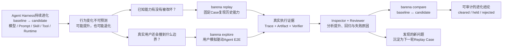

# Barena

### 面向 Agent Harness 演进的端到端评测与发布门禁

> **Prove every Agent change works reliably before you ship it.**

当模型、Prompt、Role、Skill、Tool、Memory 或 Runtime 发生变化时，Barena 用真实 Agent E2E 任务对 baseline 与 candidate 做隔离执行，保留 Trace、Artifact 与 Verifier 证据，并给出可审计的 `cleared / held / rejected` 发布结论。

> Barena 是评测控制面。XiaobaOS、OpenClaw、Hermes 或其他 CLI Agent 都只是被测目标。Barena **不会调用 XiaobaOS 内置 Arena 来替自己完成评测**。

## 为什么需要 Barena

Agent Harness 的改动不是普通函数改动。单元测试可以验证某个工具函数，却很难回答：

- 新 Skill 在真实 Agent 中是否真的提升任务成功率？
- Prompt、模型或工具改动有没有破坏历史能力？
- 多次运行是否稳定，还是偶然成功？
- Agent 声称“完成”时，目标 Artifact 是否真的存在且正确？
- 这次发布结论能否回到原始 Case、Trace、Workspace 和 Verifier 证据？

Barena 把这些问题收敛为一条发布评测链路：



当前版本已经落地左侧的固定 Case Replay、配对 Skill A/B、Artifact Verifier、证据持久化和发布门禁。UserCat 驱动的探索式多轮 E2E、Inspector/Reviewer 自动归因仍是下一阶段；当前固定 Replay 会诚实地把这些 evaluator stages 标记为 `not_applicable`，不会伪造多 Agent Trace。

## 适用场景

1. **交付 Skill 前模拟用户验收**：同一个 Role、同一个任务，比较无 Skill 与启用候选 Skill 后的真实结果，避免交付后才收到差评。
2. **Harness 自进化回归门禁**：模型、Prompt、Tool 或 Runtime 改动后重跑历史 Case，检查能力是否退化。
3. **模型或 Provider 迁移**：固定任务、输入与验证器，比较不同模型配置的成功率和稳定性。
4. **工具权限与实现变更**：确认 Agent 不只是“说完成了”，而是真的通过工具产生了可验证结果。
5. **故障修复回放**：把线上失败整理为 Case，修复后做独立 Replay，保留从输入到发布决策的完整证据链。
6. **跨 Agent Harness 复用同一套验收标准**：用相同的 Case 和 Verifier 比较 XiaobaOS、OpenClaw 或实现 Portable Driver 的其他 CLI Agent。

## 当前能力边界

| 能力 | 当前状态 |
|---|---|
| 固定 Case Replay | 可用 |
| 无 Skill vs 候选 Skill 配对评测 | 可用 |
| 多次独立 workspace/session | 可用 |
| Artifact / structured JSON verifier | 可用 |
| `cleared / held / rejected` 发布门禁 | 可用 |
| XiaobaOS 普通 `chat` 适配器 | 可用；不调用 Arena |
| OpenClaw 本地 subprocess 适配器 | 可用 |
| Hermes / custom CLI JSON Driver | 契约与测试夹具可用；需要目标侧 Driver |
| 目标 Runtime 原生 Trace | 可选；仅在普通目标执行真实产出时引用 |
| `AgentRuntimeAdapter` 多轮统一接口 | 架构已锁定；待从当前 one-shot `TargetAdapter` 迁移 |
| OpenTelemetry / OTLP 统一 Trace | 架构已锁定；当前 boundary NDJSON 待迁移 |
| SkillsBench 派生校准 | 1 个固定任务 starter，可验证链路，不是官方成绩 |
| XiaobaOS Role A/B | 暂时 held；迁移到普通目标契约中，禁止回退 Arena |
| UserCat 探索式多轮 E2E | 设计中，尚未作为已完成能力宣传 |

## 框架架构

Barena 只有一个产品、两种执行模式和一个比较操作：Replay 保护已知能力，Explore 通过用户模拟发现未知边界，Compare 对兼容的 baseline / candidate RunSet 做发布判断。所有 Runtime 调用统一经过 `AgentRuntimeAdapter`；行为 Trace 统一采用 OpenTelemetry，通过 OTLP 导出和接入。

```mermaid
flowchart LR
    CLI["Barena CLI"]
    Explore["barena explore<br/>探索未知边界"]
    Replay["barena replay<br/>回放已知Case"]
    Compare["barena compare<br/>比较RunSets"]

    UserCat["UserCat<br/>XiaobaOS · 模拟用户"]
    Adapter["AgentRuntimeAdapter<br/>统一调用不同Agent"]
    Runtime["Target Runtime<br/>XiaobaOS · Claude Code · Codex<br/>OpenClaw · Hermes"]
    OTel["OpenTelemetry / OTLP<br/>统一Trace协议"]
    Artifact["Artifact + Verifier<br/>最终状态证据"]
    InspectorCat["InspectorCat<br/>XiaobaOS · 分析证据"]
    ReviewerCat["ReviewerCat<br/>XiaobaOS · 生成结论"]
    RunSets["Baseline / Candidate<br/>RunSets"]
    NewCase["Replay Case Candidate<br/>沉淀新问题"]
    Result["Scorecard + Release Gate<br/>提升 · 稳定性 · 回归"]

    CLI --> Explore
    CLI --> Replay
    CLI --> Compare

    Explore --> UserCat
    UserCat --> Adapter
    Replay --> Adapter
    Adapter --> Runtime
    Runtime --> OTel
    Runtime --> Artifact
    OTel --> InspectorCat
    Artifact --> InspectorCat
    InspectorCat --> ReviewerCat
    InspectorCat --> NewCase
    ReviewerCat --> RunSets
    RunSets --> Compare
    Compare --> Result

    classDef entry fill:#eff6ff,stroke:#2563eb,color:#172554;
    classDef runtime fill:#f8fafc,stroke:#64748b,color:#0f172a;
    classDef telemetry fill:#ecfdf5,stroke:#16a34a,color:#064e3b;
    classDef evaluator fill:#fff7ed,stroke:#ea580c,color:#7c2d12;
    classDef output fill:#fdf2f8,stroke:#db2777,color:#831843;
    class CLI,Explore,Replay,Compare entry;
    class Adapter,Runtime runtime;
    class OTel,Artifact telemetry;
    class UserCat,InspectorCat,ReviewerCat evaluator;
    class RunSets,NewCase,Result output;
```



这是一张执行 DAG，而不是流水线：Explore 先由 UserCat 驱动 Agent，Replay 直接执行固定 Case，二者共用同一个 `AgentRuntimeAdapter`；Runtime 产生的 OTel Trace 与 Artifact / Verifier 证据在 InspectorCat 汇合，经 ReviewerCat 形成 RunSets。Compare 只消费 baseline / candidate RunSets，再输出 Scorecard 与发布门禁。`Replay Case Candidate` 是本轮 DAG 的输出，显式确认后才进入下一轮 Replay。

完整且锁定的组件、命令与遥测契约见 [`docs/ARCHITECTURE.md`](docs/ARCHITECTURE.md)。

## 安装

```bash
git clone https://github.com/fightheyyy/barena.git
cd barena
npm install
npm run build
npm link

barena --version
barena --help
```

如果全局命令出现 `permission denied`，先确认构建后的入口具有执行权限：

```bash
npm run build
chmod +x dist/cli.js
npm link
```

要求 Node.js 18 或更高版本。

## 最快跑通：SkillsBench → XiaobaOS

Barena 内置一个从 [SkillsBench](https://github.com/benchflow-ai/skillsbench) `dialogue-parser` 任务派生的最小校准集。它固定了上游 commit、任务文件哈希、适配说明、fixture 和结构化 JSON/图验证器。

它的用途是验证 Barena 的 baseline/candidate、隔离执行、证据留存和门禁是否工作；它不是完整 SkillsBench，也不是官方 leaderboard 分数。

```bash
barena doctor \
  --target xiaobaos \
  --xiaobaos-command /path/to/xiaoba \
  --xiaobaos-project-root /path/to/xiaobaOS \
  --roles-root /path/to/xiaobaOS/roles

barena evaluate skill /path/to/candidate-skill \
  --target xiaobaos \
  --role secretary-cat \
  --suite skillsbench:starter \
  --xiaobaos-command /path/to/xiaoba \
  --xiaobaos-project-root /path/to/xiaobaOS \
  --roles-root /path/to/xiaobaOS/roles \
  --attempts 2
```

实际目标调用只有普通 Agent 入口：

```text
xiaoba chat --role <role> --message <prompt> [--skill <candidate>]
```

Barena 自己负责：

```text
Case → baseline/candidate attempts → boundary/native evidence
     → artifact verifier → pass-rate/stability/lift → release decision
```

两组运行先复制同一份已安装 base Skills；baseline 排除候选同名 Skill，candidate 注入并显式激活已通过准入的候选快照。Role、任务、fixture、超时和验证器保持一致。

## 使用自己的 Case

Case 使用 `barena.agent_e2e_case.v1`。XiaobaOS 示例：

```json
{
  "schema": "barena.agent_e2e_case.v1",
  "case_id": "secretary-artifact-smoke",
  "target": {
    "adapter": "xiaoba",
    "runtime": "xiaobaos",
    "agent": "secretary-cat",
    "env_allowlist": ["OPENAI_API_KEY"]
  },
  "task": {
    "prompt": "读取 workspace/input.md，并将结构化结果写入 result.json。"
  },
  "fixtures": [
    { "source": "fixtures/input.md", "destination": "input.md" }
  ],
  "assertions": {
    "artifacts": [
      {
        "path": "result.json",
        "json_checks": [
          { "kind": "type", "pointer": "", "expected": "object" },
          { "kind": "required_keys", "pointer": "", "keys": ["summary", "actions"] }
        ]
      }
    ]
  },
  "replays": 1,
  "timeout_ms": 180000,
  "isolation": {
    "level": "policy_only",
    "network": "allowlisted",
    "writable_roots": ["workspace"]
}
```

运行：

```bash
barena evaluate skill ./candidate-skill \
  --target xiaobaos \
  --case ./cases/secretary-artifact-smoke.json \
  --xiaobaos-command xiaoba \
  --xiaobaos-project-root /path/to/xiaobaOS \
  --roles-root /path/to/xiaobaOS/roles \
  --attempts 3
```

自定义 Case 中的 Role 来自 `target.agent`。`--role` 主要用于把内置 suite 物化为目标专用 Case。

## OpenClaw 与其他 CLI Agent

OpenClaw 使用内置 adapter：

```bash
barena evaluate skill ./candidate-skill \
  --target openclaw \
  --case ./cases/openclaw-case.json \
  --attempts 2
```

Hermes 或自定义 CLI Agent 使用严格 JSON Driver：

```bash
barena evaluate skill ./candidate-skill \
  --target hermes \
  --target-command ./bin/hermes-barena-driver \
  --case ./cases/hermes-case.json \
  --attempts 2
```

Driver 需要实现：

- `probe --json` → `barena.portable_target_probe.v1`
- `run --request <request.json>` → 标准输出一个 `barena.portable_target_result.v1`

目标声称成功不能直接通过 Case；Barena 仍会检查 workspace 中的 Artifact。

## API 与凭据怎么配置

Barena 不接管目标 Agent 的 Provider 配置。目标 Runtime 仍按自己的方式配置模型、API Base 和凭据；Barena 只允许显式列出的环境变量进入目标子进程，并且不会把变量值写入报告。

可以创建项目配置：

```bash
barena init \
  --target xiaobaos \
  --target-command /path/to/xiaoba \
  --role secretary-cat \
  --xiaobaos-project-root /path/to/xiaobaOS \
  --roles-root /path/to/xiaobaOS/roles \
  --pass-env OPENAI_API_KEY,OPENAI_BASE_URL

barena config show
barena doctor --target xiaobaos
barena eval skill ./candidate-skill
```

配置文件默认位于 `.barena/config.json`。它只保存环境变量名称，不保存 Secret 值。

## 输出与证据

一次 Skill A/B 会写入：

```text
runs/skill-eval-.../
  evaluation-request.json
  static-admission.json
  arms/
    baseline/<case-id>/agent-e2e-.../
      case.json
      workspace/
      traces/boundary.ndjson
      reviewer/scorecard.json
      reports/report.json
    candidate/<case-id>/agent-e2e-.../
      ...
  skill-evaluation.json
  reports/report.json
  reports/report.md
```

核心证据分层：

- **Boundary Trace（当前）**：Barena 观察到的输入、stdout/stderr、进程状态和 workspace diff；目标架构迁移为带 provenance 的 OTel spans。
- **Target-native Trace**：普通目标执行真实通过 OTLP 导出时才接入；缺失不会被推断或伪造。
- **Artifact Evidence**：文件存在性、内容、JSON 结构和图约束等确定性验证结果。
- **Scorecard**：每次 Attempt 的结果、整体成功率、稳定性、lift 和最终发布决策。

`policy_only` 是策略声明，不等于操作系统级硬沙箱。报告不会把它描述为硬隔离。

## 判定语义

- `cleared`：候选结果稳定、证据完整，并相对 baseline 观察到正向提升。
- `held`：无提升、结果不稳定、前置条件缺失、运行被阻断或证据不完整。
- `rejected`：候选触发明确不安全结果或静态准入拒绝。

常见原因码包括 `positive_lift`、`no_effect`、`unstable_result`、`artifact_assertion_failed`、`credential_missing` 和 `evidence_incomplete`。

## CLI

锁定的目标命令是：

```text
barena replay <case-or-suite> --config <harness-config>
barena explore <scenario> --config <harness-config>
barena compare --baseline <run-set> --candidate <run-set>
```

当前版本仍使用下面的兼容命令；迁移期间不会把目标命令写成已经实现：

```text
barena guide
barena init --target <xiaobaos|openclaw|runtime>
barena doctor --target <id>
barena list suites
barena evaluate skill <skill-path> --suite skillsbench:starter ...
barena evaluate skill <skill-path> --case <case.json> ...
barena e2e probe --target <id>
barena e2e run <case.json>
barena list runs
barena show <run-id>
barena report <run-id> --format markdown
barena tui
```

静态准入出现可接受的 warning 时，可显式传入逗号分隔的 finding ID：`--accept-scan-findings <id1,id2>`。该确认只属于 Barena 的 Skill 准入，不是目标 Runtime 的执行策略。

`barena evaluate role` 当前会 fail closed，而不会回退到 XiaobaOS Arena。待普通目标契约能够诚实表达 baseline Role 与 candidate Role 后再恢复。

`barena run <subject-id>` 是早期确定性 scaffold，仅为旧数据/测试兼容保留，不会调用真实 Agent，也不能替代 `barena evaluate skill`。

## 开发与验证

```bash
npm run check
npm run pack:dry-run
```

回归测试覆盖 CLI/TUI、静态准入、路径与 symlink 防护、OpenClaw/Portable Driver、XiaobaOS ordinary-chat adapter、paired Skill evaluation、Artifact Verifier、run catalog 和打包入口。

项目仍处于早期版本。当前可以把它当作“可运行的 Harness 变更评测内核”，不应把尚未发布的 UserCat 自动探索或完整 SkillsBench 成绩写成已完成事实。

## License

Apache-2.0
