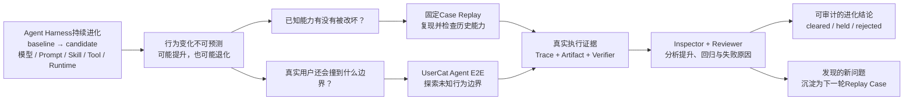

<div align="center">


# Barena

### 面向 Agent Harness 演进的端到端评测与发布门禁

[](https://github.com/fightheyyy/barena)
[](#how-it-works)
[](#quick-start)
[](#runtime-support)
[](https://nodejs.org)
[](https://www.typescriptlang.org/)
[](#current-runtime-boundary)
[](#license)

**当 Agent Harness 持续变化，行为就是最终契约。Barena 负责验证这份契约。**

[产品定位](docs/POSITIONING.md) · [为什么需要 Agent E2E](#why-agent-e2e-testing) · [工作原理](#how-it-works) · [使用场景](#use-cases) · [运行时支持](#runtime-support) · [快速开始](#quick-start) · [能力边界](#boundaries)

</div>

---

> 如果每一次 Agent Harness 变更，都必须先证明它仍能完成真实用户任务呢？

Barena 是一个面向 **Agent Harness 演进**的端到端评测与发布框架。它把模型、Prompt、Role、Skill、工具、记忆、权限和 Runtime 组成的完整 Harness 视为被测系统，通过隔离的 baseline/candidate 运行、Trace、Artifact、Replay、确定性 Verifier 和发布决策，审计每一次具体变更。

这里的 **Harness Evolution** 指所有会改变 Agent 行为的版本化变更，并不等同于 Agent 自主修改自身。v0.1 首先把 Skill 与 Role 变更做成一等评测对象，同时保留同一套 baseline/candidate 发布模型，用于承载后续的模型、Prompt、工具、记忆策略和 Runtime 变更。

权威产品边界记录在 [`docs/POSITIONING.md`](docs/POSITIONING.md)：Barena 要回答的不是“哪个 Agent 排名更高”，而是“一次具体变更是否有效、稳定、没有不可接受的回归，并且可以发布”。第一阶段同时提供 XiaobaOS Role/Skill 原生发布评测，以及面向外部 CLI Agent 的 Portable 确定性验证路径。

当前版本支持 XiaobaOS 0.1.1 与 0.2.0 的原生 Arena 契约；同时通过内置 subprocess adapter 运行 OpenClaw，并通过 `barena.portable_target_*.v1` 接入 Hermes 或自定义 CLI Agent。Portable 运行只声明真实存在的 boundary/workspace/verifier 证据，不伪造目标 Runtime 的原生 Trace 或 evaluator session。

---

<a id="why-agent-e2e-testing"></a>

## 为什么需要 Agent E2E

AI Agent 的行为不再只由代码决定，而是由模型决策、Prompt、Skill、工具调用、记忆、权限、环境状态和外部服务共同涌现。仅仅阅读实现，无法证明系统最终能正确完成用户任务。

每一次模型替换、Prompt 修改、Skill 新增或工具变更，都可能引入静默回归。Barena 把发布信任从“看起来实现正确”转移到“存在可复查的端到端行为证据”。

| 发布前必须回答的问题 | Barena 提供的证据 |
|---|---|
| 哪项 Agent 能力发生了变化？ | Subject manifest、源码路径、Fingerprint |
| 该变更是否允许进入真实执行？ | Skill 静态扫描与 fail-closed preflight |
| Agent 端到端实际做了什么？ | Trace 事件与 Artifact |
| 最终结果是否正确？ | 确定性 Verifier 结果 |
| 行为是否稳定？ | 多次独立 Replay |
| 这次变更是否应该发布？ | `cleared`、`held` 或 `rejected` |

---

<a id="how-it-works"></a>

## 工作原理



Agent Harness 持续变化，一项能力得到提升的同时，另一项能力可能静默退化。Barena 使用两条互补路径让演进过程可审计：

- **固定 Case Replay**：通过可重复的 baseline/candidate 运行保护已知能力。
- **UserCat Agent E2E**：模拟信息不完整、表达模糊和多轮追问的真实用户，探索未知行为边界。

两条路径最终汇聚为持久化执行证据。Inspector 与 Reviewer 分析 Trace、Artifact、Verifier、能力提升、稳定性和回归风险，Barena 再输出发布决策。新发现的问题会成为下一轮固定 Replay 的候选 Case，但主流程图保持单向表达，不把发现问题后的治理流程画成运行时回路。

v0.1 已在受支持的 Runtime Profile 中实现配对 Replay、证据持久化、确定性验证、结果聚合和发布门禁。XiaobaOS 0.1.1 与 0.2.0 将 UserCat、InspectorCat 和 ReviewerCat 作为一条复合原生 Arena Pipeline 提供，而不是三个相互独立的 evaluator `AgentSession`。Portable 运行会把这些阶段标记为 `not_applicable`，不生成虚假的 evaluator Trace，并将仅有边界证据的置信度限制为 `medium`。

Barena 是 Agent Harness 变更的发布门禁，而不是 Benchmark 排行榜。目标不是获得一个漂亮分数，而是反复证明：Candidate 改善了可观察行为，同时没有破坏用户已经依赖的能力。

---

<a id="use-cases"></a>

## Barena 有什么用

下面这些并不是彼此割裂的产品功能。它们都可以归约为同一个问题：**Harness 从 baseline 变成 candidate 后，能不能让真实用户安全地使用？**

| 使用场景 | Baseline → Candidate | Barena 要回答的问题 |
|---|---|---|
| **定制 Skill / Role 交付验收** | 无 Skill 或通用 Role → 客户定制版本 | Skill 是否真的被激活、选对工具并完成任务，而不是等客户差评后才发现问题？ |
| **自进化晋升门禁** | 进化前 Harness → 自动生成的进化补丁 | 这次自进化带来了真实提升，还是应该暂缓或拒绝晋升？ |
| **线上 Badcase 修复回归** | 出现用户投诉的生产版本 → 修复版本 | 历史问题是否被修复，同时没有破坏其他已知能力？ |
| **模型或 Provider 替换** | 原模型 → 新模型、低成本模型或新 Provider | 成本和延迟优化后，任务成功率、工具调用与多轮行为是否退化？ |
| **Prompt / Tool / MCP 契约变更** | 旧 Prompt、工具定义或 Schema → 新版本 | Agent 是否仍能选对工具、填写正确参数，并避免把“说自己调用了工具”当成真实完成？ |
| **Runtime / 框架升级** | 旧 XiaobaOS、OpenClaw、Hermes 或自定义 Harness → 新版本 | 会话、工具调用、异常恢复、Artifact 和结果交付是否仍然成立？ |
| **安全与权限策略调整** | 旧确认/Allowlist/记忆策略 → 新策略 | Candidate 能否阻止危险操作，同时不误伤正常任务？ |
| **跨 Runtime 迁移** | 原 Harness → 新目标 Harness | 同一个 Skill 或工作流换到 XiaobaOS、OpenClaw、Hermes 或自定义 CLI Agent 后是否仍然有效？ |

v0.1 对 **XiaobaOS Skill/Role 配对评测、固定 Case Replay、原生证据留存与发布决策**提供一等支持；OpenClaw、Hermes 和自定义 CLI Agent 通过 Portable Verifier Contract 接入。模型、Prompt、Tool、Policy 和 Runtime 变更共享同一评测模型，但仍需要针对目标 Harness 准备对应的 baseline/candidate 配置、Case 和确定性断言，不能把一张通用分数表当成发布证明。

---

## 使用 SkillsBench 验证 Barena

Barena 使用 SkillsBench 任务验证自己的核心主张：一次具体的 Agent Harness 变更，应当产出可复现的 baseline/candidate 证据，并揭示能力提升、回归和不稳定行为。SkillsBench 提供公开 Case 来源；Barena 在此基础上增加配对执行、Trace 与 Artifact 留存、Replay、确定性验证和发布决策。

XiaobaOS 验证包把一个固定版本的 SkillsBench `dialogue-parser` 任务投影到上述两条评测路径：

| 评测路径 | Case | 验证问题 |
|---|---|---|
| 固定 Case Replay | 明确给出适配后的图结构要求 | Candidate 能否稳定复现并保护一项已知能力？ |
| UserCat Agent E2E | 信息不足的请求、一次自适应追问机会、相同隐藏 Oracle | 当真实用户表达不完整时，Candidate 能否通过交互恢复并完成目标？ |

两个 Case 都比较同一个 XiaobaOS Role 在“不加载”与“加载”候选 `dialogue-graph` Skill 时的表现。它们保留上游 Revision 与任务哈希，使用相同 Workspace Fixture，并通过 Barena 可信的结构化 Artifact 断言验证结果图。由于该校准不会执行被测 Skill 自带的 Verifier 代码，因此明确排除了上游的可执行 Parser 要求。完整方法见 [XiaobaOS 验证协议](calibration/skillsbench/dialogue-graph-mini/VALIDATION.md)。

仓库已经通过确定性契约测试验证了 Case 投影与配对编排。一个本地增量 XiaobaOS Audit Contract 补丁也通过了 Barena Preflight，并携带原生 Trace、Arena Stage、Verifier、脱敏、清理和物理调用证据到达真实 Provider 边界。该次运行在 Candidate Arm 开始前因本地 OAuth 过期而 fail-closed（`401`；目标 Trace 报告 Prompt/Completion Token 均为零；Billing Usage 不可用；零重试），因此它**不能证明线上能力提升**。在完整 baseline/candidate 结果发布前，这只是 **SkillsBench-derived Barena calibration**，不是 SkillsBench 官方成绩，也不是已经完成的有效性结论。

---

<a id="runtime-support"></a>

## Runtime 支持

Barena 提供两种边界清晰的证据 Profile：

- `xiaobaos_native`：XiaobaOS Role/Skill 配对评测，保留原生 Arena 证据。
- `portable_verifier`：通过 OpenClaw 内置 Adapter 或 Hermes/自定义 JSON Driver，保留 Boundary、Workspace 和 Verifier 证据。

Portable 路径可以产生真实发布结论，但证据强度低于 XiaobaOS 原生路径。报告会明确记录 `evaluation_mode=portable_verifier`、`evidence_profile=boundary_verified`、`target_native_trace=false` 和 `isolation=policy_only`。Driver 声称完成任务，不能绕过 Barena 的确定性 Verifier。

OpenClaw 已有内置 Adapter。当前版本的 Hermes 支持是 Driver Contract 兼容；仓库自带的 Driver 是离线协议示例，不代表已经完成 Hermes 原生或线上验证。

已发布的 XiaobaOS 0.2.0 与 Barena 的原生 Probe 和 Artifact Contract 兼容，但尚未包含付费/线上评测要求的 `arena live-contract --json` 能力和权威物理 Provider 调用遥测。因此，Barena 会在任一 Arm 开始前将未打补丁的安装判定为 `held`。增量 Audit Contract 补丁已在本地触达真实 Provider 请求，但不会被包装成 XiaobaOS 已发布能力。

---

## 当前可以评测什么

| 评测对象 | 状态 | 说明 |
|---|---:|---|
| 本地 `SKILL.md` 目录 | 已支持 | Import、Scan、Run、Replay、Report |
| GitHub Skill 仓库 | 已支持 | 仅 Clone 与 Scan；不运行安装脚本 |
| 内置 Agent Target Profile | 已支持 | `opencode`、`xiaoba`、`hermes`、`openclaw` |
| XiaobaOS Skill 有效性 | 原生契约 | 同一不可变 Role：`role` baseline 对比 `role_skill` candidate；未打补丁的 0.2.0 会在付费执行前被 `held` |
| XiaobaOS Role 有效性 | 原生契约 | 固定 Case 下显式 baseline Role 对比 candidate Role；未打补丁的 0.2.0 会在付费执行前被 `held` |
| XiaobaOS 原生 Trace Package | 已支持 | Session-log-v3 Trace、Arena Stage、Artifact、Verifier、Hash |
| OpenClaw Portable Adapter | 已支持 | 本地 JSON CLI、Skill Eligibility、Boundary/Workspace/Verifier 证据 |
| Hermes/自定义 Portable Driver | 契约已支持 | 严格 JSON Driver；不声称原生或线上 Hermes 验证 |
| 可复用 Portable E2E Case | 已支持 | Task、Fixture、Assertion、Replay Control、Timeout |
| 三个独立 Evaluator AgentSession | 不声称 | XiaobaOS 为复合 Stage；Portable 路径不适用 |
| 跨版本回归报告 | 计划中 | 比较不同版本的 Pass、Fail 与 Flaky 行为 |

---

## MVP1

Barena MVP1 是一个基于 TypeScript 的 CLI/TUI，用确定性 Verifier 支撑 Agent Harness 变更的发布评测；Skill 与 Role 是第一批一等评测对象。

| 模块 | 能力 |
|---|---|
| Import | 本地 Skill、GitHub Skill 仓库、内置 Agent Target |
| Safety | Runtime 执行前静态扫描 |
| Runtime | `runs/<run-id>/` 下的独立运行目录 |
| Review | UserCat、InspectorCat、ReviewerCat 契约 |
| Stability | 带 Trace 引用的多次 Replay |
| Verification | 可选 Verifier Command |
| Output | JSON Scorecard 与 Markdown Report |
| Decisions | `cleared`、`held`、`rejected` |
| Statuses | `pass`、`unstable`、`reopened`、`blocked`、`unsafe` |
| XiaobaOS Skill Release | 同 Role baseline/candidate 配对与原生激活证明 |
| XiaobaOS Role Release | 显式 Role baseline/candidate 配对 |
| UI | 引导式 Import/Setup CLI，以及用于评测、结果和 Trace 检查的键盘 TUI |

---

<a id="quick-start"></a>

## 快速开始

先初始化一个项目级 Agent Profile，再使用持久化的 Target、运行次数、Run Directory 和固定 Starter Suite 发起评测：

```bash
barena init --target openclaw \
  --provider openai \
  --model <model-id> \
  --api-key-env OPENAI_API_KEY

barena doctor
barena eval skill ./my-skill
```

该命令会写入 `.barena/config.json`，其中只保存 Target 设置和**环境变量名称**。Barena 不会把 API Key 或 Base URL 的值写入 Config、Doctor 输出、Case 或 Report。如果目标 Agent 已经管理 OAuth 或 Provider 配置，可以省略 Provider Flags；Doctor 会把认证方式标记为 Target-managed。

`barena eval` 是 `barena evaluate` 的别名。显式 Flags 始终覆盖项目默认值。默认 Suite 为 `skillsbench:starter`，目前包含一个固定版本、由 SkillsBench 衍生的 Dialogue Graph 校准任务。它用于证明安装和集成链路，不是大规模或官方 SkillsBench 成绩。

要配置其他 CLI Agent，请让 Barena 指向一个符合严格协议的 Portable JSON Driver：

```bash
barena init --target my-agent \
  --target-command ./my-agent-driver \
  --provider openai \
  --model <model-id> \
  --api-key-env MY_AGENT_API_KEY

barena doctor --target my-agent
barena eval skill ./my-skill
```

Provider 调用由目标 Agent 自己负责。Portable 评测使用确定性的 Artifact/Final State 验证，不要求额外调用第二个 Judge API。UserCat、InspectorCat 和 ReviewerCat 是 XiaobaOS 原生的复合 Evaluator Stage，不会在每次 Portable 运行中偷偷启动额外 Agent。

需要交互式导入和配置时，使用：

```bash
barena guide
```

在交互式终端中直接运行不带参数的 `barena`，也会打开相同引导。它依次询问 Skill 来源、目标 Agent、E2E Case 和每个 Arm 的运行次数；在修改任何内容前，会解释 baseline/candidate 对比、Evidence Profile、Snapshot 位置和可复现的自动化命令。准备评测与开始模型/付费执行需要分别确认。

如果 Skill 和 E2E Case 已经在本地，可以直接打开键盘工作区：

```bash
barena tui
```

TUI 会引导完成 XiaobaOS Skill/Role、OpenClaw Skill 和 Hermes/自定义 Portable Driver 评测。界面会展示当前步骤、每个必填项的示例、目标 Session 总数和证据边界，并在模型执行前单独要求输入 `y` 确认。验证失败时会返回对应步骤并保留已有输入。仍需导入/Snapshot Skill 或创建 Starter Case 时，使用 `barena guide`。

Guide 支持三种 Skill 来源：

- 包含 `SKILL.md` 的本地目录。
- `owner/repo` 或 URL 形式的 GitHub 仓库。Barena 只 Clone 并 Snapshot，不运行安装脚本或任意仓库代码。
- 已经下载到本地的 SkillHub 或其他目录型 Skill。选择 Downloaded Directory 并指向本地目录；当前版本不声称直接接入 SkillHub API。

Snapshot 目录不能包含 Source Skill 目录，也不能位于 Source Skill 目录内部。如果评测当前工作目录，请选择外部 Snapshot Root，例如 `barena guide --subjects-root ../barena-subjects`。

根据所需证据强度选择 Agent：

| Agent 路径 | 当前支持情况 | 证据边界 |
|---|---|---|
| XiaobaOS 0.1.1 / 0.2.0 | 原生 Arena 集成 | 最高证据路径：原生 Trace、Arena Stage 与 Barena Verifier |
| OpenClaw | 内置 Portable Adapter | Boundary/Workspace/Verifier 证据；无原生 Trace；置信度最高为 Medium |
| Hermes 或其他 CLI Agent | Portable JSON Driver Contract | 仅保证 Driver 兼容；不声称 Hermes 原生/线上验证 |

真实发布决策应使用包含任务专属 Fixture 和确定性 Assertion 的 Case。Guide 可以创建最小 Starter Case，帮助理解 Schema 并完成首次运行，但该模板只是上手脚手架，不能证明 Case 已覆盖真实行为、回归、对抗输入或生产质量。

从源码 Checkout 开发 CLI：

```bash
npm ci
npm run build
npm link
barena guide
```

评测 OpenClaw Skill，以不加载 Skill 为 baseline、加载候选 Skill 为 candidate：

```bash
barena evaluate skill ./my-skill \
  --target openclaw \
  --case ./my-openclaw-case.json \
  --attempts 3
```

不编写 Case 文件，直接使用仓库内置的 SkillsBench-derived Starter Suite：

```bash
barena list suites
barena eval skill ./my-skill \
  --target openclaw \
  --suite skillsbench:starter \
  --attempts 3
```

通过 Hermes-compatible Portable Driver 评测同一组 baseline/candidate：

```bash
barena evaluate skill ./my-skill \
  --target hermes \
  --target-command ./my-hermes-driver \
  --case ./my-portable-case.json \
  --attempts 3
```

Portable Case 必须使用 `target.adapter=portable`，并让 `target.runtime` 与 `--target` 匹配（上述示例为 `hermes`）。接入真实 Hermes 或自定义 CLI Agent 时，复制 `examples/portable-driver.mjs`，保留 Probe/Request/Result Schema，然后把确定性 Artifact 写入替换为真实 Target 调用。Driver 完成任务不能绕过 Barena Verifier。

在 CI 中运行 XiaobaOS 原生 Skill 评测：

```bash
barena evaluate skill ./my-skill \
  --target xiaobaos \
  --role engineer-cat \
  --case ./xiaoba-native-case.json \
  --attempts 3 \
  --live-policy ./live-policy.json
```

只有已安装的 XiaobaOS Runtime 能证明满足 Barena Live Safety Contract 时，该命令才会开始模型执行。未打补丁的 XiaobaOS 0.2.0 会在付费执行前返回 `held`；如果只想在无凭证环境验证 Barena 的可安装链路，请使用下方 Portable 离线示例。

使用订阅制 XiaobaOS Provider 时，复制打包的 Policy Template，设置 Provider 环境变量，将所有 `REPLACE_*` 替换为当前可核验数据；只有确认订阅额度后才能设置 `hard_limit.verified=true`，并在允许任一 Arm 调用模型前先运行 Preflight：

```bash
cp ./examples/xiaoba-subscription-live-policy.template.json ./live-policy.json

export XIAOBA_LLM_API_KEY='<credential>'
export XIAOBA_LLM_API_BASE='https://your-provider.example/v1'

barena evaluate skill ./my-skill \
  --target xiaobaos \
  --role engineer-cat \
  --case ./xiaoba-native-case.json \
  --attempts 1 \
  --live-policy ./live-policy.json \
  --preflight-only
```

`billing_mode=subscription` 不声明按 Token 单价，因此使用零美元记账；但仍要求近期订阅权益证据，以及可强制执行的调用次数、输入 Token、输出 Token、Provider/Model、遥测和零重试边界。按量付费 API 用户必须提供有来源的正数 Token 价格与经过验证的 Provider 侧 Hard Limit。Barena 只持久化环境变量名称和脱敏证据，不保存凭证值。

推荐对外使用 Target 名称 `xiaobaos`；`xiaoba` 继续作为兼容别名，可执行文件仍为 `xiaoba`。内置 SkillsBench-derived Calibration Pack 可以通过相同原生路径运行：`--case-pack calibration/skillsbench/dialogue-graph-mini/case-pack.json`。它是 **SkillsBench-derived Barena calibration**，不是 SkillsBench 或 BenchFlow 官方结果。

要在没有模型凭证的情况下验证可安装 Portable Protocol，请构建 Tarball，并在干净 Consumer Directory 中运行内置离线 Driver：

```bash
# 在 Barena 发布 Checkout 中
npm pack

# 在干净 Consumer Directory 中
mkdir barena-smoke && cd barena-smoke
npm init -y
npm install /absolute/path/to/barena-0.1.0.tgz

npx barena e2e probe \
  --target hermes \
  --target-command ./node_modules/barena/examples/portable-driver.mjs

npx barena e2e run \
  ./node_modules/barena/examples/portable-case.json \
  --target-command ./node_modules/barena/examples/portable-driver.mjs
```

`barena@0.1.0` 发布后，安装命令将变为 `npm install barena`。内置 Driver 是确定性离线实现。成功运行返回退出码 `0`、`decision=cleared`、`evaluation_mode=portable_verifier` 和 `evidence_profile=boundary_verified`。这证明可安装协议与证据链路成立，不代表真实 Hermes Benchmark。

缺少 Binary、协议不兼容、凭证缺失、激活证据缺失、Trace 缺失、Verifier 证据缺失或 Sandbox 证据缺失时，Barena 会产生 `held`/blocked，而不是模拟成功。不安全的 Target 结果会产生 `rejected`，并返回退出码 `2`。

---

## 内置 Agent Target

```bash
barena list targets
barena import agent opencode --id opencode-ci
barena run opencode-ci --replays 1
```

| Target | 定位 |
|---|---|
| `opencode` | Coding Agent 与代码任务 CI |
| `xiaoba` / 对外别名 `xiaobaos` | 原生 Role/Skill Arena 评测 |
| `hermes` | Portable JSON Driver Contract；不声称原生/线上验证 |
| `openclaw` | 内置 Portable Local JSON Adapter |

---

## 命令参考

```text
barena
barena init --target <xiaobaos|openclaw|custom-id> [--target-command ./driver] [--provider id --model id --api-key-env ENV_NAME]
barena config show
barena config path
barena guide
barena eval skill <path> [--suite skillsbench:starter]
barena evaluate skill <path> --target xiaobaos --role <role-id> (--case <native-case.json> | --case-pack <pack.json>) --live-policy <policy.json> [--attempts 2] [--preflight-only]
barena evaluate role <candidate-role-id> --baseline-role <role-id> (--case <native-case.json> | --case-pack <pack.json>) --live-policy <policy.json> [--attempts 2] [--preflight-only]
barena evaluate skill <path> --target openclaw --case <agent-case.json> [--attempts 2]
barena evaluate skill <path> --target hermes --target-command ./driver --case <portable-case.json> [--attempts 2]
barena import skill <path>
barena import github <owner/repo|url>
barena import agent <opencode|xiaoba|hermes|openclaw>
barena scan <subject-id>
barena run <subject-id> [--replays 3] [--verifier path]
barena e2e probe [--target xiaobaos|openclaw|hermes] [--target-command ./driver]
barena e2e run <case.json> [--target-command ./driver] [--runs-root runs]
barena scorecard <run-id>
barena report <run-id> [--format markdown|json]
barena list subjects
barena list runs
barena list targets
barena list suites
barena tui [--snapshot] [--color|--no-color]
barena doctor [--target <id>]
```

---

## Run Package 证据目录

XiaobaOS 原生能力评测：

```text
runs/<xiaoba-skill-or-role-eval-id>/
  evaluation-request.json
  capability-evaluation.json
  arms/<baseline|candidate>/<case-id>/attempt-<n>/
    request-manifest.json
    xiaoba-project/arena/runs/<unique-run-id>/
      clean-runtime.json
      arena-runner.json
      arena-scorecard.json
      arena-run.json
      workspace/logs/sessions/**/traces.jsonl
    verifier/artifact-assertions.json
    traces/boundary.ndjson
    evidence/evidence-manifest.json
    evidence/<boundary|native|evaluator|verifier|debug>/...
  reports/report.json
  reports/report.md
```

每份被接受的证据副本都会写入 Hash。每次 Barena Attempt 拥有独立 XiaobaOS Run ID 和 Workspace；XiaobaOS 内部 Replay 是额外证据，不能替代 Barena 的独立 Attempt。

OpenClaw Skill Portable 评测：

```text
runs/<skill-eval-id>/
  evaluation-request.json
  skill-evaluation.json
  arms/baseline/<case-id>/<agent-e2e-run-id>/...
  arms/candidate/<case-id>/<agent-e2e-run-id>/...
  reports/report.json
  reports/report.md
```

每个 Arm 都包含下方 Agent E2E Package。Candidate Workspace 只加载被选中的 Skill；Baseline Workspace 使用空 Skill Allowlist。

```text
runs/<run-id>/
  run-manifest.json
  workspace/
  scan/scan-report.json
  traces/trace.ndjson
  artifacts/
  inspector/issues.json
  replays/replay-*/trace.ndjson
  verifier/verifier-results.json
  reviewer/scorecard.json
  reports/report.json
  reports/report.md
```

Agent E2E Run 使用独立证据布局：

```text
runs/<agent-e2e-run-id>/
  case.json
  workspace/
  traces/boundary.ndjson
  traces/evaluators/*.ndjson
  traces/native/                 # optional, never inferred
  replays/replay-*/boundary.ndjson
  verifier/artifact-assertions.json
  reviewer/scorecard.json
  reports/report.json
  reports/report.md
```

---

## 将 Barena 作为 Skill 使用

Barena 也可以被封装成面向 Agent 的 Clearance Skill。在这种形态下，Skill 告诉 Agent 何时调用 Barena、如何解释 Scorecard，以及何时拒绝自我晋升；CLI 仍然是实际证据引擎。

目标行为如下：

```text
skill / role / tool / prompt / runtime change
  -> Barena clearance
  -> trusted only when evidence says cleared/pass
```

---

<a id="current-runtime-boundary"></a>

## 当前 Runtime 边界

最高证据路径通过已安装的 `xiaoba` 可执行文件，调用 XiaobaOS 0.1.1 或 0.2.0 的精确原生 Arena Contract：

```text
evaluation mode: xiaobaos_native
target runtime: XiaobaOS native Arena
Skill pair: same Role fingerprint, role vs role_skill
Role pair: explicit baseline Role vs candidate Role
evidence: native AgentSession trace + Arena stages + Barena verifier
sandbox: enforced workspace-write proof required
evaluator stages: composite XiaobaOS stages, not three independent AgentSessions
network disabled: declared policy, not claimed as a hard network boundary
```

原有确定性 Clearance 路径为兼容性而保留：

```text
provider: barena-deterministic
adapter: xiaoba-compatible
xiaoba_invoked: false
```

该 Legacy 路径**不会**调用 XiaobaOS 或 `AgentSession`。

外部 CLI Agent 使用 Portable Verifier Profile：

```text
evaluation_mode: portable_verifier
evidence_profile: boundary_verified
evaluator stages: not_applicable
target_native_trace: false
isolation: policy_only
confidence: at most medium
decision: cleared | held | rejected from Barena verifier evidence
```

Portable Profile 不声称拥有 XiaobaOS Evaluator Clearance、Hermes/OpenClaw 原生 Trace、硬进程/网络隔离或隐藏推理可见性。未来可以通过 External Evaluator Seam 增加更强证据，而不改变现有 Portable Contract。

---

<a id="boundaries"></a>

## 能力边界

Barena 不是：

- 完整的恶意软件检测器。
- 托管式 Benchmark 排行榜。
- 自动操作生产环境的发布系统。
- 单元测试、代码审查或 Runtime Sandbox 的替代品。

Barena 补充的是 Agent 发布越来越依赖的端到端行为证据。

本仓库不会复制 XiaobaOS 的 Dashboard、Electron、Pet、飞书、微信、Output Log 或 Secret 等产品面。XiaobaOS Native 归一化代码位于 `src/evaluation`；Portable Evaluator 与 Target 集成位于 `src/evaluators` 和 `src/targets`。

## License

Apache-2.0.
