<div align="center">


# Barena

### End-to-end testing and release CI for AI agents

[](https://github.com/fightheyyy/barena)
[](#how-it-works)
[](#quick-start)
[](#runtime-support)
[](https://nodejs.org)
[](https://www.typescriptlang.org/)
[](#current-runtime-boundary)
[](#license)

**When code becomes a black box, behavior becomes the contract. Barena tests the contract.**

[Positioning](docs/POSITIONING.md) · [Why Agent E2E](#why-agent-e2e-testing) · [How It Works](#how-it-works) · [Runtime Support](#runtime-support) · [Quick Start](#quick-start) · [Boundaries](#boundaries)

</div>

---

> What if every agent release had to prove it could still complete real user tasks?

Barena is an open-source end-to-end testing and release CI project for AI agents. It treats the agent system — model, prompt, skills, tools, memory, and runtime — as a black box, then evaluates observable behavior with clean runs, traces, artifacts, replay evidence, verifiers, and release decisions.

The authoritative product scope is locked in [`docs/POSITIONING.md`](docs/POSITIONING.md): Barena evaluates whether a concrete Agent change is effective, stable, regression-free, and ready to ship. Phase 1 combines native XiaobaOS Role/Skill release CI with a portable deterministic verifier for external CLI agents.

The current release supports exact XiaobaOS 0.1.1 and 0.2.0 native Arena contracts. It also runs OpenClaw through a built-in subprocess adapter and Hermes/custom CLI agents through `barena.portable_target_*.v1`. Portable runs preserve honest boundary/workspace/verifier evidence and never fabricate native traces or evaluator sessions.

---

## Why Agent E2E Testing

An AI agent's behavior is no longer defined by code alone. It emerges from model decisions, prompts, skills, tool calls, memory, permissions, environment state, and external services. Reading the implementation cannot prove that the system will finish the user's job correctly.

Every model swap, prompt edit, new skill, or tool change can introduce a silent regression. Barena moves trust from implementation inspection to end-to-end behavioral evidence.

| Release question | Barena evidence |
|---|---|
| What agent capability changed? | Subject manifest, source path, fingerprint |
| Is it safe enough to run? | Static scan findings |
| What happened end to end? | Trace events and artifacts |
| Did it produce the correct outcome? | Verifier result |
| Is the behavior stable? | Replay attempts |
| Should this release be trusted? | `cleared`, `held`, or `rejected` |

---

## How It Works

```mermaid
flowchart LR
    subgraph Input["1) Release Change"]
        direction TB
        Cases["E2E cases"]
        Baseline["baseline<br/>Role or Skill"]
        Candidate["candidate<br/>Role or Skill"]
    end

    subgraph Orchestrator["2) Barena Orchestrator"]
        direction TB
        Preflight["fail-closed preflight<br/>blocked means held"]
        BaseRuns["fresh baseline attempts"]
        CandidateRuns["fresh candidate attempts"]
        Preflight --> BaseRuns
        Preflight --> CandidateRuns
    end

    subgraph Runtime["3) Runtime Profile"]
        direction TB
        Native["XiaobaOS native Arena<br/>native trace + stages"]
        Portable["OpenClaw / JSON driver<br/>boundary observation"]
        Artifacts["artifacts + final state"]
        Native --> Artifacts
        Portable --> Artifacts
    end

    subgraph Evidence["4) Barena Evidence"]
        direction TB
        RuntimeEvidence["native or boundary evidence<br/>profile stays explicit"]
        Verifier["artifact verifier"]
        Package["validated + hash-stamped<br/>evidence package"]
        RuntimeEvidence --> Package
        Verifier --> Package
    end

    subgraph Gate["5) Paired Release Gate"]
        direction TB
        Aggregate["truth + lift<br/>stability + regressions"]
        Decision["cleared / held / rejected"]
        Aggregate --> Decision
    end

    Cases --> Preflight
    Baseline --> BaseRuns
    Candidate --> CandidateRuns
    BaseRuns --> Native
    CandidateRuns --> Native
    BaseRuns --> Portable
    CandidateRuns --> Portable
    Native --> RuntimeEvidence
    Portable --> RuntimeEvidence
    Artifacts --> Verifier
    Package --> Aggregate
```



The native path uses XiaobaOS trace and Arena-stage evidence. The portable path uses only Barena-observed input, process output, runtime status, workspace changes, and deterministic verifier results. Both paths aggregate baseline/candidate attempts into truth, observed lift, stability, regressions, and the final release decision.

XiaobaOS 0.1.1 and 0.2.0 run UserCat, InspectorCat, and ReviewerCat as a composite native Arena pipeline—not three independent evaluator `AgentSession`s. Portable runs mark those stages `not_applicable`, emit no evaluator traces, and cap boundary-only confidence at `medium`.

Barena is a release gate, not a benchmark leaderboard. The goal is not one impressive score; it is repeatable proof that an agent capability can cross a trust boundary without breaking expected behavior.

---

## Runtime Support

Barena ships two explicit evidence profiles:

- `xiaobaos_native`: XiaobaOS Role/Skill paired evaluation with native Arena evidence.
- `portable_verifier`: OpenClaw built-in adapter or Hermes/custom JSON driver, with boundary/workspace/verifier evidence.

Portable clearance is real but lower-evidence than XiaobaOS native clearance. Reports explicitly record `evaluation_mode=portable_verifier`, `evidence_profile=boundary_verified`, `target_native_trace=false`, and `isolation=policy_only`. Driver completion never bypasses Barena's deterministic verifier.

OpenClaw has a built-in adapter. Hermes is driver-compatible in this release; the bundled driver is an offline conformance example, not a claim of native/live Hermes validation.

Stock XiaobaOS 0.2.0 is compatible with Barena's native probe and artifact contracts, but it does not yet expose the `arena live-contract --json` capability or authoritative physical provider-call telemetry required for paid/live evaluation. Barena fails closed with `live_runtime_contract_unsupported` before either arm starts. The repository's fake live target exercises a future additive contract; it is not evidence that stock XiaobaOS is live-ready.

---

## What Barena Clears

| Subject | Status | Notes |
|---|---:|---|
| Local `SKILL.md` directory | Supported | Import, scan, run, replay, report |
| GitHub skill repository | Supported | Clone-and-scan only; no install scripts |
| Built-in agent target profile | Supported | `opencode`, `xiaoba`, `hermes`, `openclaw` |
| XiaobaOS Skill effectiveness | Native contract | Same immutable Role: `role` baseline vs `role_skill` candidate; stock 0.2.0 live runs are held before paid execution |
| XiaobaOS Role effectiveness | Native contract | Explicit baseline Role vs candidate Role under pinned cases; stock 0.2.0 live runs are held before paid execution |
| XiaobaOS native trace package | Supported | Session-log-v3 traces, Arena stages, artifacts, verifier, hashes |
| OpenClaw portable adapter | Supported | Local JSON CLI, Skill eligibility, boundary/workspace/verifier evidence |
| Hermes/custom portable driver | Supported contract | Strict JSON driver; native/live Hermes validation is not claimed |
| Reusable portable E2E case | Supported | Task, fixtures, assertions, replay controls, timeout |
| Three independent evaluator AgentSessions | Not claimed | XiaobaOS stages are composite; portable stages are not applicable |
| Cross-version regression report | Coming soon | Compare pass, fail, and flaky behavior between releases |

---

## MVP1

Barena MVP1 is a TypeScript CLI/TUI for verifier-backed release evaluation of open-source Agent capabilities.

| Area | Capability |
|---|---|
| Import | Local skills, GitHub skill repositories, built-in agent targets |
| Safety | Static scan before runtime execution |
| Runtime | Clean run directories under `runs/<run-id>/` |
| Review | UserCat, InspectorCat, ReviewerCat contracts |
| Stability | Replay attempts with trace refs |
| Verification | Optional verifier command |
| Output | JSON scorecards and Markdown reports |
| Decisions | `cleared`, `held`, `rejected` |
| Statuses | `pass`, `unstable`, `reopened`, `blocked`, `unsafe` |
| XiaobaOS Skill release | Same-Role baseline/candidate pairing with native activation proof |
| XiaobaOS Role release | Explicit Role baseline/candidate pairing |
| UI | Guided import/setup CLI plus a keyboard TUI for local evaluation, results, and traces |

---

## Quick Start

Initialize one project-scoped Agent profile, then evaluate with the stored target, attempts, run directory, and pinned starter suite:

```bash
barena init --target openclaw \
  --provider openai \
  --model <model-id> \
  --api-key-env OPENAI_API_KEY

barena doctor
barena eval skill ./my-skill
```

This writes `.barena/config.json` with target settings and **environment-variable names only**. Barena never writes API-key or base-URL values into the config, doctor output, case, or report. If the target Agent already owns OAuth or provider configuration, omit the provider flags; doctor reports that authentication as target-managed.

`barena eval` is an alias for `barena evaluate`. Explicit flags always override project defaults. The default suite is `skillsbench:starter`, currently one pinned SkillsBench-derived dialogue-graph calibration task. It is an onboarding and integration proof, not a broad or official SkillsBench score.

To configure another CLI Agent, point Barena at a strict portable JSON driver:

```bash
barena init --target my-agent \
  --target-command ./my-agent-driver \
  --provider openai \
  --model <model-id> \
  --api-key-env MY_AGENT_API_KEY

barena doctor --target my-agent
barena eval skill ./my-skill
```

The target Agent owns its provider call. Portable evaluation uses deterministic artifact/final-state verification and does not require a second Judge API. UserCat, InspectorCat, and ReviewerCat are XiaobaOS-native composite evaluator stages, not hidden extra Agents started for every portable run.

For an interactive import/setup flow instead, start with:

```bash
barena guide
```

Running `barena` with no arguments in an interactive terminal opens the same guide. It asks for the Skill source, target Agent, E2E case, and attempts per arm; then it explains the baseline/candidate comparison, evidence profile, snapshot destination, and exact automation command before changing anything. Preparing the evaluation and starting model or paid execution require separate confirmations.

If the Skill and E2E case already exist locally, open the keyboard workspace instead:

```bash
barena tui
```

The TUI walks through XiaobaOS Skill/Role, OpenClaw Skill, and Hermes/custom portable-driver evaluation. It shows the current workflow step, examples for every required input, total target sessions, evidence limits, and a separate `y` confirmation before model-backed execution. Validation failures return to the relevant step with previous inputs preserved. Use `barena guide` when you still need to import/snapshot a Skill or create a starter case.

The guide accepts three Skill sources:

- A local directory containing `SKILL.md`.
- A GitHub repository as `owner/repo` or a URL. Barena clones and snapshots it; it does not run install scripts or arbitrary repository code.
- A SkillHub or other catalog Skill that you have already downloaded. Select the downloaded-directory option and point Barena at the local folder. This release does not claim direct SkillHub API integration.

The snapshot directory must not contain, or be contained by, the source Skill directory. If you are evaluating the current working directory, choose an external snapshot root, for example `barena guide --subjects-root ../barena-subjects`.

Choose the Agent according to the evidence you need:

| Agent path | Current support | Evidence boundary |
|---|---|---|
| XiaobaOS 0.1.1 / 0.2.0 | Native Arena integration | Highest-evidence path: native trace and Arena stages plus Barena verifier |
| OpenClaw | Built-in portable adapter | Boundary/workspace/verifier evidence; no native trace; confidence capped at medium |
| Hermes or another CLI Agent | Portable JSON driver contract | Driver-compatible only; native/live Hermes validation is not claimed |

For a real release decision, use an existing case with task-specific fixtures and deterministic assertions. The guide can create a minimal starter case to teach the schema and complete the first run, but that template is only onboarding scaffolding. It is not evidence that the case covers realistic behavior, regressions, adversarial inputs, or production quality.

For CLI development from this source checkout:

```bash
npm ci
npm run build
npm link
barena guide
```

Evaluate an OpenClaw Skill as a no-Skill baseline versus the candidate Skill:

```bash
barena evaluate skill ./my-skill \
  --target openclaw \
  --case ./my-openclaw-case.json \
  --attempts 3
```

Use the bundled SkillsBench-derived starter suite without writing a case file:

```bash
barena list suites
barena eval skill ./my-skill \
  --target openclaw \
  --suite skillsbench:starter \
  --attempts 3
```

Evaluate the same pair through a Hermes-compatible portable driver:

```bash
barena evaluate skill ./my-skill \
  --target hermes \
  --target-command ./my-hermes-driver \
  --case ./my-portable-case.json \
  --attempts 3
```

The portable case must use `target.adapter=portable` and a `target.runtime` matching `--target` (`hermes` above). To integrate a real Hermes or custom CLI Agent, copy `examples/portable-driver.mjs`, preserve the probe/request/result schemas, and replace the deterministic artifact write with the real target invocation. Driver completion never bypasses Barena's verifier.

Run XiaobaOS native Skill evaluation for CI:

```bash
barena evaluate skill ./my-skill \
  --target xiaobaos \
  --role engineer-cat \
  --case ./xiaoba-native-case.json \
  --attempts 3 \
  --live-policy ./live-policy.json
```

This command starts model execution only when the installed XiaobaOS runtime proves Barena's live safety contract. Stock XiaobaOS 0.2.0 currently returns a held result before paid execution; use the portable offline example below to verify the installable Barena path without credentials.

`xiaobaos` is the recommended public target name; `xiaoba` remains a compatibility alias, and the executable remains `xiaoba`. The bundled SkillsBench-derived calibration pack can use the same native path with `--case-pack calibration/skillsbench/dialogue-graph-mini/case-pack.json`. It is a **SkillsBench-derived Barena calibration**, not an official SkillsBench or BenchFlow result.

To verify the installable portable protocol without model credentials, build a tarball and run the bundled offline driver in a clean consumer directory:

```bash
# In the Barena release checkout
npm pack

# In a clean consumer directory
mkdir barena-smoke && cd barena-smoke
npm init -y
npm install /absolute/path/to/barena-0.1.0.tgz

npx barena e2e probe \
  --target hermes \
  --target-command ./node_modules/barena/examples/portable-driver.mjs

npx barena e2e run \
  ./node_modules/barena/examples/portable-case.json \
  --target-command ./node_modules/barena/examples/portable-driver.mjs
```

After `barena@0.1.0` is published, the install line becomes `npm install barena`. The bundled driver is deterministic and offline. A successful run returns exit `0`, `decision=cleared`, `evaluation_mode=portable_verifier`, and `evidence_profile=boundary_verified`. It proves the installable protocol and evidence path; it is not a live Hermes benchmark.

Missing binaries, incompatible protocols, credentials, activation evidence, traces, verifier evidence, or sandbox evidence produce `held`/blocked—not simulated success. Unsafe target outcomes produce `rejected` and exit `2`.

---

## Built-In Agent Targets

```bash
barena list targets
barena import agent opencode --id opencode-ci
barena run opencode-ci --replays 1
```

| Target | Focus |
|---|---|
| `opencode` | Coding agent and code-task CI |
| `xiaoba` / public alias `xiaobaos` | Native Role/Skill Arena evaluation |
| `hermes` | Portable JSON driver contract; native/live validation not claimed |
| `openclaw` | Built-in portable local JSON adapter |

---

## Commands

```text
barena
barena init --target <xiaobaos|openclaw|custom-id> [--target-command ./driver] [--provider id --model id --api-key-env ENV_NAME]
barena config show
barena config path
barena guide
barena eval skill <path> [--suite skillsbench:starter]
barena evaluate skill <path> --target xiaobaos --role <role-id> (--case <native-case.json> | --case-pack <pack.json>) --live-policy <policy.json> [--attempts 2] [--preflight-only]
barena evaluate role <candidate-role-id> --baseline-role <role-id> (--case <native-case.json> | --case-pack <pack.json>) --live-policy <policy.json> [--attempts 2] [--preflight-only]
barena evaluate skill <path> --target openclaw --case <agent-case.json> [--attempts 2]
barena evaluate skill <path> --target hermes --target-command ./driver --case <portable-case.json> [--attempts 2]
barena import skill <path>
barena import github <owner/repo|url>
barena import agent <opencode|xiaoba|hermes|openclaw>
barena scan <subject-id>
barena run <subject-id> [--replays 3] [--verifier path]
barena e2e probe [--target xiaobaos|openclaw|hermes] [--target-command ./driver]
barena e2e run <case.json> [--target-command ./driver] [--runs-root runs]
barena scorecard <run-id>
barena report <run-id> [--format markdown|json]
barena list subjects
barena list runs
barena list targets
barena list suites
barena tui [--snapshot] [--color|--no-color]
barena doctor [--target <id>]
```

---

## Run Package

XiaobaOS native capability evaluation:

```text
runs/<xiaoba-skill-or-role-eval-id>/
  evaluation-request.json
  capability-evaluation.json
  arms/<baseline|candidate>/<case-id>/attempt-<n>/
    request-manifest.json
    xiaoba-project/arena/runs/<unique-run-id>/
      clean-runtime.json
      arena-runner.json
      arena-scorecard.json
      arena-run.json
      workspace/logs/sessions/**/traces.jsonl
    verifier/artifact-assertions.json
    traces/boundary.ndjson
    evidence/evidence-manifest.json
    evidence/<boundary|native|evaluator|verifier|debug>/...
  reports/report.json
  reports/report.md
```

Every accepted evidence copy is hash-stamped. Each Barena attempt owns a distinct XiaobaOS run ID and workspace; XiaobaOS internal replay is additional evidence, not a replacement for independent attempts.

Secondary OpenClaw Skill evaluation:

```text
runs/<skill-eval-id>/
  evaluation-request.json
  skill-evaluation.json
  arms/baseline/<case-id>/<agent-e2e-run-id>/...
  arms/candidate/<case-id>/<agent-e2e-run-id>/...
  reports/report.json
  reports/report.md
```

Each arm contains the Agent E2E package below. Candidate workspaces stage only the selected Skill; baseline workspaces use an empty Skill allowlist.

```text
runs/<run-id>/
  run-manifest.json
  workspace/
  scan/scan-report.json
  traces/trace.ndjson
  artifacts/
  inspector/issues.json
  replays/replay-*/trace.ndjson
  verifier/verifier-results.json
  reviewer/scorecard.json
  reports/report.json
  reports/report.md
```

Agent E2E runs use a separate evidence layout:

```text
runs/<agent-e2e-run-id>/
  case.json
  workspace/
  traces/boundary.ndjson
  traces/evaluators/*.ndjson
  traces/native/                 # optional, never inferred
  replays/replay-*/boundary.ndjson
  verifier/artifact-assertions.json
  reviewer/scorecard.json
  reports/report.json
  reports/report.md
```

---

## Barena As A Skill

Barena can also be packaged as an agent-facing clearance skill. In that form, the skill teaches an agent when to invoke Barena, how to interpret scorecards, and when to refuse self-promotion. The CLI remains the evidence engine.

The intended behavior is:

```text
skill / role / tool / prompt / runtime change
  -> Barena clearance
  -> trusted only when evidence says cleared/pass
```

---

## Current Runtime Boundary

The highest-evidence path invokes exact XiaobaOS 0.1.1 or 0.2.0 native Arena contracts through the installed `xiaoba` executable:

```text
evaluation mode: xiaobaos_native
target runtime: XiaobaOS native Arena
Skill pair: same Role fingerprint, role vs role_skill
Role pair: explicit baseline Role vs candidate Role
evidence: native AgentSession trace + Arena stages + Barena verifier
sandbox: enforced workspace-write proof required
evaluator stages: composite XiaobaOS stages, not three independent AgentSessions
network disabled: declared policy, not claimed as a hard network boundary
```

The original deterministic clearance path remains for compatibility:

```text
provider: barena-deterministic
adapter: xiaoba-compatible
xiaoba_invoked: false
```

That legacy path does **not** invoke XiaobaOS or `AgentSession`.

External CLI agents use the portable verifier profile:

```text
evaluation_mode: portable_verifier
evidence_profile: boundary_verified
evaluator stages: not_applicable
target_native_trace: false
isolation: policy_only
confidence: at most medium
decision: cleared | held | rejected from Barena verifier evidence
```

The portable profile does not claim XiaobaOS evaluator clearance, native Hermes/OpenClaw traces, hard process/network isolation, or hidden reasoning visibility. A future external-evaluator seam may add stronger evidence without changing the portable contract.

---

## Boundaries

Barena is not:

- A complete malware detector.
- A hosted benchmark leaderboard.
- An automatic production promotion system.
- A replacement for unit tests, code review, or runtime sandboxing.

Barena adds the end-to-end behavioral tests that agent releases increasingly depend on.

This repository deliberately does not copy XiaobaOS product surfaces such as Dashboard, Electron, Pet, Feishu, Weixin, output logs, or secrets. XiaobaOS-native normalization lives under `src/evaluation`; portable evaluator and target integrations live under `src/evaluators` and `src/targets`.

## License

Apache-2.0.
