# Barena Framework Architecture Contract

Status: **Locked**
Version: **1.5**
Locked on: **2026-07-27**
Amended on: **2026-08-03 — Barena evolution station and Runner boundary**

This document is the authoritative technical architecture for Barena. `docs/POSITIONING.md` remains authoritative for the product category; this document fixes the component boundaries, execution modes, Runtime integration contract, and telemetry contract. When implementation differs, the difference must be described as migration work rather than silently changing this architecture.

The **Barena Evaluation Engine** is embedded by the wider **Barena Platform**.
The Platform owns the multi-user Trace-to-improvement product experience; the
Engine owns Replay, Compare, verifier, Run Package, and Release Check
semantics. The current Barena MVP1
topology and ADRs are maintained in the downstream platform repository at
`docs/spiral/architecture/`.

## 1. Canonical framework

Barena is one Agent E2E evaluation and release product with two execution
modes, one comparison operation, and one policy-driven release check:

- `barena replay`: execute fixed Cases to protect known capabilities.
- `barena explore`: use a simulated user to drive multi-turn Agent behavior, inspect evidence, review the outcome, and discover unknown failure boundaries.
- `barena compare`: compare compatible baseline and candidate RunSets when an
  improvement claim requires relative evidence. It does not introduce a third evaluator.
- `Release Check`: apply either `non_regression` to one candidate Replay RunSet
  or `improvement` to compatible baseline/candidate RunSets.

```mermaid
flowchart LR
    CLI["Barena CLI"]
    Explore["barena explore<br/>discover unknown boundaries"]
    Replay["barena replay<br/>run known Cases"]
    Compare["barena compare<br/>compare RunSets"]

    UserCat["UserCat<br/>XiaobaOS · simulate users"]
    Adapter["AgentRuntimeAdapter<br/>one Agent invocation seam"]
    Runtime["Target Runtime<br/>XiaobaOS · Claude Code · Codex<br/>OpenClaw · Hermes"]
    OTel["OpenTelemetry / OTLP<br/>one Trace protocol"]
    Artifact["Artifact + Verifier<br/>final-state evidence"]
    InspectorCat["InspectorCat<br/>XiaobaOS · analyze evidence"]
    ReviewerCat["ReviewerCat<br/>XiaobaOS · produce verdict"]
    RunSets["Baseline / Candidate<br/>RunSets"]
    ReleaseCheck["Release Check<br/>non_regression · improvement"]
    NewCase["Replay Case Candidate<br/>persist discovered issue"]
    Result["Scorecard + Release Gate<br/>lift · stability · regression"]

    CLI --> Explore
    CLI --> Replay
    CLI --> Compare

    Explore --> UserCat
    UserCat --> Adapter
    Replay --> Adapter
    Adapter --> Runtime
    Runtime --> OTel
    Runtime --> Artifact
    OTel --> InspectorCat
    Artifact --> InspectorCat
    InspectorCat --> ReviewerCat
    InspectorCat --> NewCase
    ReviewerCat --> RunSets
    RunSets --> ReleaseCheck
    RunSets --> Compare
    Compare --> ReleaseCheck
    ReleaseCheck --> Result

    classDef entry fill:#eff6ff,stroke:#2563eb,color:#172554;
    classDef runtime fill:#f8fafc,stroke:#64748b,color:#0f172a;
    classDef telemetry fill:#ecfdf5,stroke:#16a34a,color:#064e3b;
    classDef evaluator fill:#fff7ed,stroke:#ea580c,color:#7c2d12;
    classDef output fill:#fdf2f8,stroke:#db2777,color:#831843;
    class CLI,Explore,Replay,Compare entry;
    class Adapter,Runtime runtime;
    class OTel,Artifact telemetry;
    class UserCat,InspectorCat,ReviewerCat evaluator;
    class RunSets,ReleaseCheck,NewCase,Result output;
```



The diagram is normative. Boxes describe ownership; arrows describe allowed dependency direction.

### 1.1 Platform delivery architecture

Barena Platform turns real Agent Runtime evidence and active Explore findings
into reusable Cases, evaluations, and release decisions. The target Agent
Runtime is always external. The LangWatch downstream fork is the mandatory
developer frontend, registered HTTP Agent Explore runtime, and Trace subsystem.
Go owns the continuous-evolution business workflow. The TypeScript Engine owns
local/private execution plus deterministic Replay and Release Check.

```mermaid
flowchart LR
    Dev["Agent developer"] --> Explore["Explore<br/>describe one behavior"]
    Explore --> Scenario["Scenario runtime<br/>User Simulator · orchestration · Judge"]
    Scenario --> HTTP["Registered external HTTP Agent"]
    HTTP -- "W3C context + OTLP" --> Trace["Evidence<br/>conversation · Trace · Judge facts"]
    Scenario --> Trace
    Trace --> Adopt["Adopt terminal Run<br/>Go"]
    Adopt --> Issue["Issue"]
    Issue --> Case["Immutable Case"]
    Case --> Replay["Deterministic Replay<br/>TypeScript Engine"]
    Replay --> Gate["Release Gate"]
    Adopt --> Compare["Compatible evidence Compare"]

    CLI["Barena CLI"] --> Adapter["AgentRuntimeAdapter"]
    Adapter --> Private["Local / private Runtime"]
    Private -- "OTLP + Run Events" --> Trace

    classDef source fill:#eff6ff,stroke:#2563eb,color:#172554;
    classDef observe fill:#ecfdf5,stroke:#16a34a,color:#064e3b;
    classDef control fill:#fff7ed,stroke:#ea580c,color:#7c2d12;
    classDef evaluate fill:#f5f3ff,stroke:#7c3aed,color:#4c1d95;
    classDef release fill:#fdf2f8,stroke:#db2777,color:#831843;
    class Explore,Scenario,HTTP,CLI,Adapter,Private source;
    class Trace observe;
    class Adopt,Issue,Case control;
    class Replay,Compare evaluate;
    class Gate release;
```



The Apache-2.0 `fightheyyy/barena-platform` downstream fork is the selected
public Web, authentication/project, API-key, registered HTTP Agent, Scenario,
OTLP, Trace-store, search, and waterfall implementation. Barena adds the
product information architecture and workflows for Explore, Evidence, Issues,
Cases, Replay, Compare, and Release Gates inside that frontend. Scenario
execution and Judge facts are canonical for Platform HTTP Explore only; they
are evidence and never a Barena release verdict.

Browser and Runner calls enter through the fork's public boundary. The fork
validates a browser session or project credential and forwards short-lived
signed project context to Go. Go is Barena's business backend: it owns Run
state, evidence-backed Issue review, immutable Case lineage, Harness Versions,
evaluation records, release records, and audit. It never reimplements raw Trace
storage or derives a second evaluation verdict.

The internal boundary uses an HMAC signature over method, exact request URI,
project, actor, timestamp, and body digest. Replay Engine telemetry enters the
fork through the same signed project boundary, while Runtime-native telemetry
uses the public project-key OTLP receiver. OTLP/JSON Base64 IDs and W3C hex IDs
are normalized at ingestion so evaluator, boundary, and native spans join one
Trace instead of appearing as protocol-shaped duplicates.

The first Web-triggered execution path invokes only a registered reachable HTTP
Agent through Scenario. Local/private Runtime execution remains endpoint-push:
local/CI Barena executes the Agent and uploads Events and results while OTLP
enters the Trace subsystem. No persistent tunnel, arbitrary remote shell,
managed Runtime, or Go Runner is part of v1.

The current per-Run OTLP receiver remains a compatibility bridge because
Explore Inspector reads its bounded snapshot during execution. Durable cloud
observation uses the fork after it passed OTLP ingest, search, metadata/event,
and waterfall acceptance. OTLP remains the telemetry protocol, and Inspector
must keep a bounded local snapshot until remote evidence latency can satisfy
the same fail-closed completeness tests.

### 1.2 Final source-of-truth boundary

| Plane | Canonical ownership | Explicitly does not own |
| --- | --- | --- |
| TypeScript Evaluation Engine | Local/private Agent execution and adapters, deterministic Replay, Inspector/Reviewer where invoked, verifier, scorecard facts, Release Check algorithm, immutable Run Package | Login/projects, durable multi-user state, raw cloud Trace storage, public HTTP Agent secrets |
| LangWatch-derived Barena Web + Scenario | Product frontend, login, organizations/projects, membership, public API keys, registered HTTP Agent Explore, User Simulator/orchestration/Judge, live run and Trace views | Run/Issue/Case state machines, local/private Agent execution, deterministic release computation |
| LangWatch Trace subsystem | OTLP ingest, raw Trace storage/index/query, span/event and tool-call presentation | Issue/Case lineage, artifacts, Harness Versions, scorecards, releases |
| Go continuous-evolution control plane | Project-scoped Run/Event state, evidence-backed Issues, Case review/promotion, Harness Version lineage, Run Package integrity, evaluation/release records, audit and Trace correlation | Raw OTLP/Trace database, Agent execution, Inspector/Reviewer, verifier, Compare or Release Check computation |

The continuous-evolution loop is fixed:

1. Platform HTTP Explore or local/private Barena execution produces Trace,
   artifacts, outcomes, and feedback.
2. A terminal Platform Scenario run is adopted without re-execution. Inspector
   or a human creates an Issue candidate that references retained
   evidence; an Issue without evidence provenance cannot become a Case.
3. Human review promotes the Issue into an immutable Case revision with
   replay input, Harness context, success criteria, and verifier requirements.
4. Barena Replay protects the Case; Compare is used only for explicit
   improvement claims.
5. The Engine produces a hash-verified Run Package and Release Check decision.
6. Go persists and audits the Engine result against a Harness Version.
7. The released Harness produces new real Sessions and the loop repeats.

`fightheyyy/barena` contains the TypeScript Engine/Runner and the Go
continuous-evolution control plane. `fightheyyy/barena-platform` contains the
LangWatch-derived product frontend and Trace subsystem. It stays a separate
downstream fork so upstream LangWatch changes can be merged without vendoring
its source into Barena. They form one product but remain two repositories.

Identity/project configuration stays in the fork's PostgreSQL database and raw
Trace stays in its ClickHouse storage. Evaluation-domain records stay in a
separate Barena PostgreSQL database or schema. Deployments may share one
PostgreSQL instance, but services must not use cross-database joins, foreign
keys, or direct reads of each other's tables.

## 2. Command semantics

### `barena replay`

Input is a fixed Case or Suite plus one immutable Harness configuration. Each attempt gets a fresh workspace and session. The output is a Replay RunSet containing attempts, evidence coverage, verifier results, and a per-run verdict.

### `barena explore`

Input is a Scenario: target objective, user persona and constraints, hidden success criteria, turn/tool/time budget, and safety policy.

The Explore engine owns this loop:

```text
User Simulator -> Agent -> Evidence -> Inspector -> Reviewer
       ^                                               |
       +------------- next turn / stop ----------------+
```

The User Simulator produces realistic incomplete or ambiguous user turns. Inspector extracts evidence-backed issues and minimal reproduction information. Reviewer decides whether the objective was met and whether the evidence is sufficient. A discovered issue may become a proposed Replay Case, but promotion into the Case Registry is explicit and auditable.

### `barena compare`

Input is two compatible RunSets, identified as baseline and candidate. A RunSet is comparable only when its Case or Scenario revision, evaluator configuration, verifier revision, attempt policy, and relevant environment declaration match.

`compare` computes lift, regression, stability, and evidence completeness. It
may orchestrate missing baseline or candidate execution, but the actual work
still runs through Replay or Explore. It never bypasses their evidence
contracts and is not mandatory for a non-regression Release Check.

### `Release Check`

A Release Check selects one immutable policy:

- `non_regression`: consumes one candidate Replay RunSet and clears only when
  required Cases pass, stability policy is met, evidence is complete, and no
  unsafe result exists.
- `improvement`: consumes compatible baseline/candidate RunSets and clears only
  when required lift is demonstrated without regression, instability,
  incomplete evidence, or unsafe behavior.

The decision is:

- `cleared`: the selected policy is satisfied;
- `held`: execution/evidence is incomplete, results are flaky, or required
  improvement was not demonstrated;
- `rejected`: a known capability regressed, static admission was rejected, or
  unsafe behavior was verified.

Release Check is a policy layer over canonical RunSet facts. It does not replay,
compare, score, inspect, or review through a parallel implementation.

## 3. Engine Protocol

The Local Platform reaches the TypeScript Engine through one internal,
versioned Node Runner protocol. Human CLI output is never parsed as an API.

### `barena.engine_request.v1`

The Server assigns `request_id` and `run_id`, selects one operation
(`explore | replay | compare`), provides a controlled `runs_root`, and embeds
the typed operation input. The Engine must use the supplied Run identity or
fail before target execution.

### `barena.engine_event.v1`

Every event contains:

```text
event_id
run_id
sequence
timestamp
operation
kind
phase
actor
attempt_id?
trace_id?
payload
```

Rules:

- `(run_id, sequence)` and `event_id` are stable idempotency identities.
- Sequence is monotonic within one Run.
- Events are appended to `events.ndjson` before or while they are delivered to
  the parent process.
- stdout is NDJSON protocol only; diagnostics use stderr.
- Web SSE is a projection of persisted Engine Events, not a second event schema.
- Unknown event kinds are retained but cannot mutate canonical Run state.
- An external cancellation signal must reach the Engine and the active
  `AgentRuntimeAdapter`.

### `barena.run_package.v1`

Every terminal or interrupted Run exposes one run-relative, hash-verified
manifest containing the result reference and only those evidence files that a
consumer may read. Absolute paths and arbitrary workspace browsing are not
public package contracts.

## 4. `AgentRuntimeAdapter`

`AgentRuntimeAdapter` is the only component allowed to invoke a tested Agent Runtime. The canonical lifecycle is:

```ts
interface AgentRuntimeAdapter {
  readonly id: string;
  probe(config: RuntimeConfig): Promise<RuntimeCapabilities>;
  openSession(request: OpenSessionRequest): Promise<AgentSession>;
  sendTurn(session: AgentSession, turn: AgentTurn): Promise<AgentTurnResult>;
  cancel(session: AgentSession, reason: string): Promise<void>;
  close(session: AgentSession): Promise<void>;
}
```

Every adapter must:

- preserve Barena's attempt, workspace, deadline, and session boundaries;
- accept W3C Trace Context and OTLP configuration from Barena;
- report whether native OTel export, session resume, structured output, tool events, and cancellation are supported;
- return only observable Runtime output and genuine identifiers;
- never perform evaluation, scoring, comparison, or release decisions.

Built-in implementations are planned for XiaobaOS, Claude Code, Codex, and OpenClaw. Hermes and arbitrary CLI Agents use the Portable CLI contract until a native adapter is justified.

The current `TargetAdapter.execute(...)` API is a one-shot compatibility facade. It must migrate behind `AgentRuntimeAdapter`; it is not a second long-term abstraction.

## 5. OpenTelemetry and OTLP contract

OpenTelemetry is Barena's canonical behavioral trace model. OTLP is the canonical transport. They are related but not interchangeable terms.

For every attempt:

1. Barena creates the root trace and the attempt span.
2. Barena passes W3C `traceparent`/`tracestate` plus allowlisted OTLP configuration through the Runtime Adapter.
3. Barena evaluator components and the Runtime Adapter emit OTel spans and events.
4. A Runtime that supports native OTel exports its real spans through OTLP.
5. The OTLP Gateway validates correlation attributes, redacts configured secrets, records provenance, and persists trace references in the Evidence Store.

Minimum correlation attributes:

```text
barena.run.id
barena.case.id | barena.scenario.id
barena.attempt.id
barena.mode = replay | explore
barena.arm = single | baseline | candidate
barena.runtime.name
barena.session.id
barena.actor = user_simulator | target | inspector | reviewer | verifier
barena.evidence.source = barena_evaluator | adapter_boundary | runtime_native
```

Rules:

- Every adapter MUST emit honest boundary spans even when the Runtime has no native OTel support.
- Runtime-native spans are accepted only when the Runtime actually exports them.
- Barena MUST NOT parse prose to invent tool calls, retries, hidden reasoning, or native spans.
- Barena MUST NOT build a proprietary trace parser for every Runtime. Unsupported proprietary traces may be retained only as opaque attachments.
- A native trace that cannot join the root trace may be linked using explicit run/attempt resource attributes; it must not be presented as a child span unless parentage is real.
- Secret values are never written into span attributes, events, logs, artifacts, or manifests.

OTel unifies behavioral traces, not all evidence. Artifact hashes, workspace changes, deterministic verifier outputs, configuration manifests, and comparison results remain first-class structured evidence and are correlated by the same run/case/attempt identifiers.

## 6. Evidence and decision ownership

An Evidence Store entry is complete only when it contains:

- immutable Case or Scenario revision;
- immutable Harness and evaluator configuration manifests;
- attempt/workspace/session identity;
- OTel trace identity and provenance coverage;
- Artifact/workspace observations;
- deterministic verifier result where the task permits one;
- Inspector findings and Reviewer verdict;
- explicit missing-evidence markers.

Agent completion text never overrides Artifact or final-state verification. Missing binary, credentials, required evidence, or telemetry correlation produces `blocked`/`held`, not simulated success.

Only Release Check can emit `cleared`, `held`, or `rejected`. Compare provides
relative facts for the `improvement` policy but does not own the final decision.

## 7. Frozen invariants

The following decisions are fixed:

1. One product, not separate Replay, Explore, and Compare products.
2. Replay protects known capabilities; Explore discovers unknown boundaries;
   Compare provides relative evidence; Release Check turns one or two RunSets
   into a policy-specific release decision.
3. User Simulator, Inspector, Reviewer, verifier, aggregation, and release
   ownership remain inside the Barena product. Platform HTTP Explore reuses the
   existing Scenario implementation; local/private Explore uses the TypeScript
   Engine implementation.
4. Local/private Runtimes are reached through `AgentRuntimeAdapter`. A
   registered HTTP Agent is reached through Scenario's typed HTTP adapter.
5. OpenTelemetry is the only canonical behavioral trace schema; OTLP is the canonical export/ingest protocol.
6. Adapter-owned boundary spans are mandatory; native Runtime spans are optional and truthfully labeled.
7. Artifacts and deterministic verification remain independent evidence and are never reduced to trace text.
8. Explore findings enter Replay only through explicit, reviewable Case promotion.
9. Runtime-owned benchmark or Arena logic never substitutes for Barena evaluation.
10. Missing capability or evidence fails closed; Barena never fabricates observability.
11. The LangWatch-derived Platform may execute and Judge HTTP Explore, but it
    never implements deterministic Replay or Release Check. Go implements no
    evaluator.
12. Go/Node integration uses the versioned Engine Protocol; human CLI output is
    never a machine contract.
13. The Platform fork owns public identity, projects, API keys, OTLP, and Trace
    presentation. Go owns Run lifecycle and canonical evaluation records behind
    a signed internal project boundary; neither duplicates the other's storage
    or authentication responsibility.
14. The TypeScript Engine alone computes verifier-backed Replay facts and
    Release Check decisions. Scenario Judge facts remain source evidence. Go
    validates, persists, and audits records but never derives a competing
    result.
15. Browser and Runner traffic use one public Platform credential boundary;
    the internal Go service has no second user login or endpoint token.
16. Platform and evaluation data use separate logical stores and communicate
    through versioned APIs, never cross-service database reads.
17. V1 cloud-triggered execution is limited to registered reachable HTTP
    Agents. Local/private execution is endpoint-push. Cloud scheduling, job
    leases, managed Runtimes, private tunnels, and a Go Runner require a future
    accepted contract change.
18. Every Issue promoted to a Case retains source Run/Trace provenance; raw
    Trace text alone is not a replay contract.
19. Case promotion is explicit and reviewable. The promoted revision is
    immutable and includes replay input, Harness context, success criteria, and
    verifier requirements.

Changing an invariant requires updating this file first, explaining the evidence for the change, and synchronizing `docs/POSITIONING.md`, `docs/SPEC.md`, module SPECs, PLANs, README, and tests.
