# Barena Framework Architecture Contract

Status: **Locked**
Version: **1.0**
Locked on: **2026-07-27**

This document is the authoritative technical architecture for Barena. `docs/POSITIONING.md` remains authoritative for the product category; this document fixes the component boundaries, execution modes, Runtime integration contract, and telemetry contract. When implementation differs, the difference must be described as migration work rather than silently changing this architecture.

## 1. Canonical framework

Barena is one Agent E2E evaluation and release product with two execution modes and one comparison operation:

- `barena replay`: execute fixed Cases to protect known capabilities.
- `barena explore`: use a simulated user to drive multi-turn Agent behavior, inspect evidence, review the outcome, and discover unknown failure boundaries.
- `barena compare`: compare compatible baseline and candidate RunSets. It does not introduce a third evaluator.

```mermaid
flowchart LR
    CLI["Barena CLI"]
    Explore["barena explore<br/>discover unknown boundaries"]
    Replay["barena replay<br/>run known Cases"]
    Compare["barena compare<br/>compare RunSets"]

    UserCat["UserCat<br/>XiaobaOS · simulate users"]
    Adapter["AgentRuntimeAdapter<br/>one Agent invocation seam"]
    Runtime["Target Runtime<br/>XiaobaOS · Claude Code · Codex<br/>OpenClaw · Hermes"]
    OTel["OpenTelemetry / OTLP<br/>one Trace protocol"]
    Artifact["Artifact + Verifier<br/>final-state evidence"]
    InspectorCat["InspectorCat<br/>XiaobaOS · analyze evidence"]
    ReviewerCat["ReviewerCat<br/>XiaobaOS · produce verdict"]
    RunSets["Baseline / Candidate<br/>RunSets"]
    NewCase["Replay Case Candidate<br/>persist discovered issue"]
    Result["Scorecard + Release Gate<br/>lift · stability · regression"]

    CLI --> Explore
    CLI --> Replay
    CLI --> Compare

    Explore --> UserCat
    UserCat --> Adapter
    Replay --> Adapter
    Adapter --> Runtime
    Runtime --> OTel
    Runtime --> Artifact
    OTel --> InspectorCat
    Artifact --> InspectorCat
    InspectorCat --> ReviewerCat
    InspectorCat --> NewCase
    ReviewerCat --> RunSets
    RunSets --> Compare
    Compare --> Result

    classDef entry fill:#eff6ff,stroke:#2563eb,color:#172554;
    classDef runtime fill:#f8fafc,stroke:#64748b,color:#0f172a;
    classDef telemetry fill:#ecfdf5,stroke:#16a34a,color:#064e3b;
    classDef evaluator fill:#fff7ed,stroke:#ea580c,color:#7c2d12;
    classDef output fill:#fdf2f8,stroke:#db2777,color:#831843;
    class CLI,Explore,Replay,Compare entry;
    class Adapter,Runtime runtime;
    class OTel,Artifact telemetry;
    class UserCat,InspectorCat,ReviewerCat evaluator;
    class RunSets,NewCase,Result output;
```



The diagram is normative. Boxes describe ownership; arrows describe allowed dependency direction.

## 2. Command semantics

### `barena replay`

Input is a fixed Case or Suite plus one immutable Harness configuration. Each attempt gets a fresh workspace and session. The output is a Replay RunSet containing attempts, evidence coverage, verifier results, and a per-run verdict.

### `barena explore`

Input is a Scenario: target objective, user persona and constraints, hidden success criteria, turn/tool/time budget, and safety policy.

The Explore engine owns this loop:

```text
User Simulator -> Agent -> Evidence -> Inspector -> Reviewer
       ^                                               |
       +------------- next turn / stop ----------------+
```

The User Simulator produces realistic incomplete or ambiguous user turns. Inspector extracts evidence-backed issues and minimal reproduction information. Reviewer decides whether the objective was met and whether the evidence is sufficient. A discovered issue may become a proposed Replay Case, but promotion into the Case Registry is explicit and auditable.

### `barena compare`

Input is two compatible RunSets, identified as baseline and candidate. A RunSet is comparable only when its Case or Scenario revision, evaluator configuration, verifier revision, attempt policy, and relevant environment declaration match.

`compare` computes lift, regression, stability, evidence completeness, and the release result. It may orchestrate missing baseline or candidate execution, but the actual work still runs through Replay or Explore. It never bypasses their evidence contracts.

## 3. `AgentRuntimeAdapter`

`AgentRuntimeAdapter` is the only component allowed to invoke a tested Agent Runtime. The canonical lifecycle is:

```ts
interface AgentRuntimeAdapter {
  readonly id: string;
  probe(config: RuntimeConfig): Promise<RuntimeCapabilities>;
  openSession(request: OpenSessionRequest): Promise<AgentSession>;
  sendTurn(session: AgentSession, turn: AgentTurn): Promise<AgentTurnResult>;
  cancel(session: AgentSession, reason: string): Promise<void>;
  close(session: AgentSession): Promise<void>;
}
```

Every adapter must:

- preserve Barena's attempt, workspace, deadline, and session boundaries;
- accept W3C Trace Context and OTLP configuration from Barena;
- report whether native OTel export, session resume, structured output, tool events, and cancellation are supported;
- return only observable Runtime output and genuine identifiers;
- never perform evaluation, scoring, comparison, or release decisions.

Built-in implementations are planned for XiaobaOS, Claude Code, Codex, and OpenClaw. Hermes and arbitrary CLI Agents use the Portable CLI contract until a native adapter is justified.

The current `TargetAdapter.execute(...)` API is a one-shot compatibility facade. It must migrate behind `AgentRuntimeAdapter`; it is not a second long-term abstraction.

## 4. OpenTelemetry and OTLP contract

OpenTelemetry is Barena's canonical behavioral trace model. OTLP is the canonical transport. They are related but not interchangeable terms.

For every attempt:

1. Barena creates the root trace and the attempt span.
2. Barena passes W3C `traceparent`/`tracestate` plus allowlisted OTLP configuration through the Runtime Adapter.
3. Barena evaluator components and the Runtime Adapter emit OTel spans and events.
4. A Runtime that supports native OTel exports its real spans through OTLP.
5. The OTLP Gateway validates correlation attributes, redacts configured secrets, records provenance, and persists trace references in the Evidence Store.

Minimum correlation attributes:

```text
barena.run.id
barena.case.id | barena.scenario.id
barena.attempt.id
barena.mode = replay | explore
barena.arm = single | baseline | candidate
barena.runtime.name
barena.session.id
barena.actor = user_simulator | target | inspector | reviewer | verifier
barena.evidence.source = barena_evaluator | adapter_boundary | runtime_native
```

Rules:

- Every adapter MUST emit honest boundary spans even when the Runtime has no native OTel support.
- Runtime-native spans are accepted only when the Runtime actually exports them.
- Barena MUST NOT parse prose to invent tool calls, retries, hidden reasoning, or native spans.
- Barena MUST NOT build a proprietary trace parser for every Runtime. Unsupported proprietary traces may be retained only as opaque attachments.
- A native trace that cannot join the root trace may be linked using explicit run/attempt resource attributes; it must not be presented as a child span unless parentage is real.
- Secret values are never written into span attributes, events, logs, artifacts, or manifests.

OTel unifies behavioral traces, not all evidence. Artifact hashes, workspace changes, deterministic verifier outputs, configuration manifests, and comparison results remain first-class structured evidence and are correlated by the same run/case/attempt identifiers.

## 5. Evidence and decision ownership

An Evidence Store entry is complete only when it contains:

- immutable Case or Scenario revision;
- immutable Harness and evaluator configuration manifests;
- attempt/workspace/session identity;
- OTel trace identity and provenance coverage;
- Artifact/workspace observations;
- deterministic verifier result where the task permits one;
- Inspector findings and Reviewer verdict;
- explicit missing-evidence markers.

Agent completion text never overrides Artifact or final-state verification. Missing binary, credentials, required evidence, or telemetry correlation produces `blocked`/`held`, not simulated success.

Only the Comparator and Release Gate can emit `cleared`, `held`, or `rejected` for a baseline/candidate change.

## 6. Frozen invariants

The following decisions are fixed:

1. One product, not separate Replay, Explore, and Compare products.
2. Replay protects known capabilities; Explore discovers unknown boundaries; Compare turns compatible RunSets into a release decision.
3. User Simulator, Inspector, Reviewer, verifier, aggregation, and release ownership remain inside Barena.
4. Every tested Runtime is reached only through `AgentRuntimeAdapter`.
5. OpenTelemetry is the only canonical behavioral trace schema; OTLP is the canonical export/ingest protocol.
6. Adapter-owned boundary spans are mandatory; native Runtime spans are optional and truthfully labeled.
7. Artifacts and deterministic verification remain independent evidence and are never reduced to trace text.
8. Explore findings enter Replay only through explicit, reviewable Case promotion.
9. Runtime-owned benchmark or Arena logic never substitutes for Barena evaluation.
10. Missing capability or evidence fails closed; Barena never fabricates observability.

Changing an invariant requires updating this file first, explaining the evidence for the change, and synchronizing `docs/POSITIONING.md`, `docs/SPEC.md`, module SPECs, PLANs, README, and tests.
