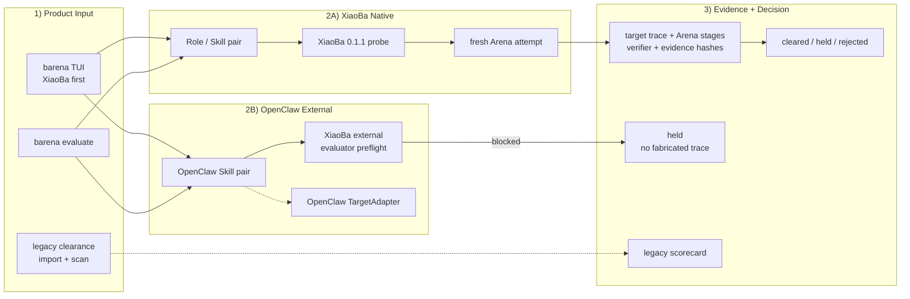

# Barena SPEC

Status: MVP1 / Open-source Agent E2E Phase 1
Last updated: 2026-07-15

Authoritative product positioning: [`docs/POSITIONING.md`](POSITIONING.md). If scope language conflicts, the positioning contract wins.

Barena is end-to-end testing and release CI for AI agents. The existing MVP1 remains a publishable local CLI for deterministic capability clearance. Open-source Agent E2E Phase 1 adds the first real target-process boundary without pretending that Barena owns or can see a target runtime's internal trace.

The product direction is to treat the complete target agent — model, prompt, skills, tools, memory, permissions, and runtime — as a black box whose observable behavior is the release contract. The unit of evaluation is a concrete baseline-to-candidate change. Phase 1 starts with XiaoBa Role and Skill changes. XiaoBa-CLI is both the fixed evaluator runtime and the first native target runtime, but evaluator-plane and target-plane evidence remain logically distinct. External target agents continue to use pluggable `TargetAdapter` contracts, beginning with OpenClaw.

## Scope

In scope for this repository:

- A TypeScript CLI named `barena`.
- Subject import for local skills and GitHub skill repositories.
- Built-in agent target profiles for `opencode`, `xiaoba`, `hermes`, and `openclaw`.
- Static safety scan before runtime execution.
- Clean run directories under `runs/<run-id>/`.
- Built-in UserCat, InspectorCat, and ReviewerCat contracts.
- XiaoBa-CLI as the required evaluator runtime for real Agent E2E runs.
- XiaoBa native Arena as the first composite evaluation boundary for `role`, `base_skill`, and `role_skill` subjects.
- Paired Role evaluation with an explicit baseline Role and candidate Role under pinned conditions.
- Paired Skill evaluation with a truthful explicit baseline, beginning with the same Role in `role` versus `role_skill` modes.
- A `TargetAdapter` boundary for open-source target agents, beginning with OpenClaw's local JSON CLI.
- Barena-owned boundary traces for target input, process output, runtime status, and workspace changes.
- Optional target-native traces, stored separately and never inferred from summary metadata.
- A reusable E2E case contract, replay attempts, artifact verification, and evidence-aware scorecards.
- Paired baseline/candidate evaluation for Role and Skill effectiveness, stability, and regression detection.
- A keyboard-driven TUI that selects XiaoBa or OpenClaw, Role or Skill change, truthful baseline, case/suite source, replay policy, and exposes release results plus persisted trace evidence.
- Honest `blocked` results when XiaoBa lacks the external-agent evaluator seam or the target binary/configuration is unavailable.
- Replay attempts and optional verifier execution.
- JSON and Markdown reports.
- Scorecard decisions: `cleared`, `held`, `rejected`.
- Review statuses: `pass`, `unstable`, `reopened`, `blocked`, `unsafe`.

Out of scope for this MVP:

- A new chat runtime or coding agent.
- Dashboard, Electron, Pet, Feishu, Weixin, or external side-effect tools.
- GitHub install execution, package install scripts, or arbitrary repository code execution.
- Closed-source target agents.
- GUI or desktop automation.
- Real target adapters for opencode, Hermes Agent, or Pi.
- Cross-version regression baselines or a hosted benchmark service.
- Claiming evaluator/target process isolation or hard network isolation. XiaoBa native requires sandbox enforcement evidence for workspace-write containment, while external OpenClaw remains `policy_only`.
- Public benchmark leaderboard or hosted service.
- Automatic production promotion.
- A full Role × Skill 2×2 factorial experiment in the first XiaoBa native slice.
- Modifying XiaoBa-CLI from this repository; Barena integrates through the installed CLI contract.

## Core Evaluation DAG

This is the canonical reader map for Barena. Every supported runtime path must preserve this evidence flow even when the underlying runtime implements the evaluator stages differently.

```mermaid
flowchart LR
    subgraph Input["1) Release Change"]
        direction TB
        Cases["E2E cases"]
        Baseline["baseline<br/>Role or Skill"]
        Candidate["candidate<br/>Role or Skill"]
    end

    subgraph Orchestrator["2) Barena Orchestrator"]
        direction TB
        Preflight["fail-closed preflight<br/>blocked means held"]
        BaseRuns["fresh baseline attempts"]
        CandidateRuns["fresh candidate attempts"]
        Preflight --> BaseRuns
        Preflight --> CandidateRuns
    end

    subgraph Native["3) XiaoBa Arena per Attempt"]
        direction TB
        UserRun["UserCat → target AgentSession"]
        TraceReview["E2E Trace → InspectorCat<br/>→ ReviewerCat native score"]
        Artifacts["artifacts + final state"]
        UserRun --> TraceReview
        UserRun --> Artifacts
    end

    subgraph Evidence["4) Barena Evidence"]
        direction TB
        NativeEvidence["native trace + stage evidence"]
        Verifier["artifact verifier"]
        Package["validated + hash-stamped<br/>evidence package"]
        NativeEvidence --> Package
        Verifier --> Package
    end

    subgraph Gate["5) Paired Release Gate"]
        direction TB
        Aggregate["truth + lift<br/>stability + regressions"]
        Decision["cleared / held / rejected"]
        Aggregate --> Decision
    end

    Cases --> Preflight
    Baseline --> BaseRuns
    Candidate --> CandidateRuns
    BaseRuns --> UserRun
    CandidateRuns --> UserRun
    TraceReview --> NativeEvidence
    Artifacts --> Verifier
    Package --> Aggregate
```



The Trace is the behavioral evidence spine: UserCat produces pressure, InspectorCat extracts problems, and ReviewerCat produces the native case score. Barena separately verifies artifacts and final state, validates and hash-stamps the complete evidence package, then aggregates all baseline/candidate attempts into effectiveness, stability, regression, and release decisions.

`UserCat`, `InspectorCat`, and `ReviewerCat` are logical evaluator stages in this DAG. XiaoBa 0.1.1 currently implements them as a composite native Arena pipeline rather than three independent evaluator `AgentSession`s; the result contract records that limitation explicitly.

## Current Architecture

The repository owns subject, scan, run, trace, replay, verifier, paired capability result, scorecard, report, CLI, and TUI contracts. XiaoBa 0.1.1 is now the implemented first-party native target through a dedicated composite Arena route. OpenClaw remains the implemented external target adapter but stops at XiaoBa evaluator preflight because XiaoBa has no external-agent driver. The original deterministic clearance path remains a legacy scaffold and is not equivalent to real XiaoBa AgentSessions.



## Target Architecture

Barena owns paired release orchestration, normalization, verification, evidence provenance, and the final release decision. XiaoBa native Arena is a composite evaluation contract that already contains evaluator and target planes; it must not be forced into the single-target `TargetAdapter` interface. The external path remains separate for OpenClaw and future runtimes.

```mermaid
flowchart LR
    subgraph Input["1) Role / Skill Release Input"]
        direction TB
        TUI["barena TUI<br/>runtime + kind + baseline + candidate"]
        CLI["automation CLI<br/>same evaluation request"]
        Change["baseline + candidate<br/>Role or Skill change"]
        Cases["XiaoBa suite/cases<br/>external cases later"]
        TUI --> Change
        CLI --> Change
    end

    subgraph Runner["2) Barena Paired Release Runner"]
        direction TB
        Preflight["fail-closed preflight"]
        Pair["paired execution<br/>baseline + candidate"]
        Normalize["normalize attempts<br/>without changing provenance"]
        Aggregate["truth + lift<br/>stability + quality"]
        Preflight --> Pair
        Normalize --> Aggregate
    end

    subgraph Native["3A) XiaoBa Native Evaluation"]
        direction TB
        Arena["XiaoBa Arena CLI<br/>composite control plane"]
        Evaluators["evaluator stages<br/>UserCat / InspectorCat / ReviewerCat<br/>not 3 AgentSessions in 0.1.1"]
        NativeTarget["target plane<br/>isolated Role / Skill runtime"]
        NativeEvidence["native traces<br/>scorecard + artifacts"]
        Arena --> Evaluators
        Evaluators --> NativeTarget
        NativeTarget --> NativeEvidence
        NativeEvidence --> Evaluators
    end

    subgraph External["3B) External Target Evaluation"]
        direction TB
        ExternalEval["XiaoBa external evaluator seam"]
        Adapter["OpenClaw TargetAdapter"]
        ExternalEval -.-> Adapter
    end

    subgraph Evidence["4) Evidence + UI"]
        direction TB
        Verify["Barena verifier<br/>artifact + final state"]
        Score["cleared / held<br/>rejected"]
        Viewer["result + trace viewer"]
        Verify --> Score
        Score --> Viewer
    end

    Change --> Preflight
    Cases --> Preflight
    Pair --> Arena
    Pair --> ExternalEval
    NativeEvidence --> Verify
    NativeEvidence --> Normalize
    Adapter --> Verify
    Adapter --> Normalize
    Verify --> Normalize
    Aggregate --> Score
```



The XiaoBa native path can execute through the installed subject modes today. The external OpenClaw path still requires a narrow external-target seam and continues to stop with `reason_code=xiaoba_external_agent_mode_unavailable`. A deterministic TypeScript fallback is not a valid substitute on either path.

## Data Contracts

### Subject Manifest

`subjects/<subject-id>/subject-manifest.json` records:

- `subject_id`
- `type` (`skill`, `role`, `role_skill`, or `agent`)
- `source`
- `status`
- `fingerprint`
- `paths`
- `imported_at`
- `metadata.agent_target` for built-in agent targets

### Run Layout

Paired Skill evaluations wrap the per-case Agent E2E packages:

```text
runs/<skill-eval-id>/
  evaluation-request.json
  skill-evaluation.json
  arms/baseline/<case-id>/<agent-e2e-run-id>/...
  arms/candidate/<case-id>/<agent-e2e-run-id>/...
  reports/report.json
  reports/report.md
```

XiaoBa native Role/Skill evaluations use a separate composite package:

```text
runs/<xiaoba-kind-eval-id>/
  evaluation-request.json
  capability-evaluation.json
  arms/<baseline|candidate>/<case-id>/attempt-<n>/
    request-manifest.json
    workspace-seed/
    xiaoba-project/arena/runs/<xiaoba-run-id>/
      clean-runtime.json
      arena-runner.json
      arena-scorecard.json
      arena-run.json
      workspace/logs/sessions/**/traces.jsonl
    verifier/artifact-assertions.json
    traces/boundary.ndjson
    evidence/evidence-manifest.json
    evidence/<boundary|native|evaluator|verifier|debug>/...
  reports/report.json
  reports/report.md
```

Each referenced Agent E2E run uses this layout:

```text
runs/<run-id>/
  run-manifest.json
  case.json
  workspace/
  scan/scan-report.json
  traces/boundary.ndjson
  traces/evaluators/usercat.ndjson
  traces/evaluators/inspectorcat.ndjson
  traces/evaluators/reviewercat.ndjson
  traces/native/<target>.ndjson       # optional
  artifacts/
  inspector/issues.json
  replays/replay-*/boundary.ndjson
  verifier/verifier-results.json
  reviewer/scorecard.json
  reports/report.json
  reports/report.md
```

### Scorecard

The new Agent E2E scorecard is distinct from the legacy `barena.skill_clearance.v0` scorecard. It records:

- evaluator runtime identity and per-Cat stage state;
- target adapter, binary/version, invocation transport, and target status;
- `decision` (`cleared`, `held`, or `rejected`) and review status;
- replay and verifier outcomes;
- `evidence_coverage.boundary_trace` (required), `evaluator_traces`, `target_native_trace` (optional), and workspace observation;
- a confidence level derived from evidence coverage, never invented target-native detail;
- blocked reason codes and debug references.

Every boundary event records provenance:

- `recorded_by=barena`
- `layer=boundary`
- `observed_from` (`target_input`, `target_stdout`, `target_stderr`, `target_process`, or `workspace`)
- `component=<target adapter id>`

Evaluator traces use `layer=evaluator`; genuine target-native events use `layer=native`. Summary fields such as OpenClaw `toolSummary.tools` must not be expanded into fabricated `tool_call` events.

### E2E Case

`barena.agent_e2e_case.v1` contains only the minimum executable contract:

- `case_id`
- `target.adapter` and optional target configuration
- `task.prompt`
- optional `fixtures`
- expected artifact assertions
- replay count and timeouts
- policy-only isolation declaration

The first case asks an OpenClaw target to read a fixture and create a specified workspace artifact. Target completion and case success are separate: the verifier, not the target's prose, decides whether the artifact contract passed.

`barena.xiaoba_native_case.v1` is the native composite case contract. It records `case_id`, purpose, task prompt, optional fixtures, artifact assertions, scenario/turn controls, XiaoBa internal replay controls, and timeout. Barena's `attempts_per_arm` remains the independent replay count; XiaoBa internal replay does not replace it.

### Skill Evaluation

The implemented `barena.skill_evaluation.v1` remains the backward-compatible OpenClaw Skill result. The XiaoBa-first target introduces a generalized paired request/result instead of silently reinterpreting that schema.

`barena.xiaoba_capability_evaluation_request.v1` and `barena.xiaoba_capability_evaluation_result.v1` record:

- `target_runtime=xiaoba` and `evaluator_runtime=xiaoba-cli`;
- `capability_kind` (`skill` or `role`);
- explicit baseline and candidate selections with identity and fingerprint;
- XiaoBa project root and native subject modes when `target_runtime=xiaoba`;
- case/suite identity and pinned common runtime conditions;
- attempts per arm and isolation policy.

For XiaoBa native evaluation, Barena persists each original Arena run and a normalized attempt reference containing:

- arm, case, attempt, runtime, and status;
- XiaoBa run directory and original `arena-scorecard.json` reference;
- native target trace and UserCat/InspectorCat/ReviewerCat evidence refs;
- candidate activation/fingerprint evidence;
- Barena verifier and assertion refs;
- source provenance and copied evidence hash.

Normalization never relabels native evidence as Barena boundary evidence. A XiaoBa attempt passes only when the native Arena stages complete, the native decision is successful, the requested Role/Skill activation evidence matches, the Barena verifier passes, and required refs exist. The result records `three_evaluator_agent_sessions=false`, `evaluator_target_process_isolated=false`, and `network_disabled_is_hard_boundary=false` for XiaoBa 0.1.1.

Truthful XiaoBa baselines are mandatory:

- Skill introduction under a Role: baseline `role`, candidate `role_skill`, with the same explicit Role and pinned common conditions.
- Skill version-to-version comparison is not yet exposed; requests that cannot use the supported same-Role no-candidate-Skill baseline remain blocked instead of inventing a no-op subject.
- Role change: explicit baseline Role versus candidate Role under the same suite, model, tools, and replay policy.
- Missing or unrepresentable baseline: `held/blocked`; no generated no-op Skill or fake Role.

The same-Role Skill comparison is supported only when the immutable Role has `inheritBaseSkills !== false`, no Role-local Skill shadows the candidate name, both arms use the same Role fingerprint, and candidate activation is present in native `tool_visibility[].activeSkillName`. Every independent case/attempt uses a unique XiaoBa run id and workspace; XiaoBa's internal Inspector-triggered replay is evidence within one attempt, not a substitute for Barena's independent attempts.

The native runner treats the XiaoBa filesystem artifacts as authoritative because XiaoBa 0.1.1 stdout includes branding before JSON. It validates `arena-manifest.json`, `clean-runtime.json`, `arena-runner.json`, `arena-scorecard.json`, sandbox enforcement, stage states, run/mode/subject identities, and all evidence paths before normalization. Process exit code zero alone is never a pass.

The first native slice does not claim a full Role × Skill 2×2 interaction experiment.

`barena.skill_evaluation_request.v1` is a paired release request containing:

- target runtime configuration;
- baseline Skill selection (`none` or an explicit prior Skill);
- candidate local Skill path and fingerprint;
- case pack identity and revision;
- case purpose (`effectiveness`, `regression`, or `safety`);
- total attempts per arm.

`barena.skill_evaluation.v1` persists baseline and candidate run references plus four evidence-backed result groups:

- **outcome truth:** verifier-backed attempts, never a subjective truth score;
- **effectiveness:** observed candidate pass rate minus baseline pass rate, only when both arms are complete;
- **quality/stability:** stable pass, stable failure, flaky, unsafe, blocked, or incomplete;
- **release decision:** `cleared`, `held`, or `rejected` with a deterministic reason code.

Required evidence is boundary trace, verifier outcome, and all three XiaoBa evaluator traces. Target-native trace remains optional. If any arm is blocked or required evidence is missing, observed lift is unavailable and the release cannot clear.

For OpenClaw, candidate Skill injection uses the active isolated agent workspace at `skills/<skill-id>/SKILL.md` and an exact Skill allowlist. Baseline uses an empty allowlist. The adapter must bind the active OpenClaw workspace explicitly and preflight the eligible Skill set; copying a Skill without proving eligibility is not sufficient.

### Legacy Scorecard

Scorecards contain:

- `scorecard_type`
- `subject_id`
- `subject_type`
- `run_id`
- optional `case_id`
- optional `agent_target` with target id, display name, category, CI focus, and risk focus
- `runtime.provider=barena-deterministic`
- `runtime.adapter=xiaoba-compatible`
- `runtime.xiaoba_invoked=false`
- `decision`
- `status`
- `stages`
- `summary`
- `scores`
- `issues`
- `replay_attempts`
- `artifact_refs`
- `evidence_refs`
- `trace_refs`
- `replay_refs`
- `debug_refs`

## CLI Surface

MVP1 commands:

- `barena import skill <path>`
- `barena import github <owner/repo|url>`
- `barena import agent <opencode|xiaoba|hermes|openclaw>`
- `barena scan <subject-id>`
- `barena run <subject-id> [--replays n] [--verifier path]`
- `barena scorecard <run-id>`
- `barena report <run-id> [--format markdown|json]`
- `barena list subjects`
- `barena list runs`
- `barena list targets`
- `barena tui [--snapshot] [--color|--no-color]`
- `barena doctor`

Agent E2E Phase 1 adds:

- `barena e2e run <case.json> [--runs-root runs]`
- `barena e2e probe [--target xiaoba|openclaw]`
- `barena evaluate skill <skill-path> --target openclaw --case <case.json> [--attempts n]`
- `barena evaluate skill <skill-path> --target xiaoba --role <role-id> --case <case-or-suite> [--attempts n]`
- `barena evaluate role <candidate-role-id> --target xiaoba --baseline-role <role-id> --case <case-or-suite> [--attempts n]`
- `barena` on an interactive TTY opens the XiaoBa-first capability evaluation TUI; a non-TTY invocation remains help-only and script-safe.

The TUI is the first interactive product shell for MVP1. Its masthead keeps only `BARENA` as ASCII art and renders the surrounding copy as ordinary terminal text. It uses gold plus the terminal's default foreground color, with no background fill, raster sampling, image rendering, or terminal image protocols. It exposes the canonical core evaluation DAG, XiaoBa Skill, XiaoBa Role, secondary OpenClaw Skill, previous-result, prerequisite, result, and provenance-aware trace views over the same persisted evaluations as the CLI.

## Boundaries

- Production code must not import XiaoBa or OpenClaw source files by relative path.
- XiaoBa-CLI is the sole valid runtime for UserCat, InspectorCat, and ReviewerCat in Agent E2E mode.
- XiaoBa native Arena is a composite evaluation seam and is not a `TargetAdapter`; external target execution still uses `TargetAdapter` with argument arrays and `shell: false`.
- XiaoBa evaluator-plane and target-plane identities, traces, state, and source profiles must be recorded separately even when one Arena CLI process orchestrates both.
- Barena must bind the XiaoBa project root explicitly and copy/hash native evidence into the Barena run package so later TUI reads do not depend on mutable XiaoBa run retention.
- Barena may always observe its own inputs, process boundary, and workspace. Target-native traces are required when the XiaoBa native contract promises them, optional for external targets, and always retain source provenance.
- Missing XiaoBa support, roles, provider configuration, target binary, target configuration, or protocol compatibility yields `blocked`, not a simulated pass.
- OpenClaw Phase 1 is local-only, never passes delivery/channel/reply flags, gives every replay a unique session key, and records isolation as `policy_only`.
- A selected Skill is considered injected only when the candidate workspace, explicit allowlist, and OpenClaw Skill eligibility preflight all identify the same Skill fingerprint.
- A XiaoBa Skill or Role is considered active only when the native snapshot/profile/trace evidence identifies the requested subject and fingerprint; subject selection alone is not proof of use or effectiveness.
- The TUI reads trace references from persisted scorecards; a blocked target displays `No boundary trace: target was not started` instead of synthesizing events.
