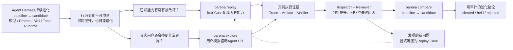
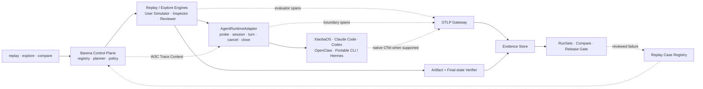

# Barena Specification

Version 2.1 — 2026-07-27

This document is authoritative for the current product boundary. Historical XiaobaOS Arena integration code and persisted result schemas may remain in the repository for migration tests and read-only run inspection, but they are not public execution paths and are excluded from the production build.

The locked target framework architecture is defined by [`ARCHITECTURE.md`](./ARCHITECTURE.md). Current implementation details in this specification must migrate toward that contract without being represented as already complete.

## 1. Product contract

Barena is an **Agentic Eval and Release framework for Agent Harness evolution**.

It evaluates a concrete baseline-to-candidate change across one or more reusable cases, preserves evidence of what actually happened, and emits one release decision:

- `cleared`: complete, stable, verifier-backed positive result;
- `held`: blocked, incomplete, unstable, or no demonstrated improvement;
- `rejected`: unsafe candidate or rejected static admission.

Harness changes may include model, Prompt, Role, Skill, Tool, memory, permission, orchestration, or Runtime changes. The currently implemented paired subject is no-Skill versus candidate-Skill.

## 2. Evaluator and target ownership

Barena owns the evaluator control plane:

- case loading and fixture staging;
- baseline/candidate arm construction;
- independent attempt/workspace/session planning;
- target invocation;
- boundary evidence capture;
- deterministic Artifact verification;
- replay aggregation, success-rate/stability/lift computation;
- persisted scorecards, reports, and release decisions.

Target adapters own only the narrow target boundary:

- probe an ordinary Agent execution contract;
- start a fresh target execution;
- submit the case prompt;
- expose target output, process status, workspace changes, and genuine native trace references if produced;
- stop at the target boundary.

Barena MUST NOT delegate evaluator ownership to an embedded target benchmark or Arena. In particular, the XiaobaOS adapter MUST NOT invoke `xiaoba arena`.

## 3. Product DAG



Current implementation covers fixed Case Replay, deterministic inspection/verification, paired aggregation, and the release gate. Adaptive multi-turn UserCat exploration and agentic Inspector/Reviewer attribution are planned. Until implemented, their stages MUST be `not_applicable` rather than represented by fabricated traces.

### 3.1 Locked target architecture



Normative details, telemetry attributes, and invariants are in `docs/ARCHITECTURE.md`.

## 4. Supported Runtime contracts

The canonical target seam is `AgentRuntimeAdapter`: probe, open session, send turn, cancel, and close. Every method preserves the Barena attempt/workspace/session boundary and receives W3C Trace Context plus allowlisted OTLP configuration.

The current one-shot `TargetAdapter.execute(...)` interface remains a compatibility facade while Replay migrates. Explore MUST use the multi-turn `AgentRuntimeAdapter` lifecycle rather than adding a separate Runtime abstraction.

### 4.1 XiaobaOS

The built-in `XiaobaTargetAdapter` probes only:

```text
xiaoba --version
xiaoba chat --help
```

It executes only:

```text
xiaoba chat --role <role-id> --message <prompt> [--skill <skill-name>]
```

Required ordinary-chat flags are `--role`, `--message`, and `--skill`.

Barena provides an isolated working directory and an isolated snapshot of installed base Skills. Baseline excludes the candidate name. Candidate receives an immutable admitted snapshot at that name and explicit `--skill` activation. All other installed base Skills and Role-local Skills remain common across arms. The following values may be bound without recording secrets:

- `XIAOBA_PROJECT_ROOT`;
- `XIAOBA_ROLES_ROOT`;
- `XIAOBA_SKILLS_ROOT`;
- allowlisted provider environment names.

XiaobaOS native `logs/sessions/**/traces.jsonl` files are accepted only when produced within the attempt workspace by ordinary chat execution. Their presence is optional and explicitly represented by `target_native_trace`.

### 4.2 OpenClaw

The built-in OpenClaw adapter uses the local JSON Agent contract, binds an isolated workspace and exact Skill allowlist, and forbids delivery/reply flags. OpenClaw completion never overrides Artifact verification.

### 4.3 Claude Code and Codex

Built-in adapters use their ordinary non-interactive Agent surfaces, preserve native session/resume semantics where available, and translate only observable boundary events into Barena-owned OTel spans. Genuine Runtime-native spans are ingested only through OTLP.

### 4.4 Hermes and custom CLI Agents

Portable targets implement:

- `barena.portable_target_probe.v1`;
- `barena.portable_target_request.v1`;
- `barena.portable_target_result.v1`.

The driver receives a prompt-file reference, workspace, deadline, unique session ID, target identity, environment names, Skill selection, and telemetry context. Barena validates the returned identity and still verifies workspace Artifacts itself.

## 5. Case contract

New executions use `barena.agent_e2e_case.v1`:

- safe unique `case_id`;
- target adapter/runtime/agent/model and environment-name allowlist;
- task prompt;
- optional immutable fixtures;
- at least one non-vacuous Artifact assertion;
- replay and timeout controls;
- explicit isolation/network declarations.

Artifact assertions may check existence/non-existence, contained text, structured JSON types/keys/array properties, and directed-graph invariants. Subject-authored executable verifier code is never trusted by default.

Legacy `barena.xiaoba_native_case.v1` and `barena.xiaoba_case_pack.v1` remain historical migration inputs only. The public CLI does not execute them through XiaobaOS Arena. The built-in SkillsBench alias materializes an `AgentE2ECaseV1` for the selected target.

## 6. Paired Skill evaluation

For every case, Barena runs:

```text
baseline: target + fixed Role/config + no candidate Skill
candidate: same target + same Role/config + admitted candidate Skill
```

Both arms receive byte-identical prompts and fixtures. `attempts_per_arm` overrides the case replay count for paired evaluation. Every attempt has a fresh workspace and target session identifier.

Static admission runs before target execution. Candidate files are scanned, fingerprinted, copied to an immutable run-owned snapshot, and re-fingerprinted before staging. Symlinks and realpath escapes fail closed.

Role A/B is not part of the current public execution contract. `barena evaluate role` MUST fail closed until baseline and candidate Roles can be represented through the same ordinary target adapter without invoking a target-owned evaluator.

## 7. Evidence model

Barena boundary evidence uses provenance:

```text
recorded_by = barena
layer = boundary
observed_from = target_input | target_stdout | target_stderr | target_process | workspace
```

Genuine target-native evidence remains a separate native reference. Barena MUST NOT infer hidden reasoning, tool calls, retries, or native traces from summary text.

The locked target evidence model replaces proprietary behavioral trace records with OpenTelemetry spans/events exported through OTLP:

- Barena creates the root run/attempt trace.
- evaluator components emit `barena_evaluator` spans;
- Runtime adapters emit `adapter_boundary` spans for directly observed input/output/process/session events;
- target Runtimes may emit `runtime_native` spans when they genuinely support OTel export;
- all evidence is correlated by run, Case/Scenario, attempt, arm, Runtime, session, actor, and provenance attributes.

OTel does not replace Artifact hashes, workspace diffs, verifier outputs, or immutable manifests. These remain structured evidence linked to the same run/case/attempt identities.

Each attempt persists:

- the exact case;
- preflight probe result;
- isolated workspace;
- boundary NDJSON;
- workspace diff and Artifact assertion results;
- optional genuine target-native trace refs;
- attempt scorecard and report.

Paired evaluation persists its request, static admission, both arms, aggregate result, and Markdown/JSON report.

Boundary-only execution reports `evaluation_mode=portable_verifier`, `evidence_profile=boundary_verified`, and confidence no higher than `medium`. `policy_only` is not an OS hard-sandbox claim.

## 8. Release semantics

Outcome truth is verifier-backed. A target exit code or completion message alone cannot pass a Case.

The aggregate evaluates:

- planned/pass/fail/blocked/unsafe attempt counts;
- baseline and candidate pass rates;
- stability of each arm;
- evidence completeness;
- observed lift;
- unsafe or regression signals.

Missing binary, missing ordinary CLI contract, missing Role, missing credentials, timeout, output overflow, Skill staging failure, incomplete evidence, or unsupported comparison produces `held`/`blocked`, never simulated success.

## 9. SkillsBench calibration

`skillsbench:starter` is a pinned, manually adapted calibration derived from one SkillsBench `dialogue-parser` task. The repository and commit, upstream task hash, adaptation notes, fixture subset, and trusted structured verifier are retained.

It validates Barena's orchestration and evidence pipeline. It is not the complete SkillsBench suite, not an official BenchFlow harness result, and not a leaderboard claim.

## 10. Security requirements

- Never execute Skill install scripts during import or admission.
- Never follow subject symlinks.
- Never allow fixture or Artifact paths to escape the workspace.
- Pass only explicitly allowlisted environment names to target children.
- Never persist secret values in evidence.
- Use argv arrays with `shell=false`; user prompts are data, not shell commands.
- Enforce timeout and captured-output limits.
- Reject delivery or external side-effect flags in adapters where applicable.
- Treat target-owned credentials and provider configuration as target state.

## 11. Public CLI

Current compatibility commands:

```text
barena init
barena guide
barena doctor --target <id>
barena list suites
barena evaluate skill <path> --target <id> (--suite <id> | --case <case.json>)
barena e2e probe --target <id>
barena e2e run <case.json>
barena list runs
barena show <run-id>
barena report <run-id>
barena tui
```

The production package MUST not export or compile the legacy XiaobaOS Arena runner, native input builder, or live-policy executor.

Locked target surface:

```text
barena replay <case-or-suite> --config <harness-config>
barena explore <scenario> --config <harness-config>
barena compare --baseline <run-set> --candidate <run-set>
```

`barena replay` and `barena explore` produce comparable RunSets. `barena compare` consumes compatible RunSets or orchestrates their missing executions through those same engines. Existing `evaluate skill` and `e2e run` commands may remain compatibility aliases during migration.

## 12. Acceptance criteria

- XiaobaOS paired Skill execution reaches only ordinary `chat` commands.
- Regression tests record all fake XiaobaOS argv and assert no `arena` token.
- Public CLI, guide, TUI execution, E2E runner, and evaluation barrel do not import legacy Arena modules.
- Legacy executable modules are excluded from `dist`.
- Built-in SkillsBench suite materializes for XiaobaOS, OpenClaw, and portable targets.
- Baseline/candidate isolation and Artifact-backed positive-lift behavior are tested.
- Runtime invocation is reachable only through `AgentRuntimeAdapter` after migration; the one-shot `TargetAdapter` remains a tested compatibility facade until removed.
- Barena evaluator and adapter boundary spans export through OTLP with W3C correlation and truthful provenance.
- Runtimes without native OTel still produce honest adapter-boundary spans; Barena never parses prose into fabricated native spans.
- Explore can promote an evidence-backed issue only as an explicit Replay Case candidate.
- README describes implemented versus planned capability without overclaiming.
- Build, full tests, package dry-run, and installed CLI smoke pass.
