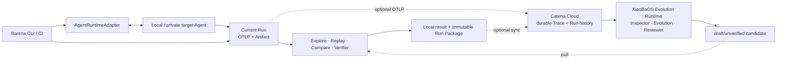
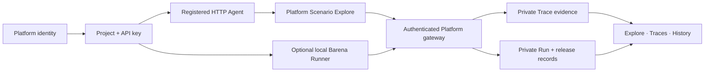

# Barena Specification

Version 2.3 — 2026-07-31

This document is authoritative for the current product boundary. Historical XiaobaOS Arena integration code and persisted result schemas may remain in the repository for migration tests and read-only run inspection, but they are not public execution paths and are excluded from the production build.

The locked target framework architecture is defined by [`ARCHITECTURE.md`](./ARCHITECTURE.md). Current implementation details in this specification must migrate toward that contract without being represented as already complete.

## 1. Product contract

Barena is an **Agentic Eval and Release framework for Agent Harness evolution**.

It evaluates a concrete candidate against known Case expectations or a
baseline-to-candidate improvement claim, preserves evidence of what actually
happened, and emits one release decision:

- `cleared`: complete, stable, verifier-backed positive result;
- `held`: blocked, incomplete, unstable, or no demonstrated improvement;
- `rejected`: unsafe candidate or rejected static admission.

Harness changes may include model, Prompt, Role, Skill, Tool, memory, permission, orchestration, or Runtime changes. The currently implemented paired subject is no-Skill versus candidate-Skill.

## 2. Evaluator and target ownership

Barena owns the evaluator control plane:

- case loading and fixture staging;
- baseline/candidate arm construction;
- independent attempt/workspace/session planning;
- target invocation;
- boundary evidence capture;
- deterministic Artifact verification;
- replay aggregation, success-rate/stability/lift computation;
- persisted scorecards, reports, and release decisions.

Target adapters own only the narrow target boundary:

- probe an ordinary Agent execution contract;
- start a fresh target execution;
- submit the case prompt;
- expose target output, process status, workspace changes, and genuine native trace references if produced;
- stop at the target boundary.

Barena MUST NOT delegate evaluator ownership to an embedded target benchmark or Arena. In particular, the XiaobaOS adapter MUST NOT invoke `xiaoba arena`.

## 3. Product DAG

```mermaid
flowchart LR
    Change["Agent Harness持续进化<br/>baseline → candidate<br/>模型 / Prompt / Skill / Tool / Runtime"]
    Risk["行为变化不可预测<br/>可能提升，也可能退化"]
    Known["已知能力有没有被改坏？"]
    Unknown["真实用户还会撞到什么边界？"]
    Replay["barena replay<br/>固定Case复现历史能力"]
    E2E["barena explore<br/>用户模拟驱动Agent E2E"]
    Evidence["真实执行证据<br/>Trace + Artifact + Verifier"]
    Review["Inspector + Reviewer<br/>分析提升、回归与失败原因"]
    RunSets["Replay / Explore RunSets"]
    Compare["barena compare<br/>baseline ↔ candidate"]
    Gate["Release Check<br/>non_regression · improvement"]
    Decision["可审计的进化结论<br/>cleared / held / rejected"]
    NewCase["发现的新问题<br/>显式沉淀为Replay Case"]

    Change --> Risk
    Risk --> Known
    Risk --> Unknown
    Known --> Replay
    Unknown --> E2E
    Replay --> Evidence
    E2E --> Evidence
    Evidence --> Review
    Review --> RunSets
    RunSets --> Gate
    RunSets --> Compare
    Compare --> Gate
    Gate --> Decision
    Review --> NewCase
    NewCase -.-> Replay
```



Current implementation covers fixed Case Replay, deterministic inspection/verification, paired aggregation, the release gate, XiaoBaOS Role Explore, and an attributed scripted Simulation calibration lane. Explore executes real `user-cat`, target Role, `inspector-cat`, and `reviewer-cat` sessions through the ordinary chat surface. Simulation reuses the same `AgentRuntimeAdapter` lifecycle and emits a pass/fail/blocked scorecard rather than a release decision. Fixed Replay continues to mark evaluator stages `not_applicable` when they did not actually run.

### 3.1 Locked target architecture

```mermaid
flowchart LR
    Human["barena explore"] --> Composer["Natural objective<br/>what behavior should be tested?"]
    Composer --> Resolve["Progressive target resolution<br/>auto-detect Runtime · default Base"]
    Resolve --> Override["Optional override<br/>/agent · /skill"]
    Override --> Preview["One-screen plan preview"]
    Preview --> Control["Barena Control Plane<br/>registry · planner · policy"]
    Commands["replay · explore · compare"] --> Control
    Control --> Engines["Replay / Explore Engines<br/>User Simulator · Inspector · Reviewer"]
    Engines --> Adapter["AgentRuntimeAdapter<br/>probe · session · turn · cancel · close"]
    Adapter --> Runtimes["XiaobaOS · DeepSeek Harness<br/>Claude Code · Codex · OpenClaw · Hermes"]

    Control -. "W3C Trace Context" .-> Adapter
    Engines -. "evaluator spans" .-> OTLP["OTLP Gateway"]
    Adapter -. "boundary spans" .-> OTLP
    Runtimes -. "native OTel when supported" .-> OTLP

    Engines --> Verifier["Artifact + Final-state Verifier"]
    OTLP --> EvidenceStore["Evidence Store"]
    Verifier --> EvidenceStore
    EvidenceStore --> Delivery["Immediate delivery<br/>Finding · Evidence · Replay Case"]
    Delivery --> Results["RunSets · Compare · Release Gate"]
    Results -. "reviewed failure" .-> Cases["Replay Case Registry"]
    Cases -.-> Control
```



Normative details, telemetry attributes, and invariants are in `docs/ARCHITECTURE.md`.

Explore follows progressive disclosure. With one adapter-ready Runtime and an
installed Base profile, `barena explore` MUST open directly in the natural
objective Composer. Runtime and Role selection are not mandatory setup pages;
they are shown as resolved context and become editable only through `/agent`
or when discovery is genuinely ambiguous. `/skill` remains an optional focus.
The preview asks for one explicit confirmation before paid model calls.

The running surface presents the observable UserCat, target, InspectorCat and
ReviewerCat activity because that makes an otherwise opaque multi-Agent test
understandable. Those actors are execution detail, not configuration concepts.
The terminal result leads with confirmed behavior findings, their evidence and
generated Replay Case candidates. Raw OTLP counts, filesystem paths and model
call budgets stay secondary.

### 3.2 Catena integration boundary

Barena has one canonical subject-execution plane: the CLI/CI Engine runs beside
the user's target Runtime through `AgentRuntimeAdapter`. It owns Explore,
Replay, Compare, current-Run evidence analysis, deterministic verification, and
the terminal release decision. It works without Catena.

When a Catena API key is configured, the same local execution additionally:

- accepts Catena's Agent-bound `catena_agent_*` credential while retaining
  bounded compatibility with historical Platform key prefixes;
- forwards correlated Runtime and Barena boundary OTLP;
- synchronizes ordered Events and one immutable `barena.run_package.v1`;
- records synchronization as `pending`, `synced`, or `failed` without changing
  the local evaluation result;
- may later pull a Catena-generated draft candidate or Case for local Replay.

Catena owns durable Trace/Run history and embeds one dedicated XiaoBaOS
Evolution Runtime. That Runtime consumes an Evidence Pack through InspectorCat,
EvolutionCat, and ReviewerCat and emits draft `agent.md`, Skill, Role or
Runtime-bound DSH Plugin assets. It never invokes the target Agent and never
creates or changes a release verdict. The historical Platform HTTP Explore and
cloud Replay paths remain migration/demo compatibility only and are not the
target architecture.



The TypeScript Engine remains the only implementation of deterministic Replay,
artifact verification, scorecard computation, and Release Check. Catena
persists the package and displays the result without recomputing it. The Server
must never parse human CLI output as a control protocol.

The current per-Run OTLP receiver remains a scoped compatibility bridge because
Inspector requires a bounded in-process evidence snapshot. Durable observation
uses Catena through Agent-bound OTLP and immutable Run Bundle synchronization.

The current embedded React/Chakra client is migration scaffolding. The target
Web is the downstream fork with a Barena Release Workbench. Barena retains its
own Engine, Run/Event contracts, verifier, scorecards, and release decisions;
the fork supplies the platform shell and Trace infrastructure.

### 3.3 Identity and endpoint connection

The v0.3 Platform reuses the fork's identity, projects, membership, and API-key
boundary without changing evaluation truth or Trace privacy:

- the browser and Runner authenticate at the Platform fork;
- the fork forwards signed project context to internal Go Run Control;
- Go does not run a second GitHub OAuth or expose a second public credential
  surface in the target architecture;
- Go stores neither fork OAuth credentials nor public project API keys;
- Edge Runs use ordered Event append and explicit completion; no cloud worker
  is started;
- raw Trace, prompt, event, artifact, and workspace evidence remains private;
- Community profiles remain experimental and are not a primary v0.3 journey.

The fork's identity/project configuration and ClickHouse Trace data remain
separate from Barena's evaluation-domain PostgreSQL schema. They may share
physical infrastructure, but services communicate only through versioned APIs:
there are no cross-service table reads, joins, or foreign keys.

The Platform may initiate subject execution only for a registered reachable
HTTP Agent. Local/private subject Runtime execution is endpoint-push. The
embedded XiaoBaOS evaluator/evolution Runtime is platform-owned and has no
route to impersonate or replace a subject Runtime. A general-purpose managed
target Runtime, private laptop tunnel, and Go Runner remain explicitly
deferred until cloud-triggered private execution becomes a validated
requirement.



## 4. Supported Runtime contracts

The canonical target seam is `AgentRuntimeAdapter`: probe, open session, send turn, cancel, and close. Every method preserves the Barena attempt/workspace/session boundary and receives W3C Trace Context plus allowlisted OTLP configuration.

The current one-shot `TargetAdapter.execute(...)` interface remains a compatibility facade while Replay migrates. XiaoBaOS Explore now uses the multi-turn `AgentRuntimeAdapter` lifecycle; subsequent Runtime integrations and Replay migration MUST reuse it rather than adding another invocation abstraction.

### 4.1 XiaobaOS

The built-in `XiaobaTargetAdapter` probes only:

```text
xiaoba --version
xiaoba chat --help
```

It executes only:

```text
xiaoba chat --role <role-id> --message <prompt> [--skill <skill-name>]
```

Required ordinary-chat flags are `--role`, `--message`, and `--skill`.

Barena provides an isolated working directory and an isolated snapshot of installed base Skills. Baseline excludes the candidate name. Candidate receives an immutable admitted snapshot at that name and explicit `--skill` activation. All other installed base Skills and Role-local Skills remain common across arms. The following values may be bound without recording secrets:

- `XIAOBA_PROJECT_ROOT`;
- `XIAOBA_ROLES_ROOT`;
- `XIAOBA_SKILLS_ROOT`;
- allowlisted provider environment names.

XiaobaOS native `logs/sessions/**/traces.jsonl` files are accepted only when produced within the attempt workspace by ordinary chat execution. Their presence is optional and explicitly represented by `target_native_trace`.

For Explore, XiaoBaOS uses explicit full-history replay behind
`probe/openSession/sendTurn/cancel/close`. Barena snapshots the resolved Role and
base-Skill roots, creates separate target/evaluator workspaces, enables the
XiaoBaOS native OTel exporter, and ingests OTLP/HTTP protobuf on a loopback
receiver. The receiver persists redacted envelopes and a Runtime-neutral span
NDJSON projection. XiaoBaOS honors the `TRACEPARENT` environment supplied to
ordinary chat, so Simulation can parent native session/model/tool spans under
the matching Barena Turn. Correlation attributes remain available for receivers
that cannot preserve parentage.

### 4.2 DeepSeek Harness

The built-in DSH adapter uses only the public `dsh --profile headless` CLI.
Each user turn invokes one fresh DSH session with the complete visible history,
so the adapter reports `full-history-replay` rather than claiming native
resume. Every Barena session receives a run-private `DSH_HOME`. The public
`--dsh-patch` option forwards one validated regular patch file to DSH's native
`--patch` launcher contract. An optional
Catena `dsh_plugin` package is validated and installed into that private
profile before target execution; the adapter rejects malformed manifests,
missing Cordis patches, path escapes and symlinks.

Plugin installation disables package lifecycle scripts. Catena-generated DSH
Plugins use a configuration-only bundle contract: `package.json` declares the
bundle and `cordis.patch.yml` overrides existing Profile rows. Barena still
lets DSH itself validate the final composed Profile before treating target
execution as evidence.

DSH's current telemetry surface does not provide the trace-span contract that
Barena requires. The adapter therefore emits one explicitly attributed
Barena-owned Turn bridge span and retains observable DSH session files as
native references. It never converts prose or session data into fabricated
Model, Tool or hidden-reasoning spans.

The evidence seal scans retained DSH session files for admitted Secret values,
but excludes the run-private Profile's package-manager `node_modules` tree.
That dependency graph is Runtime implementation state rather than target
evidence; its pnpm symlinks cannot downgrade an otherwise complete run.

### 4.3 OpenClaw

The built-in OpenClaw adapter uses the local JSON Agent contract, binds an isolated workspace and exact Skill allowlist, and forbids delivery/reply flags. OpenClaw completion never overrides Artifact verification.

### 4.4 Claude Code and Codex

Built-in adapters use their ordinary non-interactive Agent surfaces, preserve native session/resume semantics where available, and translate only observable boundary events into Barena-owned OTel spans. Genuine Runtime-native spans are ingested only through OTLP.

### 4.5 Hermes and custom CLI Agents

Portable targets implement:

- `barena.portable_target_probe.v1`;
- `barena.portable_target_request.v1`;
- `barena.portable_target_result.v1`.

The driver receives a prompt-file reference, workspace, deadline, unique session ID, target identity, environment names, Skill selection, and telemetry context. Barena validates the returned identity and still verifies workspace Artifacts itself.

## 5. Case contract

New executions use `barena.agent_e2e_case.v1`:

- safe unique `case_id`;
- target adapter/runtime/agent/model and environment-name allowlist;
- task prompt;
- optional immutable fixtures;
- at least one non-vacuous Artifact assertion;
- replay and timeout controls;
- explicit isolation/network declarations.

Artifact assertions may check existence/non-existence, contained text, structured JSON types/keys/array properties, and directed-graph invariants. Subject-authored executable verifier code is never trusted by default.

Legacy `barena.xiaoba_native_case.v1` and `barena.xiaoba_case_pack.v1` remain historical migration inputs only. The public CLI does not execute them through XiaobaOS Arena. The built-in SkillsBench alias materializes an `AgentE2ECaseV1` for the selected target.

## 6. Paired Skill evaluation

For every case, Barena runs:

```text
baseline: target + fixed Role/config + no candidate Skill
candidate: same target + same Role/config + admitted candidate Skill
```

Both arms receive byte-identical prompts and fixtures. `attempts_per_arm` overrides the case replay count for paired evaluation. Every attempt has a fresh workspace and target session identifier.

Static admission runs before target execution. Candidate files are scanned, fingerprinted, copied to an immutable run-owned snapshot, and re-fingerprinted before staging. Symlinks and realpath escapes fail closed.

Role A/B is not part of the current public execution contract. `barena evaluate role` MUST fail closed until baseline and candidate Roles can be represented through the same ordinary target adapter without invoking a target-owned evaluator.

## 7. Evidence model

Barena boundary evidence uses provenance:

```text
recorded_by = barena
layer = boundary
observed_from = target_input | target_stdout | target_stderr | target_process | workspace
```

Genuine target-native evidence remains a separate native reference. Barena MUST NOT infer hidden reasoning, tool calls, retries, or native traces from summary text. XiaoBaOS Explore requires at least one decoded target-native OTLP span; a missing export is reported as `blocked/evidence_incomplete`.

The locked target evidence model replaces proprietary behavioral trace records with OpenTelemetry spans/events exported through OTLP:

- Barena creates the root run/attempt trace.
- evaluator components emit `barena_evaluator` spans;
- Runtime adapters emit `adapter_boundary` spans for directly observed input/output/process/session events;
- target Runtimes may emit `runtime_native` spans when they genuinely support OTel export;
- all evidence is correlated by run, Case/Scenario, attempt, arm, Runtime, session, actor, and provenance attributes.

OTel does not replace Artifact hashes, workspace diffs, verifier outputs, or immutable manifests. These remain structured evidence linked to the same run/case/attempt identities.

Each attempt persists:

- the exact case;
- preflight probe result;
- isolated workspace;
- boundary NDJSON;
- workspace diff and Artifact assertion results;
- optional genuine target-native trace refs;
- attempt scorecard and report.

Paired evaluation persists its request, static admission, both arms, aggregate result, and Markdown/JSON report.

Boundary-only execution reports `evaluation_mode=portable_verifier`, `evidence_profile=boundary_verified`, and confidence no higher than `medium`. `policy_only` is not an OS hard-sandbox claim.

## 8. Release semantics

Outcome truth is verifier-backed. A target exit code or completion message alone cannot pass a Case.

The aggregate evaluates:

- planned/pass/fail/blocked/unsafe attempt counts;
- baseline and candidate pass rates;
- stability of each arm;
- evidence completeness;
- observed lift;
- unsafe or regression signals.

Missing binary, missing ordinary CLI contract, missing Role, missing credentials, timeout, output overflow, Skill staging failure, incomplete evidence, or unsupported comparison produces `held`/`blocked`, never simulated success.

Release Check selects one immutable policy:

- `non_regression` consumes one candidate Replay RunSet against fixed Case
  expectations;
- `improvement` consumes compatible baseline/candidate RunSets and the facts
  produced by Compare.

Only Release Check emits `cleared | held | rejected`. Compare is required only
for `improvement`.

## 9. SkillsBench calibration

`skillsbench:starter` is a pinned, manually adapted calibration derived from one SkillsBench `dialogue-parser` task. The repository and commit, upstream task hash, adaptation notes, fixture subset, and trusted structured verifier are retained.

It validates Barena's orchestration and evidence pipeline. It is not the complete SkillsBench suite, not an official BenchFlow harness result, and not a leaderboard claim.

The repository also publishes an immutable 24-task SkillsBench v1.1 method-validation
package under `docs/benchmarks/skillsbench-v1.1/`. That experiment used BenchFlow,
Docker, and an explicitly labelled XiaoBaOS ACP compatibility shim. Its strict primary
comparison contains 36 same-task/same-trial pairs with verifier-admitted evidence in both
arms. It validates paired evidence admission, deterministic verification, comparison, and
release-gate behavior; it does not validate the newer XiaoBaOS `AgentRuntimeAdapter`,
UserCat Explore DAG, or OTLP ingestion path.

The public package MUST preserve the selection hash, upstream revision, compatibility
boundary, evidence exclusions, matched denominator, statistical caveat, and
non-leaderboard disclaimer. Raw provider trajectories are not published.

## 10. Security requirements

- Never execute Skill install scripts during import or admission.
- Never follow subject symlinks.
- Never allow fixture or Artifact paths to escape the workspace.
- Pass only explicitly allowlisted environment names to target children.
- Never persist secret values in evidence.
- Use argv arrays with `shell=false`; user prompts are data, not shell commands.
- Enforce timeout and captured-output limits.
- Reject delivery or external side-effect flags in adapters where applicable.
- Treat target-owned credentials and provider configuration as target state.

## 11. Public CLI

Current compatibility commands:

```text
barena
barena explore
barena explore <scenario.json>
barena explore --runtime xiaobaos --role <role> --task <objective>
barena replay <case.json> [--target-command <driver>]
barena compare <candidate-skill> (--case <case.json> | --suite <id>)
barena init
barena guide
barena doctor --target <id>
barena list suites
barena evaluate skill <path> --target <id> (--suite <id> | --case <case.json>)
barena e2e probe --target <id>
barena e2e run <case.json>
barena simulation run <case.json> [--otlp-traces-endpoint URL]
barena list runs
barena show <run-id>
barena report <run-id>
barena tui
```

The production package MUST not export or compile the legacy XiaobaOS Arena runner, native input builder, or live-policy executor.

The v0.1 `replay` and `compare` commands are product aliases over the existing
fixed-Case runner and paired Skill evaluator. They are real execution paths,
not placeholder menus. `e2e run` and `evaluate skill` remain compatibility
aliases.

Locked target surface after the RunSet migration:

```text
barena replay <case-or-suite> --config <harness-config>
barena explore <scenario> --config <harness-config>
barena compare --baseline <run-set> --candidate <run-set>
```

`barena replay` and `barena explore` produce comparable RunSets. `barena compare` consumes compatible RunSets or orchestrates their missing executions through those same engines. Existing `evaluate skill` and `e2e run` commands may remain compatibility aliases during migration.

The zero-argument human interface is selection-first: task, detected Runtime,
and Runtime-native target profile are bound before the user writes an open
objective. XiaoBaOS exposes `base` as the explicit default profile plus its
installed Roles. The objective Composer accepts an optional `/skill` qualifier;
without it Explore evaluates the selected complete Agent configuration. The
reviewed plan invokes the same strict engine as automation. Natural language
and slash qualifiers do not bypass execution confirmation, static Skill
admission, evidence requirements, or typed Scenario contracts.

DeepSeek Harness is a selectable target Runtime. It has no Role or `/skill`
selection page: after selecting DSH, the user writes the natural-language
objective and may provide a candidate package through `--dsh-plugin`.

## 12. Acceptance criteria

- XiaobaOS paired Skill execution reaches only ordinary `chat` commands.
- Regression tests record all fake XiaobaOS argv and assert no `arena` token.
- Public CLI, guide, TUI execution, E2E runner, and evaluation barrel do not import legacy Arena modules.
- Legacy executable modules are excluded from `dist`.
- Built-in SkillsBench suite materializes for XiaobaOS, OpenClaw, and portable targets.
- Baseline/candidate isolation and Artifact-backed positive-lift behavior are tested.
- Runtime invocation is reachable only through `AgentRuntimeAdapter` after migration; the one-shot `TargetAdapter` remains a tested compatibility facade until removed.
- Barena evaluator and adapter boundary spans export through OTLP with W3C correlation and truthful provenance.
- Runtimes without native OTel still produce honest adapter-boundary spans; Barena never parses prose into fabricated native spans.
- Explore can promote an evidence-backed issue only as an explicit Replay Case candidate.
- Zero-argument `barena` selects an execution mode, detected local Runtime, and
  explicit Base/Role profile before opening the natural-language objective
  Composer; optional `/skill` selection is visible in the reviewed plan.
- Runtime discovery distinguishes installed CLIs from implemented Explore adapters.
- DeepSeek Harness Explore keeps UserCat, InspectorCat and ReviewerCat on the
  XiaoBaOS evaluator Runtime while routing only target turns through the public
  DSH headless CLI and its run-private Profile.
- XiaoBaOS Explore invokes real UserCat, target Role, InspectorCat, and ReviewerCat sessions, receives and decodes native OTLP, and fails closed on malformed evaluator JSON.
- `barena replay` executes a fixed Case through the verifier-backed replay
  engine, and `barena compare` executes baseline/candidate Skill arms through
  the existing paired release gate.
- Server-driven execution uses Server-assigned Run IDs and the versioned Engine
  Protocol; events are durable, idempotent, and never parsed from human output.
- Run packages expose only hash-verified run-relative evidence references.
- External cancellation reaches the active Runtime boundary and partial
  evidence cannot be reported as passing.
- README describes implemented versus planned capability without overclaiming.
- Build, full tests, package dry-run, and installed CLI smoke pass.
