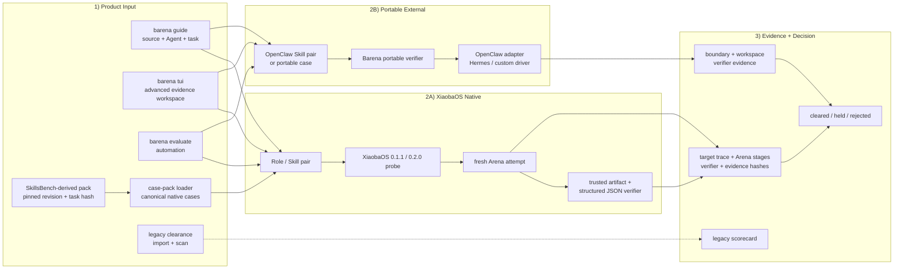

# Barena SPEC

Status: MVP1 / Open-source Agent E2E Phase 1
Last updated: 2026-07-20

Authoritative product positioning: [`docs/POSITIONING.md`](POSITIONING.md). If scope language conflicts, the positioning contract wins.

Barena is end-to-end testing and release CI for AI agents. The existing MVP1 remains a publishable local CLI for deterministic capability clearance. Open-source Agent E2E Phase 1 adds the first real target-process boundary without pretending that Barena owns or can see a target runtime's internal trace.

The product direction is to treat the complete target agent — model, prompt, skills, tools, memory, permissions, and runtime — as a black box whose observable behavior is the release contract. The unit of evaluation is a concrete baseline-to-candidate change. Phase 1 starts with XiaobaOS Role and Skill changes. XiaobaOS is the first native target runtime, while external target agents use Barena's portable verifier through a built-in OpenClaw adapter or a strict JSON driver for Hermes and custom CLI agents.

## Scope

In scope for this repository:

- A TypeScript CLI named `barena`.
- Subject import for local skills and GitHub skill repositories.
- Built-in agent target profiles for `opencode`, `xiaoba`, `hermes`, and `openclaw`.
- Static safety scan before runtime execution.
- Clean run directories under `runs/<run-id>/`.
- Built-in UserCat, InspectorCat, and ReviewerCat contracts.
- XiaobaOS native Arena as the highest-evidence composite evaluation boundary for `role`, `base_skill`, and `role_skill` subjects.
- Paired Role evaluation with an explicit baseline Role and candidate Role under pinned conditions.
- Paired Skill evaluation with a truthful explicit baseline, beginning with the same Role in `role` versus `role_skill` modes.
- A `TargetAdapter` boundary for open-source target agents, beginning with OpenClaw's local JSON CLI.
- A portable JSON driver contract for Hermes and other CLI agents that do not have a built-in adapter.
- A portable evaluator that owns replay, boundary/workspace evidence, deterministic verification, and release aggregation without starting XiaobaOS evaluator processes.
- Barena-owned boundary traces for target input, process output, runtime status, and workspace changes.
- Optional target-native traces, stored separately and never inferred from summary metadata.
- A reusable E2E case contract, replay attempts, artifact verification, and evidence-aware scorecards.
- Paired baseline/candidate evaluation for Role and Skill effectiveness, stability, and regression detection.
- A guided CLI that begins with Skill source, target Agent, and evaluation task, then explains the truthful baseline, effective case configuration, evidence profile, replay/cost policy, and persisted result before execution; the existing TUI remains an explicit advanced evidence workspace.
- Honest `blocked` results when a native contract, portable driver, target binary/configuration, or required evidence is unavailable.
- Replay attempts and optional verifier execution.
- JSON and Markdown reports.
- Scorecard decisions: `cleared`, `held`, `rejected`.
- Review statuses: `pass`, `unstable`, `reopened`, `blocked`, `unsafe`.

Out of scope for this MVP:

- A new chat runtime or coding agent.
- Dashboard, Electron, Pet, Feishu, Weixin, or external side-effect tools.
- GitHub install execution, package install scripts, or arbitrary repository code execution.
- Closed-source target agents.
- GUI or desktop automation.
- Native or built-in adapters for opencode, Hermes Agent, or Pi; Hermes support in this release is portable-driver-compatible only.
- Cross-version regression baselines or a hosted benchmark service.
- Claiming evaluator/target process isolation or hard network isolation. XiaobaOS native requires sandbox enforcement evidence for workspace-write containment, while external OpenClaw remains `policy_only`.
- Public benchmark leaderboard or hosted service.
- Automatic production promotion.
- A full Role × Skill 2×2 factorial experiment in the first XiaobaOS native slice.
- Modifying XiaobaOS from this repository; Barena integrates through the installed `xiaoba` executable and stable CLI/wire contracts.

## Core Evaluation DAG

This is the canonical reader map for Barena. Both native and portable paths preserve the same release flow while retaining different evidence profiles.

```mermaid
flowchart LR
    subgraph Input["1) Release Change"]
        direction TB
        Cases["E2E cases"]
        Baseline["baseline<br/>Role or Skill"]
        Candidate["candidate<br/>Role or Skill"]
    end

    subgraph Orchestrator["2) Barena Orchestrator"]
        direction TB
        Preflight["fail-closed preflight<br/>blocked means held"]
        BaseRuns["fresh baseline attempts"]
        CandidateRuns["fresh candidate attempts"]
        Preflight --> BaseRuns
        Preflight --> CandidateRuns
    end

    subgraph Runtime["3) Runtime Profile"]
        direction TB
        Native["XiaobaOS native Arena<br/>native trace + stages"]
        Portable["portable target driver<br/>boundary observation"]
        Artifacts["artifacts + final state"]
        Native --> Artifacts
        Portable --> Artifacts
    end

    subgraph Evidence["4) Barena Evidence"]
        direction TB
        RuntimeEvidence["native or boundary evidence<br/>profile stays explicit"]
        Verifier["artifact verifier"]
        Package["validated + hash-stamped<br/>evidence package"]
        RuntimeEvidence --> Package
        Verifier --> Package
    end

    subgraph Gate["5) Paired Release Gate"]
        direction TB
        Aggregate["truth + lift<br/>stability + regressions"]
        Decision["cleared / held / rejected"]
        Aggregate --> Decision
    end

    Cases --> Preflight
    Baseline --> BaseRuns
    Candidate --> CandidateRuns
    BaseRuns --> Native
    CandidateRuns --> Native
    BaseRuns --> Portable
    CandidateRuns --> Portable
    Native --> RuntimeEvidence
    Portable --> RuntimeEvidence
    Artifacts --> Verifier
    Package --> Aggregate
```



The native path uses XiaobaOS trace and evaluator-stage evidence. The portable path uses only Barena-observed input, process, output, workspace, and verifier evidence. Barena validates and hash-stamps the available evidence package, then aggregates baseline/candidate attempts into effectiveness, stability, regression, and release decisions.

`UserCat`, `InspectorCat`, and `ReviewerCat` are native XiaobaOS evaluator stages, not requirements for portable clearance. XiaobaOS 0.1.1 and 0.2.0 implement them as a composite native Arena pipeline rather than three independent evaluator `AgentSession`s; the result contract records that limitation explicitly. Portable scorecards mark these stages `not_applicable` and never fabricate evaluator traces.

## Current Architecture

The repository owns subject, scan, run, trace, replay, verifier, paired capability result, scorecard, report, CLI, and TUI contracts. XiaobaOS 0.1.1 and 0.2.0 are implemented first-party native targets through a dedicated composite Arena route. The native route accepts canonical cases directly or through a SkillsBench-derived case-pack projection with pinned provenance, prompt-fidelity checks, and trusted structured-JSON verification. OpenClaw now runs through the portable verifier with its built-in adapter; Hermes/custom CLI agents use the strict portable JSON driver. The original deterministic clearance path remains a legacy scaffold and is not equivalent to real XiaobaOS AgentSessions.

Stock XiaobaOS 0.2.0 satisfies the native probe, manifest, snapshot, execution, and evidence-shape integration used by Barena, but it does not expose the credential-free `arena live-contract --json` capability or authoritative physical provider-call telemetry required for paid/live execution. Barena therefore fails closed with `live_runtime_contract_unsupported` before starting either arm. Tests that implement that additive live contract are future-contract simulators, not evidence that stock XiaobaOS is live-ready.



## Target Architecture

Barena owns paired release orchestration, normalization, verification, evidence provenance, and the final release decision. XiaobaOS native Arena is a composite evaluation contract that already contains evaluator and target planes; it must not be forced into the single-target `TargetAdapter` interface. External agents use the portable verifier through a built-in adapter or the JSON driver contract.

The target live architecture adds an explicit resource-safety boundary without changing the non-live native contracts. Barena owns policy and reservation; XiaobaOS must enforce limits before each physical provider request and emit authoritative per-attempt telemetry. Missing, stale, or mismatched capability/telemetry evidence remains a held result. Inspector is deterministic in the stock Arena and Reviewer is an internal replay/scoring stage, so neither is assumed to make a provider call; live accounting follows observed physical calls instead of assigning one synthetic call to every Arena stage.

```mermaid
flowchart LR
    subgraph Input["1) Role / Skill Release Input"]
        direction TB
        Guide["barena guide<br/>Skill source + Agent + task"]
        TUI["barena tui<br/>advanced evidence workspace"]
        CLI["automation CLI<br/>same evaluation request"]
        Change["baseline + candidate<br/>Role or Skill change"]
        NativeCases["XiaobaOS native cases"]
        PortableCases["portable E2E cases"]
        Derived["SkillsBench-derived case pack<br/>source revision + task hash<br/>explicit adaptation"]
        NormalizeCase["case-pack loader<br/>compatibility + prompt fidelity"]
        Guide --> Change
        TUI --> Change
        CLI --> Change
        Derived --> NormalizeCase --> NativeCases
    end

    subgraph Runner["2) Barena Release Runner"]
        direction TB
        Preflight["fail-closed preflight"]
        Pair["paired execution<br/>baseline + candidate"]
        Normalize["normalize attempts<br/>without changing provenance"]
        Aggregate["truth + lift<br/>stability + quality"]
        Preflight --> Pair
        Normalize --> Aggregate
    end

    subgraph Native["3A) XiaobaOS Native Evaluation"]
        direction TB
        Arena["xiaoba executable<br/>composite Arena control plane"]
        Evaluators["evaluator stages<br/>UserCat / InspectorCat / ReviewerCat<br/>not 3 AgentSessions in 0.1.1"]
        NativeTarget["target plane<br/>isolated Role / Skill runtime"]
        NativeEvidence["native traces<br/>scorecard + artifacts"]
        Arena --> Evaluators
        Evaluators --> NativeTarget
        NativeTarget --> NativeEvidence
        NativeEvidence --> Evaluators
    end

    subgraph External["3B) Portable Verifier Evaluation"]
        direction TB
        Adapter["built-in OpenClaw adapter"]
        Driver["Hermes / custom<br/>portable JSON driver"]
        Boundary["fresh workspace + session<br/>boundary trace"]
        Adapter --> Boundary
        Driver --> Boundary
    end

    subgraph Evidence["4) Evidence + UI"]
        direction TB
        Verify["Barena trusted verifier<br/>artifact + structured JSON<br/>final state"]
        Profile["explicit evidence profile<br/>native or boundary_verified"]
        Score["cleared / held<br/>rejected"]
        Viewer["result + trace viewer"]
        Verify --> Profile --> Score
        Score --> Viewer
    end

    Change --> Preflight
    NativeCases --> Preflight
    PortableCases --> Preflight
    Pair --> Arena
    Pair --> Adapter
    Pair --> Driver
    NativeEvidence --> Verify
    NativeEvidence --> Normalize
    Boundary --> Verify
    Boundary --> Normalize
    Verify --> Normalize
    Aggregate --> Score
```



The XiaobaOS native path supports exact runtime contracts 0.1.1 and 0.2.0 through the installed `xiaoba` executable. New public CLI requests use `--target xiaobaos`; `xiaoba` remains a compatibility alias and existing `barena.xiaoba_*.v1` wire identifiers remain stable.

The portable path executes OpenClaw through its built-in adapter or Hermes/custom agents through `barena.portable_target_probe.v1`, `barena.portable_target_request.v1`, and `barena.portable_target_result.v1`. The same adapter boundary supports single E2E cases and paired no-Skill/candidate-Skill evaluation. Portable clearance requires complete protocol, Skill binding, boundary, workspace, verifier, and replay evidence. It reports `evaluation_mode=portable_verifier`, `evidence_profile=boundary_verified`, `target_native_trace=false`, evaluator stages `not_applicable`, and confidence no higher than medium. Driver completion never bypasses Barena's verifier.

SkillsBench-derived calibration is a case-source projection into the XiaobaOS native path, not a new runtime. Barena records the upstream repository, immutable revision, task identity and bytes hash, plus every adaptation made for workspace paths, fixtures, or verifier semantics. The loader must fail closed when the task requires an unimplemented Docker image, service, network, resource, multi-Skill, or arbitrary shell-verifier contract. Barena does not claim BenchFlow runtime compatibility or official SkillsBench leaderboard results unless the official harness and submission rules are used.

## Data Contracts

### Subject Manifest

`subjects/<subject-id>/subject-manifest.json` records:

- `subject_id`
- `type` (`skill`, `role`, `role_skill`, or `agent`)
- `source`
- `status`
- `fingerprint`
- `paths`
- `imported_at`
- `metadata.agent_target` for built-in agent targets

### Run Layout

Paired Skill evaluations wrap the per-case Agent E2E packages:

```text
runs/<skill-eval-id>/
  evaluation-request.json
  skill-evaluation.json
  arms/baseline/<case-id>/<agent-e2e-run-id>/...
  arms/candidate/<case-id>/<agent-e2e-run-id>/...
  reports/report.json
  reports/report.md
```

XiaobaOS native Role/Skill evaluations use a separate composite package:

```text
runs/<xiaoba-kind-eval-id>/
  evaluation-request.json
  capability-evaluation.json
  arms/<baseline|candidate>/<case-id>/attempt-<n>/
    request-manifest.json
    workspace-seed/
    xiaoba-project/arena/runs/<xiaoba-run-id>/
      clean-runtime.json
      arena-runner.json
      arena-scorecard.json
      arena-run.json
      workspace/logs/sessions/**/traces.jsonl
    verifier/artifact-assertions.json
    traces/boundary.ndjson
    evidence/evidence-manifest.json
    evidence/<boundary|native|evaluator|verifier|debug>/...
  reports/report.json
  reports/report.md
```

Each referenced Agent E2E run uses this layout:

```text
runs/<run-id>/
  run-manifest.json
  case.json
  workspace/
  scan/scan-report.json
  traces/boundary.ndjson
  traces/evaluators/usercat.ndjson
  traces/evaluators/inspectorcat.ndjson
  traces/evaluators/reviewercat.ndjson
  traces/native/<target>.ndjson       # optional
  artifacts/
  inspector/issues.json
  replays/replay-*/boundary.ndjson
  verifier/verifier-results.json
  reviewer/scorecard.json
  reports/report.json
  reports/report.md
```

### Scorecard

The new Agent E2E scorecard is distinct from the legacy `barena.skill_clearance.v0` scorecard. It records:

- evaluator runtime identity and per-Cat stage state;
- target adapter, binary/version, invocation transport, and target status;
- `decision` (`cleared`, `held`, or `rejected`) and review status;
- replay and verifier outcomes;
- `evidence_coverage.boundary_trace` (required), `evaluator_traces`, `target_native_trace` (optional), and workspace observation;
- a confidence level derived from evidence coverage, never invented target-native detail;
- blocked reason codes and debug references.

Every boundary event records provenance:

- `recorded_by=barena`
- `layer=boundary`
- `observed_from` (`target_input`, `target_stdout`, `target_stderr`, `target_process`, or `workspace`)
- `component=<target adapter id>`

Evaluator traces use `layer=evaluator`; genuine target-native events use `layer=native`. Summary fields such as OpenClaw `toolSummary.tools` must not be expanded into fabricated `tool_call` events.

### E2E Case

`barena.agent_e2e_case.v1` contains only the minimum executable contract:

- `case_id`
- `target.adapter` and optional target configuration
- `task.prompt`
- optional `fixtures`
- expected artifact assertions
- replay count and timeouts
- policy-only isolation declaration

The first case asks an OpenClaw target to read a fixture and create a specified workspace artifact. Target completion and case success are separate: the verifier, not the target's prose, decides whether the artifact contract passed.

`barena.xiaoba_native_case.v1` is the native composite case contract. It records `case_id`, purpose, task prompt, optional fixtures, artifact assertions, scenario/turn controls, XiaobaOS internal replay controls, and timeout. Barena's `attempts_per_arm` remains the independent replay count; XiaobaOS internal replay does not replace it.

`barena.xiaoba_case_pack.v1` groups one or more canonical native cases under immutable source provenance. Its first supported source kind is `skillsbench`, with repository URL, pinned commit, license, upstream task ID/path/hash, pack fingerprint, and an explicit adaptation manifest. Phase 1 supports only manually reviewed projections whose environment can be represented as frozen workspace fixtures and whose outcome can be verified by trusted Barena artifact or structured-JSON assertions. Upstream Oracle and verifier files are never copied into the Agent workspace.

For SkillsBench-derived cases, prompt delivery is `as_is` relative to the canonical adapted case. Barena must not prepend the candidate Skill name, Oracle hints, expected values, or verifier details to either arm. Baseline and candidate receive byte-identical task prompts and fixtures; candidate activation must be proven separately from native trace evidence.

### Skill Evaluation

The implemented `barena.skill_evaluation.v1` remains the backward-compatible OpenClaw Skill result. The XiaobaOS-first target introduces a generalized paired request/result instead of silently reinterpreting that schema.

`barena.xiaoba_capability_evaluation_request.v1` and `barena.xiaoba_capability_evaluation_result.v1` record:

- `target_runtime=xiaoba` and `evaluator_runtime=xiaoba-cli`;
- `capability_kind` (`skill` or `role`);
- explicit baseline and candidate selections with identity and fingerprint;
- XiaobaOS project root and native subject modes when `target_runtime=xiaoba`;
- case/suite identity and pinned common runtime conditions;
- attempts per arm and isolation policy.

For XiaobaOS native evaluation, Barena persists each original Arena run and a normalized attempt reference containing:

- arm, case, attempt, runtime, and status;
- XiaobaOS run directory and original `arena-scorecard.json` reference;
- native target trace and UserCat/InspectorCat/ReviewerCat evidence refs;
- candidate activation/fingerprint evidence;
- Barena verifier and assertion refs;
- source provenance and copied evidence hash.

Normalization never relabels native evidence as Barena boundary evidence. A XiaobaOS attempt passes only when the native Arena stages complete, the native decision is successful, the requested Role/Skill activation evidence matches, the Barena verifier passes, and required refs exist. The result records `three_evaluator_agent_sessions=false`, `evaluator_target_process_isolated=false`, and `network_disabled_is_hard_boundary=false` for supported native contracts.

Truthful XiaobaOS baselines are mandatory:

- Skill introduction under a Role: baseline `role`, candidate `role_skill`, with the same explicit Role and pinned common conditions.
- Skill version-to-version comparison is not yet exposed; requests that cannot use the supported same-Role no-candidate-Skill baseline remain blocked instead of inventing a no-op subject.
- Role change: explicit baseline Role versus candidate Role under the same suite, model, tools, and replay policy.
- Missing or unrepresentable baseline: `held/blocked`; no generated no-op Skill or fake Role.

The same-Role Skill comparison is supported only when the immutable Role has `inheritBaseSkills !== false`, no Role-local Skill shadows the candidate name, both arms use the same Role fingerprint, and candidate activation is present in native `tool_visibility[].activeSkillName`. Every independent case/attempt uses a unique XiaobaOS run id and workspace; XiaobaOS's internal Inspector-triggered replay is evidence within one attempt, not a substitute for Barena's independent attempts.

The native runner treats XiaobaOS filesystem artifacts as authoritative because native stdout may include branding before JSON. It validates `arena-manifest.json`, `clean-runtime.json`, `arena-runner.json`, `arena-scorecard.json`, sandbox enforcement, stage states, run/mode/subject identities, and all evidence paths before normalization. Process exit code zero alone is never a pass.

The first native slice does not claim a full Role × Skill 2×2 interaction experiment.

`barena.skill_evaluation_request.v1` is a paired release request containing:

- target runtime configuration;
- baseline Skill selection (`none` or an explicit prior Skill);
- candidate local Skill path and fingerprint;
- case pack identity and revision;
- case purpose (`effectiveness`, `regression`, or `safety`);
- total attempts per arm.

`barena.skill_evaluation.v1` persists baseline and candidate run references plus four evidence-backed result groups:

- **outcome truth:** verifier-backed attempts, never a subjective truth score;
- **effectiveness:** observed candidate pass rate minus baseline pass rate, only when both arms are complete;
- **quality/stability:** stable pass, stable failure, flaky, unsafe, blocked, or incomplete;
- **release decision:** `cleared`, `held`, or `rejected` with a deterministic reason code.

Portable Skill evaluation requires a complete boundary trace, isolated workspace observation, deterministic verifier evidence, and trustworthy baseline/candidate Skill binding. Its evaluator stages are `not_applicable`, target-native trace remains optional, and confidence is capped at `medium`. If any arm is blocked or required evidence is missing, observed lift is unavailable and the release cannot clear.

For OpenClaw, candidate Skill injection uses the active isolated agent workspace at `skills/<skill-id>/SKILL.md` and an exact Skill allowlist. Baseline uses an empty allowlist. The adapter must bind the active OpenClaw workspace explicitly and preflight the eligible Skill set; copying a Skill without proving eligibility is not sufficient.

### Legacy Scorecard

Scorecards contain:

- `scorecard_type`
- `subject_id`
- `subject_type`
- `run_id`
- optional `case_id`
- optional `agent_target` with target id, display name, category, CI focus, and risk focus
- `runtime.provider=barena-deterministic`
- `runtime.adapter=xiaoba-compatible`
- `runtime.xiaoba_invoked=false`
- `decision`
- `status`
- `stages`
- `summary`
- `scores`
- `issues`
- `replay_attempts`
- `artifact_refs`
- `evidence_refs`
- `trace_refs`
- `replay_refs`
- `debug_refs`

## CLI Surface

The recommended first command is `barena guide`. It asks for the Skill source, target Agent, and task/case, imports or snapshots the candidate, previews the exact automation command and evidence boundary, and executes only after explicit confirmation.

MVP1 commands:

- `barena import skill <path>`
- `barena import github <owner/repo|url>`
- `barena guide`
- `barena import agent <opencode|xiaoba|hermes|openclaw>`
- `barena scan <subject-id>`
- `barena run <subject-id> [--replays n] [--verifier path]`
- `barena scorecard <run-id>`
- `barena report <run-id> [--format markdown|json]`
- `barena list subjects`
- `barena list runs`
- `barena list targets`
- `barena tui [--snapshot] [--color|--no-color]`
- `barena doctor`

Agent E2E Phase 1 adds:

- `barena e2e run <case.json> [--runs-root runs]`
- `barena e2e probe [--target xiaoba|openclaw]`
- `barena evaluate skill <skill-path> --target openclaw --case <case.json> [--attempts n]`
- `barena evaluate skill <skill-path> --target xiaoba --role <role-id> --case <case-or-suite> [--attempts n]`
- `barena evaluate role <candidate-role-id> --target xiaoba --baseline-role <role-id> --case <case-or-suite> [--attempts n]`
- `barena` on an interactive TTY opens the guided Skill evaluation workflow; `barena guide` opens the same workflow explicitly. A non-TTY zero-argument invocation remains help-only and script-safe, while `barena guide` without a TTY fails with exit `3` instead of hanging.

The explicit `barena tui` surface is the keyboard evaluation workspace for users who already have local inputs. Its masthead keeps only `BARENA` as ASCII art and renders the surrounding copy as ordinary terminal text. It uses gold plus the terminal's default foreground color, with no background fill, raster sampling, image rendering, or terminal image protocols. It exposes intent-led XiaobaOS Skill/Role, OpenClaw Skill, and Hermes/custom portable-driver workflows; a contextual five-step indicator; input examples; session/evidence review; a distinct paid-execution confirmation; recoverable validation errors; the canonical core evaluation DAG; previous-result, prerequisite, compact result, and provenance-aware trace views. Import, GitHub/catalog intake, and starter-case generation remain in `barena guide`.

## Boundaries

- Production code must not import XiaobaOS or OpenClaw source files by relative path.
- XiaobaOS is the native runtime for UserCat, InspectorCat, and ReviewerCat stages; portable mode marks those stages not applicable.
- XiaobaOS native Arena is a composite evaluation seam and is not a `TargetAdapter`; external target execution uses `TargetAdapter` with argument arrays and `shell: false`.
- XiaobaOS evaluator-plane and target-plane identities, traces, state, and source profiles must be recorded separately even when one Arena CLI process orchestrates both.
- Barena must bind the XiaobaOS project root explicitly and copy/hash native evidence into the Barena run package so later TUI reads do not depend on mutable native run retention.
- Barena may always observe its own inputs, process boundary, and workspace. Target-native traces are required when the native contract promises them, optional for external targets, and never inferred or fabricated.
- Missing XiaobaOS support, roles, provider configuration, portable driver, target binary, target configuration, or protocol compatibility yields `blocked`, not a simulated pass.
- Missing XiaobaOS live-contract support or authoritative provider-call evidence yields `held/live_runtime_contract_unsupported` before paid execution; fixture contracts never count as stock-runtime compatibility evidence.
- OpenClaw portable execution retains no-delivery, exact Skill allowlist, eligibility proof, unique-session, and `policy_only` constraints. It does not start a XiaobaOS evaluator process.
- A selected Skill is considered injected only when the candidate workspace, explicit allowlist, and OpenClaw Skill eligibility preflight all identify the same Skill fingerprint.
- A XiaobaOS Skill or Role is considered active only when the native snapshot/profile/trace evidence identifies the requested subject and fingerprint; subject selection alone is not proof of use or effectiveness.
- The TUI reads trace references from persisted scorecards; a blocked target displays `No boundary trace: target was not started` instead of synthesizing events.
