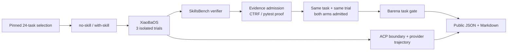

# Barena × SkillsBench v1.1

This is Barena's first public, verifier-backed method-validation package. It evaluates one
target agent—XiaoBaOS—on a source-pinned subset of SkillsBench, then asks the Barena release
gate whether adding the task's upstream Skill produces a repeatable capability change.

The experiment validates paired evidence admission, deterministic verification, comparison,
and release-gate semantics. It predates Barena's current XiaoBaOS `AgentRuntimeAdapter` and
OTLP-based Explore path, so it must not be cited as validation of those newer components.

## Matrix

- 24 public tasks: three from each of the eight SkillsBench categories
- baseline: XiaoBaOS without the upstream task Skill
- candidate: the same XiaoBaOS runtime with that Skill
- three isolated trials per arm
- 144 planned rollouts in total
- task truth: SkillsBench's deterministic verifier, never the agent's self-report
- runtime: XiaoBaOS `engineer-cat`, requested model `gpt-5.6-sol`

The fixed task list and its source metadata are in
[`barena-validation-24.json`](barena-validation-24.json). The latest public result is
published as [`results/latest.md`](results/latest.md), with the machine-readable evidence
index in [`results/latest.json`](results/latest.json).

## Published result

The execution matrix produced terminal evidence for all 144 planned rollouts. The primary
comparison keeps only same-task, same-trial pairs with verifier-admitted evidence in both
arms: 36 pairs, or 72 rollouts across 14 tasks.

| Matched pairs | Baseline pass | Candidate pass | Observed paired difference | Candidate-only pass | Baseline-only pass | Exact McNemar p |
|---:|---:|---:|---:|---:|---:|---:|
| 36 | 14/36 (38.9%) | 20/36 (55.6%) | +16.7 pp | 8 | 2 | 0.109 |

This is a complete-case paired result: the observed direction is positive, but it is not
statistically conclusive and missingness may be non-random. The task-level release gate is
reported only for the 9 tasks with complete three-by-three evidence: 2 `cleared`, 7 `held`,
and 0 `rejected`; the held set consists of 4 no-effect and 3 unstable tasks.

For auditability, the evidence inventory still records 90 verifier-admitted rollouts, of
which 72 form matched pairs and 18 do not; 54 rollouts are invalid or unscored. Unmatched
arm rates are intentionally omitted from the human-facing result. The other 15 tasks remain
in the JSON evidence index but are excluded from task-level effect claims.

## Evaluation path

BenchFlow materializes each task and runs it in Docker. XiaoBaOS does not natively implement
BenchFlow's ACP contract, so this example uses the clearly labelled compatibility shim in
[`agents/xiaobaos-acp-shim.py`](agents/xiaobaos-acp-shim.py). The shim adapts protocol
framing and mounts the upstream Skill; it does not decide whether a task passed.

## Published evidence scope

This repository publishes:

- the exact 24-task selection and source revision;
- the compatibility shim used at the Agent protocol boundary;
- the immutable validation result plus a stable `latest` copy;
- deterministic poster source, manifest, and rendered exports.

Raw BenchFlow rollout directories and provider trajectories remain local under `runs/` and
are intentionally not published. The current Barena CLI ships the product's ordinary
Runtime adapters and one-task `skillsbench:starter`; it does not ship the one-off BenchFlow
batch runner used for this experiment. Therefore this package supports result/provenance
audit and poster regeneration, but it is not presented as a one-command reproduction from
the current branch.

## Reading the result

An exact verifier reward of `1` counts as a pass. Fractional rewards remain visible as
partial scores and do not get promoted to passes. Barena reports both metrics because a
Skill can improve task quality without reaching full correctness.

`cleared` means repeatable positive verifier-score lift on a complete three-by-three task
comparison; `held` means no proven lift, instability, or insufficient evidence; `rejected`
means a measured regression on a complete comparison. A numeric reward is admitted only
when a non-empty CTRF report or completed pytest summary proves the verifier ran; incomplete
multi-report suites are excluded. The primary effect estimate matches the baseline and
candidate on task and trial number; admitted rollouts without an admitted counterpart are
inventory evidence only. Task-level release decisions require all three trials in both arms.
The upstream published reference direction is calibration metadata, not XiaoBaOS ground
truth.

The public report contains repository-relative evidence references and no credentials or
private model endpoint values. Those references identify the retained local raw evidence;
they are not claims that every raw trajectory is published in Git.
