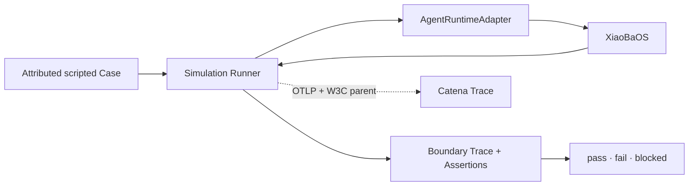
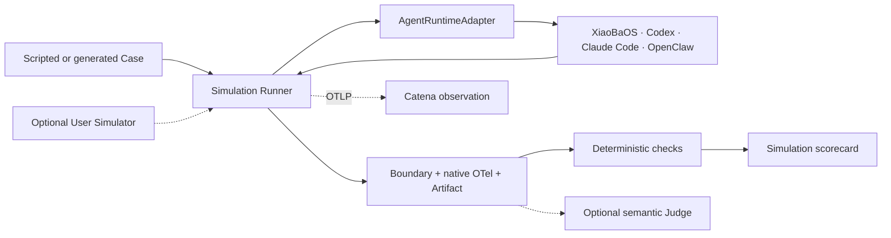

# Agent Simulation Module SPEC

## Problem

Barena needs a small Scenario-style calibration path that can replay an
attributed, scripted multi-turn conversation against the same canonical
`AgentRuntimeAdapter` used by Explore. It must preserve one session, retain
honest boundary evidence, apply deterministic checks, and make the complete
Run visible in Catena without pretending that scripted assertions are an LLM
Judge or a release decision.

## Scope

- `barena.agent_simulation_case.v1` with upstream source attribution;
- one Runtime session with ordered scripted user turns;
- deterministic assertions over the final assistant response;
- boundary NDJSON plus JSON and Markdown scorecards;
- optional fail-open OTLP/HTTP export to Catena;
- XiaoBaOS as the first live Runtime.

Autonomous UserCat generation, Inspector/Reviewer judgment, release decisions,
and a second Agent invocation abstraction are out of scope.

## Current Architecture

## Target Architecture

## Contracts

The runner opens exactly one Runtime session per Case, sends each `turns[].user`
through `sendTurn`, and closes the session in `finally`. Each turn receives a
W3C `traceparent` whose parent Span ID equals the corresponding stable
`barena.turn` Span. The exported root is Run summary evidence and never
masquerades as user input. Ordered `barena.assertion` child Spans retain the
deterministic check result.

OTLP export is fail-open: upload failure is recorded in
`evidence.catena_observation` without changing the local pass/fail/blocked
result. Runtime output remains boundary evidence; native spans must arrive from
the Runtime itself.

## Acceptance Criteria

- Two turns reuse one Runtime session and close it exactly once.
- The second turn observes Runtime-managed conversation history.
- Source attribution and requested model are retained without secrets.
- Root, Turn, Runtime, and Check spans share one Trace when the Runtime honors
  W3C Trace Context.
- Build, complete test suite, package dry-run, and CLI help pass.
